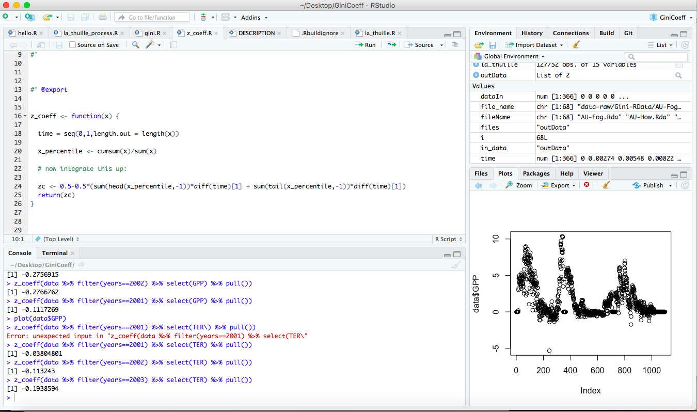
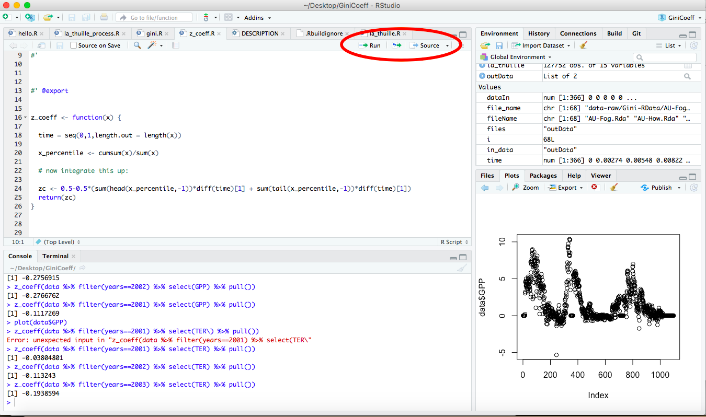
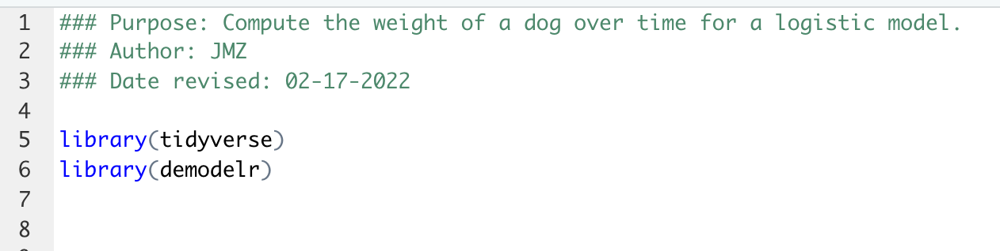

# Introduction to R {#r-intro-02}
The primary tool we have to analyze models will be `R` and `RStudio`, which are commonly used for scientific and statistical computations.  This is an exciting program and powerful program to learn!  Admittedly learning a new software may be challenging, however I think it is worth it.  With `R` you will have enormous flexibility to efficiently utilize data, design effective visualizations, and process statistical models.

## R and RStudio
First let's talk terminology. The program `RStudio` is called an *Integrated Development Environment* for the statistical software language `R`.

To get both `R` and `RStudio` requires two separate downloads and files, which can be found here:

- `R`: [https://cran.r-project.org/mirrors.html](Link to download mirror) (you need to select a location to download from; choose any one that is geographically close to you.)
- `RStudio`: [https://www.rstudio.com/products/rstudio/download/](Choose RStudio desktop - the free version).

### Why do we have two programs?
Think of `R` as your basic program - this is the engine that does the computation.  `RStudio` is a programe where you can see everything you are working on in one place.  Figure \@ref(fig:r-studio-pane) shows an example of an RStudio pane that I have:

```{r label="r-studio-pane", echo=FALSE,out.width = "50%",fig.align="center",fig.cap="A sample RStudio pane from one of my projects."}

```


There are 4 key panels that I work with, clockwise from the top:

* The **source** window is in the upper left - notice how those have different tabs associated with them.  You can have multiple source files that you can toggle between.  For the moment think of these as commands that you will want to send to R.
* The **environment** and **history** pane - these tables allow you to see what variables are stored locally in your environment, or the history of commands.
* The **files** and **plots** command (a simple plot I was working on is shown currently), but you can toggle between the tabs.  The files tab shows the files in the current `Rstudio` project directory.
* Finally, the **console** pane is the place where `R` works and runs commands.  You can type in there directly, otherwise we will also just ``send'' commands from the source down to the console.

Now we are ready to work with `R` and `RStudio`!


## First steps: getting acquainted with R
Let's get started!  Open up RStudio.  Task one will be to create a project.  A project is a central place to organize your materials for this course.  You may do this already, but R can be picky about its working directory - and navigating to it.  I found creating a project file is an easy way to avoid some of that fussiness.  Let me describe steps in how to do this.

1. In `RStudio` select "File" then  "New Project"
2. Next select the first option "New Directory" in the window - this will create a new folder on your computer.
3. At the next window choose New Directory or Existing Directory - it depends on where you want to place this project.
4. Name the project as you like.
5. Click the "Create Project" button.


### "Working" with R
Our next step: where do we get R to do something? For example if we wanted to compute of `4+9` (yeah, it is 13, but this is an illustrative example), we could type this command in the `R` console (lower left) window.  Let's try this now.

1. In the console type `4+9`
2. Then hit enter (or return)
3. Is the result 13?

Success!  Now let me show you another way that works well if you have multiple lines of code to evaluate or save.  Working with a script (`.R` file) is better.  This will utilize the upper left hand corner of your `RStudio` window.  (You may not have anything there when you start working on a project, so let's create one.)


1. In `RStudio` select "File" then "New File"
2. Next select the first option "New Script"
3. A new window called "UntitledX" should appear, where X is a number.  You are set to go!

I like to use this window as a file to type stuff in and then evaluate it, which we will do next.

**Pro tip:** There are shortcuts to creating a new file: Ctrl+Shift+N (Windows and Linux) or	Command+Shift+N (Mac)

### Sending commands down to console.
Now we want to type and evaluate a command for R to do something.  Click anywhere in the source file that you created and type the following:

```{r}
4 + 9
```

You have several options:

1. Copying and pasting the command to the window.  Shortcuts are Ctrl+C / Command+C for copying and Ctrl+V / Command+C for Windows / Mac.
2. Run the line.  This means that your cursor is at the line in your source file, then clicking the 'Run' button in the upper right hand side of the source window.  Shortcuts are Ctrl+Enter / Command+Enter.

```{r, echo=FALSE,out.width = "50%",fig.align="center",fig.cap="Sending a command to the console."}

```

3. You can also source the whole file, which means runs all the lines from top to bottom. You do this by clicking the source button, or with shortcuts Ctrl+Shift+Enter / Cmd+Shift+Enter (Windows / Mac).  You can imagine this makes things easier when you have SEVERAL lines of commands to evaluate.

Why do I like working with a script file?  Well if I run some commands that have an error then it is much easier to just fix a quick mistake and then re-run the code.

It is also helpful to annotate your code with comments (`#`), which appear as green text in `RStudio`.


### Saving your work
The neat part about a source file is that it allows you to save the file (Ctrl+S / Cmd+S).  The first time you do this you may need to give this a name.  The location where this file will be saved is in the same directory as your `.Rproj` project file.  Now you have a file that you can come back to!  In general I try to use descriptive names of files to I can refer back to them later.

&nbsp;

## Increasing functionality with packages
One awesome versatility with R is the ability to add packages - these packages extend the functionality of R with contributed, specialized code. These are similar to apps on your phone.  You can get packages from a few different places:

- [CRAN](https://cran.r-project.org/), which stands for **C**omprehensive **R** **A**rchive **N**etwork.  This is the clearing house for many contributed packages - and allows for easy cross platform functonality.

One key package is [`tidyverse`](https://www.tidyverse.org/), which is actually a collection of packages.  If you take an introductory data science course you will most likely be learning more about this package, but to install this at the command line you type the following:

```{r eval=FALSE}
install.packages("tidyverse")
```

Typing this line will connect to the CRAN download mirrors and install this set of packages locally to your computer.  It make take some time, but be patient.

Another package you should install is `devtools`:

```{r eval=FALSE}
install.packages("devtools")
```

Sometimes when you are installing packages you may be prompted to install additional packages.  In this case just say yes.

- Github.  This is another place where people can share code and packages (including myself!).  The code here has not been vetted through CRAN for compatibility, but if you trust the person sharing the code, it should work.

For this textbook I have written a collection of functions and data that we will use.  This package name is called `demodelr` (**D**ifferential **E**quations and **Model**s in **R**). To install this package you will run the following line.

```{r eval=FALSE}
devtools::install_github("jmzobitz/demodelr", build = TRUE, build_opts = c("--no-resave-data", "--no-manual"), force = TRUE)
```

The start of this command `devtools::` calls the function `install_github` from the `devtools` library. This is super handy when you just want to call one function from a library. What this command will do is pull in the package structure from my github page and install it locally.

Here is the good news: _you only need to install a package once before using it!_  To load the package up into your workspace you use the command `library`:

```{r eval=FALSE}
library(tidyverse)
library(demodelr)
```

You need to load up your these libraries _each time you restart your R session_.  This is part of the benefit of a script file - at the start I always declare the libraries that I will need at the start of the script file, as shown in the following figure:

```{r, echo=FALSE,out.width = "50%",fig.align="center",fig.cap="A sample R script."}

```

Also notice here that the first few lines of the script file I used comments (prefaced with `#`) to denote the basic purpose of the file, who wrote it, and the date it was last revised.  This type of information is good programming practice at the start.


## Working with R: variables, data frames, and datasets

### Creating variables
The next thing we will want to do is to define variables that are stored locally.  This is pretty easy to do:

```{r}
my_result <- 4 + 9
```

The symbol `<-` is assignment (you can use equals (=), but it is good coding practice to use the arrow for assignment).  Notice how I named the variable called `my_result`.  Generally I prefer using *descriptive* names for variables for the context at hand (In other words, `x` would be an odd choice - too ambiguous.)  I also used snake case to string together multiple words.  In practice you can use snake case, or alphabetic cases (`myResult`) or even `my.result` (although that may not be preferred practice in the long run).  However, you can't use `my-result` because it looks like subtraction between variables `my` and `result`.

Once we have defined a variable, we can compute with it. For example `10*my_result` should yield 130.  Cool, no?  

As an example, let's define a sequence, spaced from 0 to 5 with spacing of 0.05.  Store this in a variable called `my_sequence`. To do this we use the `seq` command and requires the starting value, ending value, and step size:
```{r eval=FALSE}
my_sequence <- seq(from = 0, to = 5, by = 0.05)
```


The format for the function `seq` is `seq(from=start,to=end,by=step_size)`.  The `seq` command is a pretty flexible - there are alternative ways you can generate a sequence by specifying the starting and the end values along with the number of points. If you want to know more about `seq` you can always use `?` followed by the command - that will bring up the help values:

```{r eval=FALSE}
?seq
```

Once you get more comfortable with syntax in `R`, you will see that `seq(0,5,0.5)` gives the same result as `seq(from=0,to=5,by=0.05)`, but it is helpful to write your code *so that you can understand what it does*.

### Data frames
A key structure in `R` is that of a data frame, which allows different types of data to be collected together. A data frame is like a spreadsheet where each column is a value and each row a value (much like you would find in a spreadsheet), as given in Table \@ref(tab:sample-data).

```{r sample-data, echo = FALSE, message=FALSE,results='asis'}
mtcars[1:5, c(1, 3)] %>%
  kbl(caption = "A data frame") %>%
  kable_paper(full_width = FALSE)
```

Table \@ref(tab:sample-data)  shows the miles per gallon in one column (the variable `mpg` and the engine size (the variable `disp`) for different types of cars.  The row names (`Mazda RX4`) just tell you the type of the car.  Sometimes row names are not shown.

Another data frame may list solutions to a differential equation, like we did with our three infection models in Section \@ref(intro-01) (Table \@ref(tab:model-table)).

```{r model-table, echo = FALSE, message=FALSE, results='asis'}
time <- seq(0, 600, length.out = 100)
n <- 4000
k <- 0.03
i0 <- 5

model_out <- tibble(time, model_1 = i0 * exp(k * time), model_2 = n - (n - i0) * exp(-k * time), model_3 = n * i0 / (i0 + (n - i0) * exp(-k * time)))

model_out[1:5, ] %>%
  kbl(caption = "Model solutions") %>%
  kable_paper(full_width = FALSE)
```

Data frames are an example of *tidy* data, where each row is an observation, each column a variable (which can be quantitative or categorical). There are several different ways to define a data frame in `R`.  I am going to rely on the approach utilized by the `tidyverse`, which calls data frames `tibbles`.  So for example, here is I am going to define a data frame that computes the quadratic function $y=3x^2-2x$ for $-5 \leq x \leq 2$.

```{r eval=FALSE}

x <- seq(from = -5, to = 2, by = 0.05)
y <- 3 * x^2 - 2 * x

my_data <- tibble(
  x = x,
  y = y
) # Notice I sam specifically defining x and y
```

Notice that the data frame `my_data` uses the column (variable) names of `x` and `y`.  You could have also used `tibble(x,y)`, but it is helpful to name the columns in the way that you would like them to be named.

### Reading in datasets
`R` has a lot of built in datasets!  In fact to see all the datasets, type `data()` at the console.  This will popup a new window in `RStudio` with the names.  Take some time exploring them. So cool!

If you want to see the datasets for a specific package (such as `demodelr`) you type `data(package = "demodelr")` at the console.

Perhaps what is most important is being able to read in datasets provided to you.  Data come in several different types of formats, but one of the more versatile ones are csv (**c**omma **s**eparated **v**alues).  What you need to do is the following:

- Where you have your .Rproj file located, create a folder called `data` or `datasets`
- Save the file locally on your computer. Take note where you have it saved on your computer, and drag the file to your `data` folder.
- To read in the file you will use the command `read_csv`, which has the following structure:

```{r eval=FALSE}
in_data <- read_csv(FILENAME)
```

The data gets assigned to the variable `in_data` (You can call this variable what you want.)  For example I have the following csv file of ebola data, which I read in via the following:

```{r eval=FALSE}
ebola <- read_csv("data/ebola.csv")
```

Notice the quotes around the FILENAME.  **Pro tip:** If you have the data files in the data folder, in RStudio you can type "data" and it may start to autocomplete - this is hand (you can also use tab.)


## Visualization with R
Now we are ready to begin visualizing data frames.  Two types of plots that we will need to make will be a scatter plot and a line plot.  We are going to consider both of these separately, with examples that you should be able to customize.

### Making a scatterplot
One dataset we have is the mass of a dog over time, adapted from  [here](http://bscheng.com/2014/05/07/modeling-logistic-growth-data-in-r/).  We have two variables here: $D=$ the age of the dog in days and $W=$ the weight of the dog in pounds.  I have the data loaded into the `demodelr` package, which you can investigate by typing the following at the command line (I display it below as well in Table \@ref(tab:wilson-02)).

```{r eval=FALSE}
glimpse(wilson)
```

(Notice that I have assumed you have the `demodelr` library loaded.)  You can also explore the documentation for this dataset by typing `?wilson` at the console.

```{r, label="wilson-02", echo = FALSE, message=FALSE,results='asis'}

wilson %>%
  kbl(caption = "Weight of a dog over time") %>%
  kable_paper(full_width = FALSE)
```

Notice that this data frame has two variables: `days` and `mass`
To make a scatter plot of these data we are going to use the command `ggplot`:
```{r,fig.width=4,fig.height=3}
ggplot(data = wilson) +
  geom_point(aes(x = days, y = mass)) +
  labs(
    x = "Days since birth",
    y = "Weight (pounds)"
  )
```

Wow!  This looks complicated.  Let's break this down step by step:

- `ggplot(data = wilson) + ` sets up the graphics structure and identifies the name of the data frame we are including.  
- `geom_point(aes(x = days, y = mass))` defines the type of plot we are going to be making.  
- `geom_point()` defines the type of plot geometry (or _geom_) we are using here - in this case, a point plot.
- `aes(x = days, y = mass)` determines the _aesthetics_ of the plot.  On the x axis is the days variable, on the y axis is the mass variable.
- The statement beginning with `labs(x=...)` defines the labels on the x and y axes.


I know this seems like a lot to write for a plot, but this structure is actually used for some more advanced data visualization.  Trust me - learning how to make informative plots can be a useful skill!

### Making a line plot
Using the same `wilson` data, later on we will discover that the function $\displaystyle W =f(D)= \frac{70}{1+e^{2.46-0.017D}}$. represents these data.  In order to make a plot of this function we can use need to first build a data frame:

```{r,fig.width=4,fig.height=3}
days <- seq(from = 0, to = 1500, by = 1) # Choose spacing that is "smooth enough"
mass <- 70 / (1 + exp(2.46 - 0.017 * days))

wilson_model <- tibble(
  days = days,
  mass = mass
)

ggplot(data = wilson_model) +
  geom_line(aes(x = days, y = mass)) +
  labs(
    x = "Days since birth",
    y = "Weight (pounds)"
  )
```

Notice that once we have the data frame set up, the structure is very similar to the scatter plot - but this time we are calling using `geom_line()` than `geom_point`.

### Changing options
Want a different color?  Thicker line?  That is fairly easy to do.  For example if we wanted to make either our points or line a different color, we can just choose the following:

```{r eval=FALSE}
ggplot(data = wilson) +
  geom_point(aes(x = days, y = mass), color = "red", size = 2)
labs(
  x = "Days since birth",
  y = "Weight (pounds)"
)
```

Notice how the command `color='red'` was applied _outside_ of the aes - which means it gets mapped to each of the points in the data frame.  `size=2` refers to the size (in millimeters) of the points.  I've linked more options about the colors and sizes you can use here:

- **Named colors in R:** [LINK](https://www.r-graph-gallery.com/42-colors-names.html) Scroll down to "Picking one color in R" - you can see the list of options!
- **More colors:** [LINK](http://www.cookbook-r.com/Graphs/Colors_(ggplot2)/). More information about working with colors.
- **Using hexadecimal colors:** [LINK](http://www.cookbook-r.com/Graphs/Colors_(ggplot2)/#hexadecimal-color-code-chart)  (You specify these by the code so `"#FF3300"` is a red color.)
- **Changing sizes of lines and points:** [LINK](https://ggplot2.tidyverse.org/articles/ggplot2-specs.html)


### Combining scatter and line plots.
This is actually easy to do, especially since we are combining both the plot geoms together.  Try running the following code (I am still using the data frame `wilson_model` as defined above:

```{r,fig.width=4,fig.height=3}
ggplot(data = wilson) +
  geom_point(aes(x = days, y = mass), color = "red") +
  geom_line(data = wilson_model, aes(x = days, y = mass)) +
  labs(
    x = "Days since birth",
    y = "Weight (pounds)"
  )
```

Notice in the above code a subtle difference when I added in the dataset `wilson_model` with `geom_line`: you need to name the `data` bringing in a new data frame to a plot geom.


While it may be useful to have a legend to the plot, for this course we will make plots where this the context will be more apparent.  Additional reading on legends can be found [here](http://www.cookbook-r.com/Graphs/Legends_(ggplot2)/).


## Defining functions
We will study lots of other built-in functions for this course, but you may also be wondering how you define your own function (let's say $y=x^{3}$).  We need the following construct:

```{r eval=FALSE}

function_name <- function(inputs) {

  # Code

  return(outputs)
}
```

Here `function_name` serves as what you call the function, inputs are what you need in order to run the function, and outputs are what gets returned.  So if we are doing $y=x^{3}$ then we will call that function `cubic`:

```{r}
cubic <- function(x) {
  y <- x^3
  return(y)
}
```

So now if we want to evaluate $y(2)=2^{3}$ we type `cubic(2)`.  Neat! Now let's make a plot of the graph $y=x^{3}$ using the function defined as `cubic`.  Here is the `R` code that will accomplish this:


```{r,fig.width=4,fig.height=3}
x <- seq(from = 0, to = 2, by = 0.05)
y <- cubic(x)

my_data <- tibble(x = x, y = y)

ggplot(data = my_data) +
  geom_line(aes(x = x, y = y)) +
  labs(
    x = "x",
    y = "y"
  )
```


### Functions with inputs
Sometimes you may want to define a function with different input parameters, so for example the function $y=x^{3}+c$.  To define that, we can modify the function to have input variables:

```{r}
cubic_revised <- function(x, c) {
  y <- x^3 + c
  return(y)
}
```

So if we want to plot what happens for different values of `c` we have the following:

```{r,fig.width=4,fig.height=3}
x <- seq(from = 0, to = 2, by = 0.05)


my_data_revised <- tibble(
  x = x,
  c_zero = cubic_revised(x, 0),
  c_pos1 = cubic_revised(x, 1),
  c_pos2 = cubic_revised(x, 2),
  c_neg1 = cubic_revised(x, -1)
)

ggplot(data = my_data_revised) +
  geom_line(aes(x = x, y = c_zero)) +
  geom_line(aes(x = x, y = c_pos1)) +
  geom_line(aes(x = x, y = c_pos2)) +
  geom_line(aes(x = x, y = c_neg1)) +
  labs(
    x = "x",
    y = "y"
  )
```

Notice how I defined multiple columns of the data frame `my_data_revised` in the `tibble` command, and then used mutiple `geom_line` commands to plot the data.  Since we had combined the different values of `c` in a single data frame we didn't need to define the `data` with each instance of `geom_line`.


## Concluding thoughts
This is not meant to be a self-contained section in `R` but rather one to get you  - those miles have been trod by others, and here are few of my favorites that I turn to:

* [**R Graphics**](http://www.cookbook-r.com/).  This is a go to resource for making graphics.  (I also use google a lot too.)
* [**The Pirates Guide to R**](https://bookdown.org/ndphillips/YaRrr/).  This book promises to build your R knowledge from the ground up.
* [**R for Reproducible Scientific Analysis**](http://swcarpentry.github.io/r-novice-gapminder/).  This set of guided tutorials can help you build your programming skills in R.
* [**R for Data Science**](https://r4ds.had.co.nz/) this is a useful book to take your R knowledge to the next level.

The best piece of advice: DON'T PANIC!  Patience and persistence are your friend. Reach out for help, and recognize that like with any new endeavor, practice makes progress.

\newpage

## Exercises
```{exercise}
Create a folder on your computer and a project file where you will store all your R work for this textbook.
```
&nbsp;
```{exercise}
Install the packages `devtools`, `tidyverse` to your R installation.  Once that is done, then install the package `demodelr` from my github page.
```
&nbsp;
```{exercise}
What are the variables listed in the dataset `phosphorous` in the `demodelr` library?  (Hint: try the command `?phosphorous`.)
```
&nbsp;
```{exercise}
Make a scatterplot (`geom_point()`) of the dataset `phosphorous` in the `demodelr` library. Be sure to label the axes.
```
&nbsp;

```{exercise}
Change the line plot of Wilson's weight over time so the line is blue and the size is 4.
```
&nbsp;

```{exercise}
Change the color of the scatterplot of Wilson's weight over time to a either a hexadecimal color or a named color of your choice.
```
&nbsp;

```{exercise}
For this exercise you will do some plotting:

a. Define a sequence (call this sequence $x$) that ranges between -12 to 12 with spacing of .05.
b. Also define the variable $y$ such that $y=\sin(x)$.
c. Make a scatter plot to graph $y=\sin(x)$.  Set the points to be red.
d. Make a line plot to graph $y=\sin(x)$.  Label the x-axis with your favorite book title. Label the y-axis with your favorite food to eat.

```
&nbsp;

```{exercise}
An equation that relates a consumer's nutrient content (denoted as $y$) to the nutrient content of food (denoted as $x$) is given by: $\displaystyle y = c x^{1/\theta}$, where $\theta \geq 1$ and $c$ are both constants is a constant.  Let's just assume that $c=1$ and the $0 \leq x \leq 1$.

Write a function called `nutrient` that will make a sequence of `y` values for an input `x` and `theta` ($theta$).  Then use that code to make a make a line plot (`geom_line()`) for five different values of $\theta>1$, appropriately labeling all axes.
```
&nbsp;

```{exercise}
Researchers measured the phosphorous content of *Daphnia* and its primary food source algae. This is the dataset `phosphorous` in the `demodelr` library. 

Researchers believe that *Daphnia* has strict homeostatic regulation of the phosphorous in algae, and as such want to determine the value of $\theta$ in the equation $y= \displaystyle y = c x^{1/\theta}$.  They have already determined that the value of $c=1.737$.

a. If you haven't already, make a scatterplot (`geom_point()`) of the dataset `phosphorous` in the package library. Be sure to label the axes correctly.
b. Use your function `nutrient` from the previous exercise to make an initial guess for `theta` ($\theta$) that would be consistent with the data.  You can evaluate your guess by plotting (with `geom_line()`) against the data.
c. Use guess and check to refine the value of $\theta$ that seems to work best.
d. Report your value of $\theta$.

```
&nbsp;

```{exercise}
For this exercise you will investigate some built-in functions.  Remember you can learn more about a function by typing `?FUNCTION`, where `FUNCTION` is the name.

a. Explain (using your own words) what the function `runif(1,100,1000)` does.
b. Explain (using your own words) what the function `ceiling()` does, showing an example of its use.

```
&nbsp;
```{exercise}
For this exercise you write a sample function file.

a. Create a new source file and save it as `myFunction.R`.
b. Type this code the file you created: `myInteger <- ceiling(runif(1, 100, 1000))` (This will declare a variable `myInteger` that you will work with in the following steps.)
c. Determine a function in R that will **compute a cumulative sum** from 1 to the value of `myInteger`.  Modify your file so that it also computes the cumulative sum and then source your file.
d. Copy and paste your function into your homework document for evaluation.

```

&nbsp;
```{exercise}
The Ebola outbreak in Africa in 2014 severely affected the country of Sierra Leone.  A model for the number of deaths $D$ due to ebola is given by the following equation:
$$ D(t) = \frac{K \cdot N_{0} }{N_{0} + (K-N_{0})  \exp(-rt)}, $$
where $K = 3980$, $N_{0}=5$ and $r = 0.0234$.  The variable $t$ is in days. Use `geom_line()` to visualize this curve from $0 \leq t \leq 700$.
```
&nbsp;
```{exercise}
Consider the following piecewise function:
\begin{equation}
y =
\begin{cases}
x^2 & \text{ for } 0 \leq x < 1,\\
2-x &\text{ for } 1 \leq x \leq  2 \\
\end{cases}
\end{equation}

a. Define a function in `R` that computes $y$ for $0 \leq x \leq 2$.
b. Use `geom_line()` to generate a graph of $y(x)$ over the interval $0 \leq x \leq 2$.

```
&nbsp;
```{exercise}
An insect's development rate $r$ depends on temperature $T$ (degrees Celsius) according to the following equation:
\begin{equation}
r =
\begin{cases}
0.1 & \text{ for } 17 \leq T < 27,\\
0 &\text{ otherwise.}
\end{cases}
\end{equation}


a. Define a function in `R` that computes $r$ for $0 \leq T \leq 30$.
b. Use `geom_line()` to generate a graph of $r(T)$ over the interval $0 \leq T \leq 30$.


```

