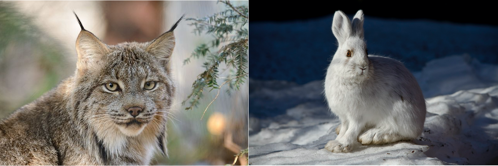

# Modeling with Rates of Change {#modeling-rates-03}
Chapter \@ref(intro-01) provided examples for modeling with rates of change, and Chapter \@ref(r-intro-02) introduced the computational and visualization software `R` and `RStudio`, and how we can translate equations with rates of change to understand phenomena. The focus for this chapter will be on taking a contextual description and starting to develop differential equation models for them.

Oftentimes when we construct differential equations from a contextual description we bring our own understanding and knowledge to this situation. How _you_ may write down the differential equation may be different from someone else - _do not worry!_  This is the fun part of modeling: models can be considered testable hypotheses that can be refined when confronted with data. Let's get started


## Competing plant species and equilibrium solutions
Consider the following context to develop a mathematical model:


> A newly introduced plant species is introduced to a region. It competes with another established species for nutrients (and is a better competitor). However, the growth rate of the new species is proportional to the difference between the current number of established species and the number of new species. You may assume that the number of established species is a constant _E_.


<!-- LW pg 5 -->


For this problem we will start by naming our variables. Let $N$ represent number of new species and $E$ the number of established species. We will break this down accordingly:

- *"the growth rate of the new species"* describes the rate of change, or derivative, expressed as $\displaystyle \frac{dN}{dt}$.

- *"is proportional to the difference between the current number of established species and the number of new species"* means $\displaystyle \alpha \cdot (E-N)$, where $\alpha$ is the proportionality constant. Including this parameter helps to avoid assuming we have a 1:1 correspondence between the growth rate of the new species and the population difference.

- *"and is a better competitor"* helps to explain why the term is $\displaystyle \alpha \cdot (E-N)$ instead of $\displaystyle \alpha \cdot (N-E)$. We know that the newly established species will start out in much smaller numbers than $N$. But since it is a better competitor, we would expect its rate to increase initially. So $\displaystyle \frac{dN}{dt}$ should be *positive* rather than negative.

Taking all these assumptions together, Equation \@ref(eq:compete-03) shows the differential equation to model this context:

\begin{equation}
\frac{dN}{dt} = \alpha \cdot (E-N) (\#eq:compete-03)
\end{equation}

You may recognize that Equation \@ref(eq:compete-03) is similar to Equation \@ref(eq:single-02) in Chapter \@ref(intro-01) for the spread of Ebola. It is not surprising to have similar differential equations appear in different contexts. We will see throughout this book that it is more advantageous to learn techniques to analyze models qualitatively rather than memorize several different types of models and not see the connections between them.

An interesting solution to a differential equation is the _steady state_ or _equilibrium solution_.\index{steady state}\index{equilibrium solution}  Equilibrium solutions occur where the rates of change are zero. For Equation \@ref(eq:compete-03), this means that we are solving $\displaystyle \frac{dE}{dt} = \alpha \cdot (E-N)  = 0$. Granted, the expression $\alpha \cdot (E-N)$ may look like alphabet soup, but it is helpful to remember that $\alpha$ and $E$ are both parameters; the steady state occurs when the expression $E-N$ equals zero, or when $N = E$. We may consider the new species $N$ to be established when it reaches the same population level as $E$. Identifying steady states in a model aids in understanding the behavior of any solutions for a differential equation. Chapters \@ref(phase-05) and \@ref(coupled-06) dig deeper into steady states and their calculation.

## The Law of Mass Action
Our next example focuses on how to generate a model that borrows concepts from modeling chemical reactions. For example let's say you have a substrate *A* that reacts with enzyme *B* to form a product *S*. One common way to represent this process is with a reaction equation (Equation \@ref(eq:reaction-03)):\index{reaction equation}

\begin{equation}
A+B \rightarrow S  (\#eq:reaction-03)
\end{equation}

Figure \@ref(fig:mass-action) is a schematic diagram of Equation \@ref(eq:reaction-03):

```{tikz, mass-action,warning=FALSE,message=FALSE,echo=FALSE,fig.align="center",fig.cap="Schematic diagram of a substrate-enzyme reaction."}

\tikzstyle{vspecies}=[rectangle,minimum size=0.5cm,draw=black]
\begin{tikzpicture}[auto, outer sep=1pt, node distance=2cm]

\node [vspecies] (A) {$A$} ;
\node [vspecies, right of = A] (S) {$P$} ;
\draw [->] ([yshift=0pt]A.east) --  node[above] {\small{$kB$}} ([yshift=0pt]S.west) ;
\end{tikzpicture}


```

One key quantity is the rate of formation for the product $P$, which we express by Equation \@ref(eq:mass-action):

\begin{equation}
\frac{dP}{dt}= kAB, (\#eq:mass-action)
\end{equation}

where $k$ is the proportionality constant or the rate constant associated with the reaction. Notice how we express the interaction between $A$ and $B$ as a product - if either the substrate $A$ or enzyme $B$ is not present (i.e. $A$ or $B$ equals zero), then product $P$ is not formed. Equation \@ref(eq:mass-action) is an example of the law of mass action.\index{mass action}

Modeling interactions (whether between susceptible and infected individuals, enzymes and substrates, or predators and prey) with the law of mass action is always a good first assumption to understand the system, which can be subsequently refined. For example, if we consider that the substrate might decay, we can revise Figure \@ref(fig:mass-action) to Figure \@ref(fig:mass-action-revised):

```{tikz, mass-action-revised,warning=FALSE,message=FALSE,echo=FALSE,fig.align="center",fig.cap="Revised schematic diagram of substrate-enzyme reaction with decay of the product $P$."}


\tikzstyle{vspecies}=[rectangle,minimum size=0.5cm,draw=black]
\begin{tikzpicture}[auto, outer sep=1pt, node distance=2cm]

\node [vspecies] (A) {$A$} ;
\node [vspecies, right of = A] (S) {$P$} ;
\draw [->] ([yshift=0pt]A.east) --  node[above] {\small{$kB$}} ([yshift=0pt]S.west) ;
\draw [->] (S.east) --  node[above] {\small{$d$}} +(1cm,0pt) ;
\end{tikzpicture}


```

In this instance the rate of change of $P$ would then include a term $dP$ (Equation \@ref(eq:mass-action-decay):

\begin{equation}
\frac{dP}{dt}= kAB - dP (\#eq:mass-action-decay)
\end{equation}


<!-- LW pg 73 has some good examples, derived in handlingh patches. -->
<!-- For determine rate constants: -->
<!-- https://kids.frontiersin.org/articles/10.3389/frym.2021.651131 -->
<!-- https://jmahaffy.sdsu.edu/courses/f09/math636/lectures/lotka/qualde2.html -->

## Coupled differential equations: lynx and hares
Another example is a *system of differential equations*.\index{differential equation!system of equations}  The context is between the snowshoe hare and the Canadian lynx, shown in Figure \@ref(fig:lynx-hare). Figure \@ref(fig:lynx-hare-time) also displays a timeseries of the two populations overlaid. Notice how in Figure \@ref(fig:lynx-hare-time) both populations show regular periodic fluctuations. One plausible reason is that the lynx prey on the snowshoe hares, which causes the population to initially decline. Once the snowshoe hare population declines, then there is less food for the lynx to survive, so their population declines. The decline in the lynx population causes the hare population to increase, and the cycle repeats.^[There is a lot more nuance for reasons behind periodic fluctuations in these two populations, which includes more complicated food web interactions and climate variation. @maclulich_fluctuations_1937, @stenseth_population_1997, and @king_geometry_2001 are good places to dig into the complexity of this fascinating biological system. &nbsp; Image sources for Figure \@ref(fig:lynx-hare): @usa_canada_2012 and @preserve_snowshoe_2011. Image source for Figure \@ref(fig:lynx-hare-time): @openstax_notitle_2016]

```{r lynx-hare, echo=FALSE, fig.cap = "Examples of lynx and hare - aren't they beautiful?",out.width="70%",fig.align='center'}



```


```{r,label="lynx-hare-time", echo=FALSE, fig.cap="Timeseries of the combined lynx and hare populations. Notice how the populations are coupled with each other.",out.width="70%",fig.align='center'}

#[Wikimedia Commons](https://commons.wikimedia.org/wiki/File:Figure_45_06_01.jpg)
knitr::include_graphics("figures/03-systems/Figure_45_06_01.jpg")

```


In summary it is safe to say that the two populations are *coupled* to one another, yielding a coupled system of equations.\index{differential equation!coupled system}  But in order to understand how they are coupled together, first let's consider the two populations *separately*.


To develop the mathematical model we will make some simplifying assumptions. The hares grow much more quickly than then lynx - in fact some hares have been known to reproduce several times a year. A reasonable assumption for large hare populations is that rate of change of the hares is proportional to the hare population. Based on this assumption Equation \@ref(eq:hareOnly) describes the rate of change of the hare population, with $H$ as the population of the hares:

\begin{equation}
\frac{dH}{dt} = r H (\#eq:hareOnly)
\end{equation}

Since the growth rate $r$ is positive, so then the rate of change ($H'$) will be positive as well, and $H$ will be increasing. A representative value for $r$ is 0.5 year$^{-1}$ [@mahaffy_lotka-volterra_2010; @brady_circle_2021]. You may be thinking that the units on $r$ seem odd - (year$^{-1}$), but that unit on $r$ makes the term $rH$ dimensionally consistent to be a rate of change.

Let's consider the lynx now. An approach is to assume their population declines exponentially, or changes at the rate proportional to the current population. Let's consider $L$ to be the lynx population, with the following differential equation (Equation \@ref(eq:lynxOnly)):

\begin{equation}
\frac{dL}{dt} = -dL (\#eq:lynxOnly)
\end{equation}

We assume the death rate $d$ in Equation \@ref(eq:lynxOnly) is positive, leading to a negative rate of change for the Lynx population (and a decreasing value for $L$). A typical value of $d$ is 0.9 yr$^{-1}$ [@mahaffy_lotka-volterra_2010; @brady_circle_2021].

The next part to consider is how the lynx and hare interact. Since the hares are prey for the lynx, when the lynx hunt, the hare population decreases. We can represent the process of hunting with the following adjustment to our hare equation:

\begin{equation}
\frac{dH}{dt} = r H - b HL
\end{equation}

So the parameter $b$ represents the hunting rate. Notice how we have the term $HL$ for this interaction. This term injects a sense of realism: if the lynx are not present ($L=0$), then the hare population can't decrease due to hunting. We model the *interaction* between the hares and the lynx with multiplication between the $H$ and $L$. A typical value for $b$ is .024 lynx$^{-1}$ year$^{-1}$. It is okay if that unit seems a little odd to you - it should be! As before, if we multiply out the units on $bHL$ we would get units of hares per year.

How does hunting affect the lynx population?  One possibility is that it increases the lynx population:

\begin{equation}
\frac{dL}{dt} =bHL -dL
\end{equation}

Notice the symmetry between the rate of change for the hares and the lynx equations. In many cases this makes sense - if you subtract a rate from one population, then that rate should be added to the receiving population. You could also argue that there is some efficiency loss in converting the hares to lynx - not all of the hare is converted into lynx biomass. In this situation we sometimes like to adjust the hunting term for the lynx equation with another parameter $e$, representing the efficiency that hares are converted into lynx:

\begin{equation}
\frac{dL}{dt} =e \, bHL -dL
\end{equation}

(sometimes people just make a new parameter $c=e \, b$, but for now we will just leave it as is and set $e=0.2$). Equation \@ref(eq:lynx-hare-combined) shows the coupled system of differential equations:

\begin{equation}
\begin{split}
\frac{dH}{dt} &= r H - b HL \\
\frac{dL}{dt} &=e\,bHL -dL
\end{split}
(\#eq:lynx-hare-combined)
\end{equation}

The schematic diagram representing these interactions is shown in Figure \@ref(fig:lynxhare-schematic):

```{tikz, lynxhare-schematic,warning=FALSE,message=FALSE,echo=FALSE,fig.align="center",fig.cap="Schematic diagram Lynx-Hare system."}


\tikzstyle{vspecies}=[rectangle,minimum size=0.5cm,draw=black]
\begin{tikzpicture}[auto, outer sep=1pt, node distance=2cm]

\node [vspecies] (H) {$H$} ;
\node [vspecies, right of = H] (L) {$L$} ;
\draw [->] ([yshift=3pt]H.east) --  node[above] {\small{$ebH$}} ([yshift=3pt]L.west) ;
% \draw [->] ([yshift=-3pt]L.west) --  node[below] {\small{$ebL$}} ([yshift=-3pt]H.east) ;
\draw [->] (L.east) --  node[above] {\small{$d$}} +(1cm,0pt) ;
\draw [<-] (H.west) --  node[above] {\small{$r$}} +(-1cm,0pt) ;

\end{tikzpicture}


```


Equation \@ref(eq:lynx-hare-combined) is a classical model in mathematical biology and differential equations - it is called the *predator-prey* model, also known as the *Lotka-Volterra model* [@lotka_analytical_1920; @lotka_elements_1926; @volterra_fluctuations_1926].\index{model!predator-prey}\index{model!Lotka-Volterra}

## Functional responses 
In several examples we have seen a rate of change proportional to the current population, as, for example, the rate of growth of the hare population is $rH$. This is one example of what we would call a [functional response](https://en.wikipedia.org/wiki/Functional_response).\index{functional response}  Another type of functional response assumes that the rate reaches a limiting value proportional to the population size, so $\displaystyle \frac{dH}{dt} = \frac{rH}{1+arH}$. This is an example of a **type II functional response**.\index{functional response!type II} Finally, the type II response has also been generalized (a **type III functional response**) $\displaystyle \frac{dH}{dt} = \frac{rH^{2}}{1+arH^{2}}$.\index{functional response!type III} Figure \@ref(fig:function-response) shows all three functional responses together:

```{r function-response,echo=FALSE,fig.cap="Comparison between examples of Type I - Type III functional responses. For a Type I functional response the rate grows proportional to population size *H*, whereas for Types II and III the rate reaches a saturating value."}
x <- seq(0,2,by=.01)


type1 <-  .5*x
type2 <- 2*x/(1+2*x)
type3 <- 4*x^2/(1+4*x^2)

my_data <- data.frame(x,type1,type2,type3) %>%
  gather(key=type,value=value,-x)
ggplot() +
  geom_line(data=my_data,aes(x=x,y=value,color=type,linetype=type),size=1.0) +
  theme_bw() +
  theme(
    legend.position = "bottom",
    legend.text = element_text(size = 14),
    axis.title.x = element_text(size = 14),
    axis.text.x = element_text(size = 10),
    axis.text.y = element_text(size = 10),
    axis.title.y = element_text(size = 14)
  ) +
  labs(x='H',y = 'Rate (dH/dt)') +
  scale_color_colorblind(name="Functional \n Response",
                       labels=c("Type I", "Type II","Type III")) +
  scale_linetype_discrete(name="Functional \n Response",
                         labels=c("Type I", "Type II","Type III"))  +
  coord_cartesian(ylim = c(0,1.5))


```

Notice the limiting behavior in the Type II and Type III functional responses. These responses are commonly used in ecology and predator-prey dynamics and in problems of how animals search for food.


## Exercises
```{exercise}
Consider the following types of functional responses:
  
\begin{equation}
\begin{split}
\mbox{ Type I: } \frac{dP}{dt} &= 0.1 P \\
\mbox{ Type II: } \frac{dP}{dt} &= \frac{0.1P}{1+.03P} \\
\mbox{ Type III: } \frac{dP}{dt} &= \frac{0.1P^{2}}{1+.05P^{2}}
\end{split}
\end{equation}
  
For each of the functional responses evaluate $\displaystyle \lim_{P \rightarrow \infty} \frac{dP}{dt}$. Since these functional responses represent a rate of change of a population, what are some examples (hypothetical or actual) in which each of these responses would be appropriate?

```


```{exercise}
A population grows according to the equation:
  
\begin{equation}
\frac{dP}{dt} = \frac{P}{1+.05P} -.1P = f(P) - g(P)
\end{equation}


a. On the same axis, plot the equations $f(P)$ and $g(P)$. What are the two positive values of $P$ where $f(P)$ and $g(P)$ intersect?
  
b. Next algebraically determine the two steady state values of $P$, that is solve $\displaystyle \frac{dP}{dt}=0$ for $P$. (*Hint:* factor a $P$ out of the expression $\displaystyle f(P)-g(P)$.)

c. Does your algebraic solution match your graphical solutions?

```


```{exercise}
A population grows according to the equation:

\begin{equation}
\frac{dP}{dt} = 2P - \frac{4P^{2}}{1+P^{2}} = r(P)-d(P)
\end{equation}

a. On the same axis, plot the equations $r(P)$ and $d(P)$. What are the two positive values of $P$ where $r(P)$ and $d(P)$ intersect?
b. Next algebraically determine the two steady state values of $P$, that is solve $\displaystyle \frac{dP}{dt}=0$ for $P$. (*Hint:* factor a $P$ out of the expression $r(P)-d(P)$.)
c. Does your algebraic solution match your graphical solutions?

```


```{exercise}
A population grows according to the equation:
  
\begin{equation}
\frac{dP}{dt} = \frac{aP}{1+abP} - dP,
\end{equation}

where $a$, $b$, and $d$ are all positive parameters. Determine the two steady state values of $P$, that is solve $\displaystyle \frac{dP}{dt}=0$ for $P$.
```


```{exercise}
A chemical reaction takes two chemicals $X$ and $Y$ to form a substrate $Z$ through the law of mass action. However the substrate can also disassociate. The reaction schematic is the following:
  
\begin{equation}
X + Y \rightleftharpoons Z,
\end{equation}

where you may define the proportionality constant $k_+$ as associated with the formation of the substrate $Z$ and $k_-$ the disassociation ($Z$ decays back to $X$ and $Y$).

&nbsp;

Write down a differential equation that represents the rate of reaction $\displaystyle \frac{dZ}{dt}$.

```  


<!-- Thornley and Johnson. Logan and Wollesensky pg 4 -->
```{exercise}
(Inspired from @thornley_plant_1990 and @logan_mathematical_2009) For each of the following exercises consider the following contextual situations modeling rates of change. For each problem you will need to:

- Name and describe all variables and parameters;
- Determine a differential equation representing the context;
- Write a brief one-two sentence explanation of why your differential equation models the situation at hand;
- Hand sketch a rough graph of what you think the solution is as a function of time, consistent with the context given.

a. The rate of change of an animal's body temperature is proportional to the difference in temperature between the environment and the current body temperature of the animal.
b. A plant grows proportional to its current length $L$. Assume this proportionality constant is $\mu$, whose rate also decreases proportional to its current value. You will need to write down a system of two equations with variables $L$ and $\mu$.
c. A patient undergoing chemotherapy receives an injection at rate $I$. This injection decreases the rate that a tumor accumulates mass. Independent of the injection, the tumor accumulates mass at a rate proportional to the mass of the tumor.
d. A cell with radius $r$ assimilates nutrients at a rate proportional to its surface area, but uses nutrients proportional to its volume. Determine an equation that represents the rate of change of the radius. 
e. The rate that a cancer cell divides (increases in amount) is proportional to the number of healthy cells in its surrounding environment. You may assume that a healthy cell has mortality $\delta_{H}$ and a cancer cell has mortality $\delta_{C}$. Be sure to write down a system of differential equations for the population of cancer cells $C$ and healthy cells $H$.
f. The rate that a virus is spread to the population is proportional to the probability that a person is sick (out of $N$ total sick and healthy individuals).

```


```{tikz,pesticide-ch3,engine='tikz',warning=FALSE,message=FALSE,echo=FALSE,fig.cap="Modeled reaction schemes representing the potential effect of a pesticide on water quality."}


\tikzstyle{vspecies}=[rectangle,minimum size=0.5cm,draw=black]
\begin{tikzpicture}[auto, outer sep=1pt, node distance=1.5cm]

%% Model 1  Burnham Anderson
\node [vspecies] (A) {$W$} ;
\node [vspecies, right of = A] (B) {$P$} ;
\node [vspecies, below of = A] (C) {$F$} ;
\node [vspecies, above of = A,node distance = 1cm] (model) {\textbf{Model 1}};
\draw [->] ([yshift=3pt]A.east) --  node[above] {\small{$k_1$}} ([yshift=3pt]B.west) ;
\draw [->] ([yshift=-3pt]B.west) --  node[below] {\small{$k_2$}} ([yshift=-3pt]A.east) ;

\draw [->] ([xshift=0]A.south) --  node[left] {\small{$k_3$}} ([xshift=0pt]C.north) ;

%%% Model 2a  Burnham Anderson
\node [vspecies, right of = B, node distance = 1.75 cm] (A2) {$W$} ;
\node [vspecies, right of = A2] (B2) {$P$} ;
\node [vspecies, below of = A2] (C2) {$F$} ;
\node [vspecies, above of = A2,node distance = 1cm] (model2) {\textbf{Model 2a}};
\draw [->] ([yshift=3pt]A2.east) --  node[above] {\small{$k_1$}} ([yshift=3pt]B2.west) ;
\draw [->] ([yshift=-3pt]B2.west) --  node[below] {\small{$k_2$}} ([yshift=-3pt]A2.east) ;

\draw [->] ([xshift=-2pt]A2.south) --  node[left] {\small{$k_3$}} ([xshift=-2pt]C2.north) ;
\draw [<-] ([xshift=2pt]A2.south) --  node[right] {\small{$k_4$}} ([xshift=2pt]C2.north) ;


%%% Model 2b Burnham Anderson
\node [vspecies, right of = B2, node distance = 1.75 cm] (A3) {$W$} ;
\node [vspecies, right of = A3] (B3) {$P$} ;
\node [vspecies, below of = A3] (C3) {$F$} ;
\node [vspecies, below of = C3] (A3pr) {$W'$} ;
\node [vspecies, above of = A3,node distance = 1cm] (model3) {\textbf{Model 2b}};
\draw [->] ([yshift=3pt]A3.east) --  node[above] {\small{$k_1$}} ([yshift=3pt]B3.west) ;
\draw [->] ([yshift=-3pt]B3.west) --  node[below] {\small{$k_2$}} ([yshift=-3pt]A3.east) ;

\draw [->] ([xshift=0]A3.south) --  node[left] {\small{$k_3$}} ([xshift=0pt]C3.north) ;
\draw [->] ([xshift=0]C3.south) --  node[left] {\small{$k_4$}} ([xshift=0pt]A3pr.north) ;


%%% Model 3a Burnham Anderson
\node [vspecies, below of = C, node distance = 3 cm] (A4) {$W$} ;
\node [vspecies, right of = A4] (B4) {$P$} ;
\node [vspecies, below of = A4] (C4) {$F$} ;
\node [vspecies, below of = C4] (A4pr) {$W'$} ;
\node [vspecies, right of = A4pr] (B4pr) {$P'$} ;


\node [vspecies, above of = A4,node distance = 1cm] (model4) {\textbf{Model 3a}};
\draw [->] ([yshift=3pt]A4.east) --  node[above] {\small{$k_1$}} ([yshift=3pt]B4.west) ;
\draw [->] ([yshift=-3pt]B4.west) --  node[below] {\small{$k_2$}} ([yshift=-3pt]A4.east) ;

\draw [->] ([xshift=0]A4.south) --  node[left] {\small{$k_3$}} ([xshift=0pt]C4.north) ;

\draw [->] ([xshift=0]C4.south) --  node[left] {\small{$k_4$}} ([xshift=0pt]A4pr.north) ;

\draw [->] ([yshift=0pt]A4pr.east) --  node[above] {\small{$k_5$}} ([yshift=0pt]B4pr.west) ;


%%% Model 3b Burnham Anderson
\node [vspecies, right of = B4, node distance = 1.75 cm] (A5) {$W$} ;
\node [vspecies, right of = A5] (B5) {$P$} ;
\node [vspecies, below of = A5] (C5) {$F$} ;
\node [vspecies, below of = C5] (A5pr) {$W'$} ;
\node [vspecies, right of = A5pr] (B5pr) {$P'$} ;


\node [vspecies, above of = A5,node distance = 1cm] (model5) {\textbf{Model 3b}};
\draw [->] ([yshift=3pt]A5.east) --  node[above] {\small{$k_1$}} ([yshift=3pt]B5.west) ;
\draw [->] ([yshift=-3pt]B5.west) --  node[below] {\small{$k_2$}} ([yshift=-3pt]A5.east) ;

\draw [->] ([xshift=0]A5.south) --  node[left] {\small{$k_3$}} ([xshift=0pt]C5.north) ;

\draw [->] ([yshift=-3pt]B5pr.west) --  node[below] {\small{$k_6$}} ([yshift=-3pt]A5pr.east) ;
\draw [<-] ([yshift=3pt]B5pr.west) --  node[above] {\small{$k_5$}} ([yshift=3pt]A5pr.east) ;


\draw [->] ([xshift=0]C5.south) --  node[left] {\small{$k_4$}} ([xshift=0pt]A5pr.north) ;


%%% Model 4a Burnham Anderson
\node [vspecies, below of = A4pr, node distance = 2.25 cm] (A6) {$W$} ;
\node [vspecies, right of = A6] (B6) {$P$} ;
\node [vspecies, below of = A6] (C6) {$F$} ;
\node [vspecies, right of = C6] (C6pr) {$F'$} ;
\node [vspecies, below of = C6] (A6pr) {$W'$} ;
\node [vspecies, right of = A6pr] (B6pr) {$P'$} ;


\node [vspecies, above of = A6,node distance = 1cm] (model6) {\textbf{Model 4a}};


\draw [->] ([yshift=3pt]A6.east) --  node[above] {\small{$k_1$}} ([yshift=3pt]B6.west) ;
\draw [->] ([yshift=-3pt]B6.west) --  node[below] {\small{$k_2$}} ([yshift=-3pt]A6.east) ;


\draw [->] ([yshift=3pt]C6.east) --  node[above] {\small{$k_8$}} ([yshift=3pt]C6pr.west) ;
\draw [->] ([yshift=-3pt]C6pr.west) --  node[below] {\small{$k_9$}} ([yshift=-3pt]C6.east) ;

\draw [->] ([yshift=0pt]A6pr.east) --  node[above] {\small{$k_5$}} ([yshift=0pt]B6pr.west) ;

\draw [->] ([yshift=0pt]C6.south) --  node[left] {\small{$k_4$}} ([yshift=0pt]A6pr.north) ;


\draw [->] ([xshift=0]A6.south) --  node[left] {\small{$k_3$}} ([xshift=0pt]C6.north) ;

%%% Model 4b Burnham Anderson
\node [vspecies, right of = B6, node distance = 1.75 cm] (A7) {$W$} ;
\node [vspecies, right of = A7] (B7) {$P$} ;
\node [vspecies, below of = A7] (C7) {$F$} ;

\node [vspecies, below of = C7] (A7pr) {$W'$} ;
\node [vspecies, right of = A7pr] (B7pr) {$P'$} ;

\node [vspecies, above of = A7,node distance = 1cm] (model7) {\textbf{Model 4b}};
\draw [->] ([yshift=3pt]A7.east) --  node[above] {\small{$k_1$}} ([yshift=3pt]B7.west) ;
\draw [->] ([yshift=-3pt]B7.west) --  node[below] {\small{$k_2$}} ([yshift=-3pt]A7.east) ;

\draw [->] ([xshift=0]A7.south) --  node[left] {\small{$k_3$}} ([xshift=0pt]C7.north) ;

\draw [->] ([xshift=-3pt]C7.south) --  node[left] {\small{$k_4$}} ([xshift=-3pt]A7pr.north) ;
\draw [<-] ([xshift=3pt]C7.south) --  node[right] {\small{$k_7$}} ([xshift=3pt]A7pr.north) ;

\draw [->] ([xshift=0]A7pr.east) --  node[above] {\small{$k_5$}} ([xshift=0pt]B7pr.west) ;

\end{tikzpicture}

```


<!-- From Burnham and Anderson pg 135 of pdf -->
```{exercise}
(Inspired by @burnham_model_2002) You are tasked with the job of investigating the effect of a pesticide on water quality, in terms of its effects on the health of the plants and fish in the ecosystem. Different models can be created that investigate the effect of the pesticide. Different types of reaction schemes for this system are shown in Figure \@ref(fig:pesticide-ch3), where $F$ represents the amount of pesticide in the fish, $W$ the amount of pesticide in the water, and $S$ the amount of pesticide in the soil. The prime (e.g. $F'$, $W'$, and $S'$ represent other bound forms of the respective state). In all seven different models can be derived. For each of the model schematics, apply the Law of Mass Action to write down a system of differential equations.
```

