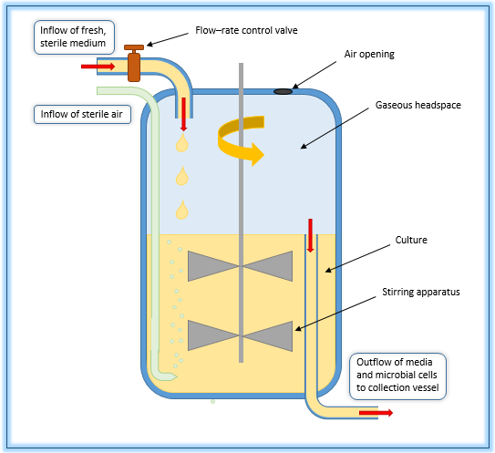
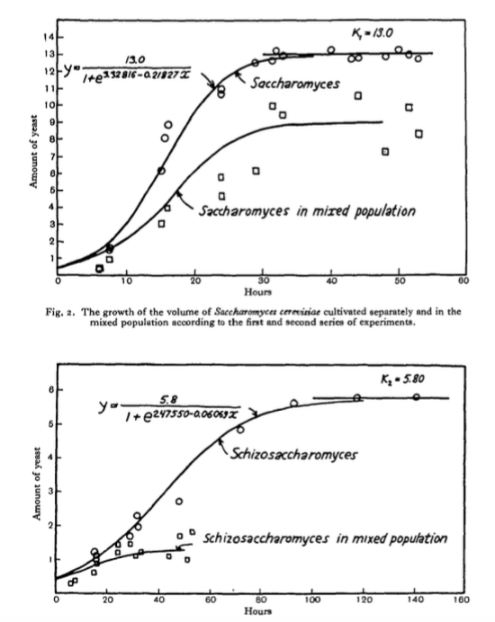

# Coupled Systems of Equations {#coupled-06}
In this section we will learn how to qualitatively understand systems of differential equations.  When analyzing a single differential equation we used the idea of a phase line to understand if a solution was stable or unstable.  Here we extend that to equations of more than one variable and investigate what we will call the *phase plane*.

## Model redux: flu with quarantine

In Section \@ref(intro-01) we studied the following model for the flu as a coupled system of equations:


\begin{equation}
\begin{split} 
\frac{dS}{dt} &= -kSI \\ 
\frac{dI}{dt} &= kSI \\
\end{split} (\#eq:flu-no-quarantine)
\end{equation}

In this scenario we are also going to consider that those who are infected are quarantined, proportional to the number infected, according to the following schematic:

```{r quarantine,engine='tikz',warning=FALSE,message=FALSE,echo=FALSE}
\begin{center}
\tikzstyle{vspecies}=[rectangle,minimum size=0.5cm,draw=black]
\begin{tikzpicture}[auto, outer sep=1pt, node distance=2cm]

\node [vspecies] (S) {$S$} ;
\node [vspecies, right of = S] (I) {$I$} ;
\draw [->,thick] (S) --  node {\small{$kS$}} (I) ;
\draw [->,thick] (I.south) --  node[right] {\small{$\beta$}} +(0pt,-1cm) ;
\end{tikzpicture}
\end{center}
```


Which gives us the following system of equations:
\begin{equation}
\begin{split}
\frac{dS}{dt} &= -kSI \\
\frac{dI}{dt} &= kSI - \beta I
\end{split} (\#eq:flu-quarantine)
\end{equation}

To find the equilibrium solutions we want to find values of $S$ and $I$ where the rates $\displaystyle \frac{dS}{dt}$ and $\displaystyle \frac{dI}{dt}$ are _both_ zero. This can be done by algebraically solving the system of equations:

\begin{equation}
\begin{split}
0 &= -kSI \\
0 &= kSI - \beta I
\end{split}
\end{equation}

Let's examine the first equation ($0 = -kSI$), which we can see is consistent when either $S=0$ and $I=0$.  These give us two options, which we then use in the second equation ($0 = kSI - \beta I$).  When $S=0$, then $0 = k\cdot 0 \cdot I - \beta I \rightarrow 0 = -\beta I$, which is consistent when $I=0$. So $(S_{*},I_{*}) = (0,0)$ is one equilibrium solution. The other case when $I=0$ gives us that any value of $S$ would be an equilibrium solution. Can you explain why?

Equation \@ref(eq:flu-quarantine) and its equilibrium solutions are an interesting example.  We call the equations $S=0$ and $I=0$ when $\displaystyle \frac{dS}{dt}=0$ as *nullclines* for $S$.  In a similar manner, the equations in $S$ and $I$ when $\displaystyle \frac{dI}{dt}=0$ are called *nullclines* for $I$.  Let's try to determine formulas for these equations:

\begin{equation}
\begin{split}
0 &= kSI-\beta I \\
0 &= I\cdot (kS - \beta )
\end{split}
\end{equation}

Because the last equation is factored as a product, nullclines for $I$ are either $I=0$ or $\displaystyle S = \frac{\beta}{k}$.

Nullclines are not equilibrium solutions by themselves - it is the _intersection_ of two different nullclines that determine equilibrium solutions. Figure \@ref(fig:quarantine-nullclines) shows the nullclines in the $S-I$ plane (since we have two equations), with $S$ on the horizontal axis and $I$ on the vertical axis.


```{r quarantine-nullclines, echo=FALSE,message=FALSE,warning=FALSE, fig.width=4,fig.height=3,fig.cap="Nullclines for Equation \\@ref(eq:flu-quarantine). To generate the plot we assumed $\\beta=1$ and $k=1$"}
k <- 1
beta <-1
ggplot(data.frame(x=c(0,2)), aes(x))  +
  labs(x = "S",y = "I") +
  #stat_function(fun=function(x)beta/k, geom="line", aes(colour="I' = 0"),size=2) +
  stat_function(fun=function(x)0, geom="line", aes(colour="S' = 0"),size=2) +
  stat_function(fun=function(x)0, geom="line", aes(colour="I' = 0"),size=2,linetype=2,inherit.aes = TRUE) +
geom_segment(data=data.frame(x1=0,x2=0,y1=0,y2=2),aes(x=x1,xend=x2,y=y1,yend=y2,colour="S' = 0"),size=2,inherit.aes = TRUE) +
geom_segment(data=data.frame(x1=beta/k,x2=beta/k,y1=0,y2=2),aes(x=x1,xend=x2,y=y1,yend=y2,colour="I' = 0"),size=2,inherit.aes = TRUE) +
#geom_vline(xintercept = beta/k, aes(colour="I' = 0"),size=2) +
    scale_color_discrete(name="Nullclines",breaks=c("S' = 0","I' = 0"))


```

A key thing to note is that where two different nullclines cross is an *equilibrium solution* to the system of equations.  This means that **both** $\displaystyle \frac{dS}{dt}$ and $\displaystyle \frac{dI}{dt}$ are zero at this point. Examining Figure \@ref(fig:quarantine-nullclines), there are three possibilities:

1. There is an equilibrium solution at $S=0$ and $I=0$ (otherwise known as the origin).  This equilibrium solution makes biological sense: if there is nobody susceptible or infected there are no flu cases (everyone is perfectly healthy - yay!) .
2. The entire horizontal axis is an equilibrium solution because $I=0$, which makes both $\displaystyle \frac{dS}{dt}$ and $\displaystyle \frac{dI}{dt}$ both zero.  There is a practical interpretation of this nullcline - whenever $I=0$, meaning there are no infected people around, so infection cannot occur. 
3. There is also a third possibility where the vertical line at $S=1$ crosses the horizontal axis ($S=1$, $I=0$), but that also falls under the second equilibrium solution.

Now that we have identified our nullclines and equilibrium solutions, we will add additional context with the *flow* of the solution.


### Adding context to our phase plane: slope fields
Let's go back to the idea of a phase plane, but this time we are going to add more context to our nullcline graph by evaluating different values of $S$ and $I$ into our system of equations and plot the _slope field_.

Table \@ref(tab:slope-arrows-06) evaluates the derivatives $\displaystyle \frac{dS}{dt}$ and $\displaystyle \frac{dI}{dt}$ in Equation \@ref(eq:flu-quarantine) for different values of $S$ and $I$.


```{r slope-arrows-06, echo=FALSE,message=FALSE,warning=FALSE}
k<-1
beta <- 1

dS <- function(S,I) {
  -k*S*I
}

dI <- function(S,I) {
  k*S*I-beta*I
}

S<- seq(0,4,length.out=10)
I <- seq(0,4,length.out=10)
model_out <- data.frame(S,I,dS_dt=dS(S,I),dI_dt=dI(S,I))
kable(model_out,caption = 'Values of $\\displaystyle \\frac{dS}{dt}$ and $\\displaystyle \\frac{dI}{dt}$ for the flu with quarantine model.')


```

Notice how the different values of $\displaystyle \frac{dS}{dt}$ and $\displaystyle \frac{dI}{dt}$ at each of the $S$ and $I$ values. We can plot each of the coordinate pairs of $\displaystyle \left( \frac{dS}{dt}, \frac{dI}{dt} \right)$ as a vector in the $(S,I)$ plane. We associate  $\displaystyle \frac{dS}{dt}$ with left-right motion, so positive  $\displaystyle \frac{dS}{dt}$ means pointing to the right.  Likewise, we associate  $\displaystyle \frac{dI}{dt}$ with up-down motion, so positive  $\displaystyle \frac{dI}{dt}$ means the vector points up. At the point $(S,I)=(1,1)$, we have an arrow that points directly to the west because and $\displaystyle \frac{dI}{dt} < 0$ and $\displaystyle \frac{dI}{dt} =0$.  Continuing on in this manner, by sequentially sampling points in the $(S,I)$ plane we get a vector field plot (Figure \@ref(fig:slope-field-06)), superimposed with the nullclines.

```{r slope-field-06, echo=FALSE,fig.width=4,fig.height=3, fig.cap="Phaseplane for Equation \\@ref(eq:flu-quarantine). To generate the plot we assumed $\\beta=1$ and $k=1$"}
k <-1
beta <- 1
s_window <- c(0,2)
i_window <- c(0,2)

systems_eq <- c(dsdt ~ -1*S*I,
                didt ~ 1*S*I-1*I )
 


 # We hacked out the color codes - can't do stat function on a phase plot!
phaseplane(systems_eq,'S','I',s_window,i_window) +
  stat_function(fun=function(x)0, geom="line", aes(colour="S' = 0"),size=2) +
  stat_function(fun=function(x)0, geom="line", aes(colour="I' = 0"),size=2,linetype=2,inherit.aes = TRUE) +
  geom_vline(xintercept = 0,color='#00bfc4',size=2)  +
  geom_vline(xintercept = beta/k,color='#f8766d',size=2)  +
  #geom_vline(xintercept = beta/k, aes(colour="I' = 0"),size=2) +
  scale_color_discrete(name="Nullclines",breaks=c("S' = 0","I' = 0"))


```


### Motion around the nullclines

We can also extend the motion around the nullclines to investigate the stability of an equilbrium solution. With a one dimensional differential equation we used a number line to quantify values where the solution is increasing / decreasing.  The problem with several differential equations is that the notion of "increasing" or "decreasing"" becomes difficult to understand - there is an additional degree of freedom! Simply put, in a plane you can move left/right *or* up/down. The benefit for having nullclines is that they **isolate** the motion in one direction.  When $\displaystyle \frac{dS}{dt}=0$ the only allowed motion is up and down; when $\displaystyle \frac{dI}{dt}=0$ the only allowed motion is left and right.

In general for a two dimensional system: 
- When a horizontal axis variable has a nullcline, the only allowed motion is up/down.
- When a vertical axis variable has a nullcline,  the only motion is up/down.

Applying this knowledge to Equation \@ref(eq:flu-quarantine), if we choose points where $I'=0$ then we know that the only motion is to the left and the right because $S$ can still change along that curve.  If we choose points where $S'=0$ then we know that the only motion is to the up/down because $I$ can still change along that curve (Figure \@ref(fig:nullclines-quarantine-explained)).


```{r nullclines-quarantine-explained, echo=FALSE, fig.width=5,fig.height=4,fig.cap="Nullclines for Equation \\@ref(eq:flu-quarantine) with context on the direction of the motion."}
k <- 1
beta <-1
ggplot(data.frame(x=c(0,2)), aes(x))  +
  labs(x = "S",y = "I") +
  #stat_function(fun=function(x)beta/k, geom="line", aes(colour="I' = 0"),size=2) +
  stat_function(fun=function(x)0, geom="line", aes(colour="S' = 0"),size=2) +
  stat_function(fun=function(x)0, geom="line", aes(colour="I' = 0"),size=2,linetype=2,inherit.aes = TRUE) +
geom_segment(data=data.frame(x1=0,x2=0,y1=0,y2=2),aes(x=x1,xend=x2,y=y1,yend=y2,colour="S' = 0"),size=2,inherit.aes = TRUE) +
geom_segment(data=data.frame(x1=beta/k,x2=beta/k,y1=0,y2=2),aes(x=x1,xend=x2,y=y1,yend=y2,colour="I' = 0"),size=2,inherit.aes = TRUE) +
#geom_vline(xintercept = beta/k, aes(colour="I' = 0"),size=2) +
    scale_color_discrete(name="Nullclines",breaks=c("S' = 0","I' = 0")) +
  geom_text(aes(x=0.3,y=1.5,label="Along this curve \n you have only \n up/down motion"),hjust="left") +
  geom_text(aes(x=1.1,y=1.40,label="Along this curve \n you have only \n left/right motion"),hjust="left") +
  geom_curve(aes(x = 0.4, y = 1.25, xend = 0.05, yend = 1.0),
             curvature = 0.05, angle = 15,
             arrow = arrow(length = unit(0.25,"cm"))) +
  geom_curve(aes(x = 1.3, y = 1.17, xend = 1.05, yend = 0.8),
             curvature = 0.05, angle = 15,
             arrow = arrow(length = unit(0.25,"cm"))) +
  xlim(c(0,2)) + ylim(c(0,2))

```


## Determining stability of an equilbrium solution
The picture of the phase plane with the nullcline qualitatively tells us about the stability of an equilibrium point.  Once of the equilibrium solutions is at the origin $(S,I)=(0,0)$.  As before we want to investigate if the equilibrium solution is stable or unstable.

Figure \@ref(fig:zoom-quarantine-plane) zooms in the phaseplane at the  equilibrium solution at $S=0$, $I=0$:

```{r, label="zoom-quarantine-plane", echo=FALSE,fig.width=4,fig.height=3,fig.cap="Zoomed in view of the phaseplane for Equation \\@ref(eq:flu-quarantine)"}
k <-1
beta <- 1

systems_eq <- c(dsdt ~ -1*S*I,
                didt ~ 1*S*I-1*I )


 # We hacked out the color codes - can't do stat function on a phase plot!
phaseplane(systems_eq,'S','I',c(0,0.25),c(0,0.25))  +
  stat_function(fun=function(x)0, geom="line", aes(colour="S' = 0"),size=2) +
  stat_function(fun=function(x)0, geom="line", aes(colour="I' = 0"),size=2,linetype=2,inherit.aes = TRUE) +
  geom_vline(xintercept = 0,color='#00bfc4',size=2)  +
  #geom_vline(xintercept = beta/k,color='#f8766d',size=2)  +
  #geom_vline(xintercept = beta/k, aes(colour="I' = 0"),size=2) +
  scale_color_discrete(name="Nullclines",breaks=c("S' = 0","I' = 0"))

```


As you can see the arrows appear to be pointing into and towards the equilibrium solution.  So we would classify this equilbrium solution as *stable*.


## Generating a phase plane in `R`
Let's take what we learned from the case study of the flu model with quarantine to qualitatively analyze a system of differential equations:

- We determine nullclines by setting the derivatives equal to zero.
- Equilibrium solutions occur where nullclines for the two different equations intersect.
- The arrows in the phase plane help us characterize the stability of the equilibrium solution.

To determine the phaseplane diagram `demodelr` package has some basic functionality to generate a phase plane. Consider the following system of differential equations (Equation \@ref(eq:phase-example)):

\begin{equation}
\begin{split}
\frac{dx}{dt} &= x-y \\
\frac{dy}{dt} &= -x+y
\end{split} (\#eq:phase-example)
\end{equation}


In order to generate a phaseplane diagram for Equation \@ref(eq:phase-example) we need to define functions for $x'$ and $y'$, which I will annotate as $dx$ and $dy$ respectively.  We are going to collect these equations in one vector called `system_eq`, using the tilde (~) as a replacement for the equals sign:

```{r}
system_eq <- c(dx ~ x-y,
               dy ~ x+y)

```

Then what we do is apply the command `phaseplane`, which will generate a vector field over a domain:

```{r,fig.width=4,fig.height=3,fig.cap="Phaseplane diagram for Equation \\@ref(eq:phase-example)"}
phaseplane(system_eq,'x','y')
# The values in quotes are the labels for the axes and to identify the variables - they are needed!

```

The command `phaseplane` has an option called `eq_soln` that will if there are any equilibrium solutions to be found and report them to the console.  For example try running `phaseplane(system_eq,'x','y',eq_soln=TRUE)` and see what gets output to console.   While this option lists equilibrium solutions, you should confirm them with the differential equation through direct solving.


### Generating a phase line in R:
From Section \@ref(phase-05) we discussed how to construct phaselines by hand.  It turns out that the command `phaseplane` can also plot phase lines.  Let's take a look at an example first and then discuss how that it works.


```{example}
A colony of bacteria growing in a nutrient-rich medium deplete the nutrient as they grow. As a result, the nutrient concentration $x(t)$ is steadily decreasing.  Determine the phaseline for the following differential equation:
  
  \begin{equation}(\#eq:bacteria-colony)
\frac{dx}{dt} = - 0.7 \cdot \frac{x \cdot (3- x)}{1 + x}
\end{equation}


```

The R code to generate this phaseline is the following:

```{r, fig.width=4,fig.height=3}
# Define the windows where we make the plots
t_window <- c(0,3)
x_window <- c(0,5)

# Define the differential equation
system_eq <- c(dt ~ 1,
               dx ~ -0.7 * x*(3-x)/(1+x))

phaseplane(system_eq,"t","x",t_window,x_window)


```

Notice how we have the equation $dt = 1$.  What we are doing is re-writing the differential equation with a new variable $s$ (Equation \@ref(eq:single-phase)):

\begin{equation}
\begin{split}
\frac{dt}{ds} &= 1 \\
\frac{dx}{ds} &= - 0.7 \cdot \frac{x \cdot (3- x)}{1 + x}
\end{split} (\#eq:single-phase)
\end{equation}

The differential equation $\displaystyle \frac{dt}{ds} = 1$ has solution $s=t$, so in essence is the same as Equation \@ref(eq:bacteria-colony) (perhaps a little more complicated).  However re-writing this system was a quick and handy workaround to re-use code.

## Exercises

```{exercise}
Determine equilibrium solutions for Equation \@ref(eq:phase-example).
```

&nbsp;

```{exercise}
This problem considers the following system of differential equations:
\begin{equation}
\begin{split}
\frac{dx}{dt} &= y \\ 
\frac{dy}{dt} &= -x 
\end{split}
\end{equation}


a. Determine the equations of the nullclines and equilibrium point of this system of differential equations.
b. Modify the function `phaseplane` to generate a phaseplane of this system.
c. For each point along a nullcline, determine the resulting motion (up-down or left-right).
d. Based on the work you generated, determine if the equilibrium solution is *stable* or *unstable*.
e. Verify that the functions $x(t) = \sin(t)$ and $y=\cos(t)$ is one solution to this system of differential equations.

```
 
 &nbsp;
 
```{exercise}
Consider the following system of differential equations:

\begin{equation} 
\begin{split}
\frac{dx}{dt} &= y \\ 
\frac{dy}{dt} &= 3x^{2}-1 
\end{split}
\end{equation}

a. Determine the equations of the nullclines and equilibrium solutions for this system of differential equations.
b. For each point along a nullcline, determine the resulting motion (up-down or left-right).
c. Modify the function \texttt{phaseplane} to generate a phaseplane of this system.
d.  Make a hypothesis to classify if the equilibrium point is *stable* or *unstable*.

```

&nbsp;


<!-- %Thornley pg 80 -->
```{exercise}
(Inspired by @thornley_plant_1990) A plant grows propritional to its current length $L$.  Assume this proportionality constant is $\mu$, whose rate also decreases proportional to its current value.  The system of equations that models this plant growth is the following:
\begin{equation}
\begin{split}
\frac{dL}{dt} &= \mu L \\ 
\frac{d\mu}{dt}  &= -0.1 \mu \\
\end{split}
\end{equation}

a. Explain why $L=0$ and $\mu=0$ is the only equilibrium solution to this differential equation.
b. Modify the function \texttt{phaseplane} to generate a phaseplane of this system.
c. Is the origin a stable equilibrium solution?


```
&nbsp;


```{exercise}
(Inspired by @logan_mathematical_2009) Red blood cells are formed from stem cells in the bone marrow.  The red blood cell density $r$ satisfies an equation of the form

\begin{equation}
\frac{dr}{dt} = \frac{0.2r}{1+r^{2}} -  0.1 r,
\end{equation}


a. What are the equilibrium solutions for this differential equation?
b. Modify the function \texttt{phaseplane} to generate a phaseline for this differential euqation for $0 \leq t \leq 5$ and $0 \leq r \leq 5$.
c. Based on the phaseline, are the equilibrium solutions stable or unstable?


```
&nbsp;

 <!-- Van den Berg page 19 -->
```{exercise}
(Inspired by @berg_mathematical_2011) Organisms that live in a saline environment biochemically maintain the amount of salt in their blood stream.  An equation that represents the level of $S$ in the blood is the following:

$$ \frac{dS}{dt} = 1 + 0.3 \cdot (3 - S) $$

a. What are the equilibrium solutions for this differential equation?
b. Modify the function \texttt{phaseplane} to generate a phaseline for this differential euqation for $0 \leq t \leq 10$ and $0 \leq S \leq 10$.
c. Based on the phaseline, are the equilibrium solutions stable or unstable?


```
&nbsp;


<!-- From van den Berg, pg 59, exercise 3.13 -->
```{exercise}
(Inspired by @berg_mathematical_2011) The core body temperature ($T$) of a mammal is coupled to the heat production (scaled by heat capacity $Q$) with the following system of differential equations:
 \begin{equation}
\begin{split}
\frac{dT}{dt} &= Q + 0.5 \cdot (20-T) \\ 
\frac{dQ}{dt} &= 0.1 \cdot (38-T),
\end{split}
\end{equation}

 

a. Determine the equations of the nullclines and equilibrium point of this system of differential equations.
b. For each point along a nullcline, determine the resulting motion (up-down or left-right).
c.  Make a hypothesis to classify if the equilibrium point is *stable* or *unstable*.

 
```

&nbsp;


```{exercise}
Consider the following system of differential equations for the lynx-hare model:
  \begin{align}
\frac{dH}{dt} &= r H - b HL \\
\frac{dL}{dt} &=ebHL -dL
\end{align}


a. Determine the steady states of this system of differential equations.
b. Determine equations for the nullclines, expressed as $L$ as a function of $H$.  There should be two nullclnes for each rate. 

```

&nbsp;

<!-- Van den berg, page 102 -->


```{r,label="chemostat-06",echo=FALSE,out.width = "50%",fig.cap="An example of a chemostat."}

```


```{exercise}
(Inspired by @berg_mathematical_2011) A chemostat is a tank used to study microbes and ecology, where microbes grow under controlled conditions.  Think of this like a large tank with nutrient-rich water being continuously cycled through, as shown in the following Figure \@ref(fig:chemostat-06). (Source: [Wikipedia](https://en.wikipedia.org/wiki/Chemostat)). Equations that describe the microbial biomass $W$ and the nutrient concentration $C$ (in the culture) are the following:

\begin{equation}
\begin{split}
\frac{dW}{dt} &= \mu W - F \frac{W}{V} \\
\frac{dC}{dt} &= D \cdot (C_{R}-C) - S \mu \frac{W}{V},
\end{split}
\end{equation}

where we have the following parameters: $\mu$ is the per capita reproduction rate, $F$ is the flow rate, $V$ is the volume of the culture solution, $D$ is the dilution rate, $C_{R}$ is the concentration of nutrients entering the culture, and $S$ is a stoichiometric conversion of nutrients to biomass. 

a. Write the equations of the nullclines for this differential equation.
b. Determine the equilibrium solutions for this system of differential equations.
c. Generate a phaseplane for this differential equation with the values $\mu=1$, $D=1$, $C_{R}=2$ and $S=1$ and $V=1$.
d. Classify the stability of the equilbrium solutions.

```
 
&nbsp;

 
```{r label="gause-06", echo=FALSE,out.width = "50%",fig.cap="Population results from two yeast species growing in competition. From @gause_experimental_1932."}

```

 
 
```{exercise}
 A classical paper *Experimental Studies on the Struggle for Existence: I. Mixed Population of Two Species of Yeast* by @gause_experimental_1932 examined two different species of yeast growing in competition with each other. The differential equations given for two species in competition are:

\begin{equation}
\begin{split}
\frac{dy_{1}}{dt} &= -b_{1} y_{1} \frac{(K_{1}-(y_{1}+\alpha y_{2}) )}{K_{1}} \\
\frac{dy_{2}}{dt} &= -b_{2} y_{2} \frac{(K_{2}-(y_{2}+\beta y_{1}) )}{K_{2}}, \\
\end{split}
\end{equation}

 where $y_{1}$ and $y_{2}$ are the two species of yeast with the parameters $b_{1}, \; b_{2}, \; K_{1}, \; K_{2}, \; \alpha, \; \beta$ describing the characteristics of the yeast species.

a. Determine the equilibrium solutions for this differential equation.  Express your answer in terms of the parameters $b_{1}, \; b_{2}, \; K_{1}, \; K_{2}, \; \alpha, \; \beta$.
b. Gause computed the following values of the parameters: $b_{1}=0.21827, \; b_{2}=0.06069, \; K_{1}=13.0, \; K_{2}=5.8, \; \alpha=3.15, \; \beta=0.439$.  Using these values, what would be the predicted values for the equilibrium solutions?
c. Use the function \texttt{systems} to solve this system of differential equations numerically.
d. Figure \ref{fig:gause-06} is from @gause_experimental_1932 and shows the experimental population values ``in mixed population''.  Use the graph to estimate the equilibrium solutions for both species. How close (or how far from) the equilibrium solutions are Gause's results to your computed equilibrium solutions?

```