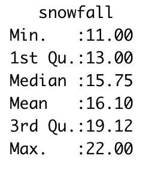

# The bootstrap method {#bootstrap-11}


In Sections and \@ref(likelihood-09) and \@ref(cost-fns-10) we saw how the parameter estimation problem is related to optimizing the likelihood or cost function.  Figure \@ref(fig:nonlin-cost) shows the cost function for the nutrient equation $\displaystyle y = c x^{1/\theta}$ using the dataset `phosphorous`:

```{r nonlin-cost,fig.cap="Nonlinear cost function plot for `phosphorous` data set."}
# Can we do this with compute likelihood?
my_model <- daphnia ~ 1.737*algae^(1/theta)

# This allows for all the possible combinations of parameters
parameters <- tibble(theta = seq(1,25,length.out=200))


out_values <- compute_likelihood(my_model, phosphorous, parameters,logLikely = TRUE)

out_values$likelihood %>%
  ggplot(aes(theta,y=l_hood)) + 
  geom_line() +
  labs(x=expression(theta),y=expression(S(theta)))

```

While Figure \@ref(fig:nonlin-cost) shows a clearly defined minimum around $\theta \approx 6$, the shape of the cost function is not quadratic (like Figure \@ref(fig:priorcost)).  For cases like these direct optimization of the cost function using techniques learned in calculus are not computationally feasible.  We need to efficiently examine different combinations of parameters, their model output, and to get a result of the sample.

In this section we are going to explore another way to approach this problem. An alternative approach uses the idea of random number generation and *sampling*, which can efficiently determine the the minimum through direct evaluation.  To understand the idea of sampling we will study an approach called *bootstrapping*.


## Plotting histograms in R
In Chapter \@ref(09-likelihood) we discussed probability distributions.  Here we are going to discuss them a little more, but now we will first discuss plotting histograms in R.  A quick recap of a histogram: this is a binned plot of data, where there are some predefined bins and we count the number of observations in each bin.  One way we can do this for (smaller) data is a dot plot, where this is a dot in each observation.

Consider the dataset of snowfall observations from weatherstations in Minnesota shown in Table \@ref(table:snow-table), with the following table.

```{r snow-table}
knitr::kable(snowfall, caption = "Weather station data from a Minnesota snowstorm.")
```

A histogram is an easy way to view the distribution of measurements. Doing a histogram in R is easy to do:


```{r}
ggplot(data = snowfall) + 
  geom_histogram(aes(x = snowfall),) +
  labs(x='Snowfall amount',
       y='Number of observations')
```

This code introduces `geom_histogram`.  Notice , which has two key inputs:

- The code `aes(x = snowfall)` is computing the histogram for the `snowfall` column in the dataset `snowfall`. You may have received a warning about the bins ``stat_bin()` using `bins = 30`. Pick better value with `binwidth``, so let's adjust the number of bins to `r round(sqrt(length(demodelr::snowfall$snowfall)),digits=0)`:

```{r,fig.width=4,fig.height=3}

ggplot() + 
  geom_histogram(data = snowfall, aes(x = snowfall),bins = 4) +
  labs(x='Snowfall amount',
       y='Number of observations')

```

Your code may look blockier, but that is ok.


## Statistical theory: Sampling distributions
To understand the process of *sampling*, let's take a look at an example.  Figure \@ref(fig:normal-small) is a histogram of 50 random samples of the standard normal distribution ($\mu=0$ and $\sigma = 1$):

```{r normal-small,fig.width=4,fig.height=3}

my_data <- tibble(samples = rnorm(50))

ggplot() + 
  geom_histogram(data = my_data, aes(x = samples),bins = 10) +
  labs(x='Samples',
       y='N')


```


This histogram *looks* like a normal distribution, but since we only have 50 samples that may not be enough data to adequately justify that conclusion, especially in a statistical sense. Now let's see what happens if we increase the number of samples by factors of 10:

```{r more-random-samples,echo=FALSE,fig.cap="More random samples of the normal distirubtion."}
x_bar <- list()
x <- list()
for (i in 1:5) {
  x[[i]] <- data.frame(i_val=i,x_val=rnorm(10^i))
  x_bar[[i]] <- data.frame(i_val=i,i_bar=mean(x[[i]]$x_val))
}

x <- bind_rows(x)
x_bar <- bind_rows(x_bar)


x  %>% mutate(N=10^i_val) %>%
  ggplot(aes(x=x_val)) +
geom_area(data=data.frame(x_val=seq(-5,5,length=200),y_val=dnorm(seq(-5,5,length=200))),
          aes(x=x_val,y=y_val),alpha=.2, fill="#FF6666") + geom_histogram(aes(y=..density..),bins=100,alpha=0.4) + facet_wrap(.~N,scales='free_y',labeller = label_both) +
  xlab('Samples') + ylab('N')


```

Figure \@ref(fig:more-random-samples) also shows the true distribution shaded in red - clearly as the number of data points increases the more the random sample approaches the true distribution. This is the concept underlying statistical inference: process of drawing conclusions about the entire population based on a sample.

When we discuss likelihood and cost functions, we assume that the parameters follow some underlying probability distribution (such as normal, uniform, etc).  However sometimes if the model is extremely nonlinear, the cost function ends up being non-linear.  However by *sampling* the distribution we can characterize the distribution. 


## Sampling the empirical distirbution
We can apply this same principle to measurements.  The distribution of measurements can be called an *empirical distribution*.  To examine data, we will use weather and precipitation today, which is collected in a cooperative [network of local observers](https://www.cocorahs.org/ViewData/ListDailyPrecipReports.aspx). These stations come from the Twin Cities of Minneapolis and St. Paul and surrounding suburbs:


```{r,echo=FALSE}
kable(precipitation[1:10,])

```

While it is great to have only one value is reported for precipitation amounts, so the question is:
*What could be a representative number for the average amount of rainfall received for this storm?*

Let $R$ be the distribution of rainfall in the Twin Cities.  The measurements are *samples* of this distribution.  One way to say is that the average of the precipitation data (`r  mean(precipitation$precip,na.rm=TRUE)` inches) is good enough, but what we don't know is how well that average value approximates the expected value of the distribution for $R$.

As an exploratory data analysis approach, one way we can do this is by a histogram of the precipitation measurements:

```{r,fig.width=4,fig.height=3}
ggplot() + 
  geom_histogram(data = precipitation, aes(x = precip),bins = 4) +
  labs(x='Precipitation amount',
       y='Number of observations')

```


The precipitation measurement illustrates the difference between a population (the true distribution of measurements) and a sample (what people observe). The histogram shown is called the *empirical distribution* of these data. For the purposes we get here, we are after what is called the *sample statistic*, which is usually the mean or standard deviation. 

This distribution looks bimodal with a lot of variability.  How could we account for the representative value of the distribution $R$? Each of the entries in the `precipitation` data frame represents a measurement made by a particular observer. To get the true distribution we would need to add more observers (such as when we sampled the normal distribution), but that isn't realistic as the event has already passed.

The way around this is a bootstrap sample, which is a sample of the original dataset with replacement.  Sampling with replacement is the process of remaking a dataset, but you get to reselect *from the entire dataset at the same time*.  This is easily done with the command `slice_sample`:

```{r}
p_new <- slice_sample(precipitation,prop=1, replace = TRUE)
```
What this code does is sample the `precipitation` data frame with replacement (`replace = TRUE`).  Here is how replacement works: say you have each of the precipitation measurements written on a piece of paper in a hat.  You draw one slip of paper, record the measurement, and then replace that slip of paper back in the hat to draw again, until you have as many measurements as the original data frame (in this case this is `r dim(precipitation)[1]`.  The command `prop=1` means that we are sampling 100% of the `precipitation` data frame.

One thing that we can do is compute the mean (average) and the standard deviation of the sample:

```{r}
slice_sample(precipitation,prop=1, replace = TRUE) %>%
  summarize(mean = mean(precip,na.rm=TRUE),
            sd = sd(precip,na.rm=TRUE))
```

Let's break this code down:

- The command `summarize` is collapsing the `precipitation` data frame and computes the mean and the standard deviation `sd` of the column `precip`.  We have the command `na.rm=TRUE` to remove any `NA` values that may affect the computation.
- How this code runs is first to do the sampling, and then the summary.

If we want to run this multiple times we need some more powerful functionality here.  The `purrr` package has the wonderful command `map`, which allows you to quickly iterate through a list quickly.

```{r}
 map_df(1:10 ,
        ~(
          slice_sample(precipitation,prop=1, replace = TRUE) %>%
                    summarize(mean = mean(precip,na.rm=TRUE),
                              sd = sd(precip,na.rm=TRUE)) 
          )  # Close off the tilde ~ ()
        )  # Close off the map_df
```

What should be returned is a dataframe with columns `mean` and `sd` that represents the mean and standard deviation of each bootstrap sample. The process of randomly sampling a dataset is called *bootstraping*.  

Let's review this code bit by bit.  Notice that I've written this on multiple lines to aid in reading.  The basic structure is `map_df(1:N,~(COMMANDS))`, where `N` is the number of times you want to run your code (in this case `N=10`).  The second part `~(COMMANDS)` lists the different commands we want to re-run (in this case it is our mean and standard deviation of the data frame).


I can appreciate this programming might be a little tricky to understand and follow - don't worry - the goal is to give you a tool that you can easily adapt to a situation.  What I would do in a use-case scenario is to first get a working example (where you compute the mean and standard deviation), and then use the `map_df` to return your result.

The final step would be to visualize the mean and the standard deviation. Let's re-run our example and then plot:

```{r}
 
bootstrap_samples <- map_df(1:1000 ,
        ~(
          slice_sample(precipitation,prop=1, replace = TRUE) %>%
                    summarize(mean = mean(precip,na.rm=TRUE),
                              sd = sd(precip,na.rm=TRUE)) 
          )  # Close off the tilde ~ ()
        )  # Close off the map_df

# Now make the histogram plots for the mean and standard deviation:
  ggplot(bootstrap_samples) +
    geom_histogram(aes(x=mean))
  
  ggplot(bootstrap_samples) +
    geom_histogram(aes(x=sd))

```

Excellent!  This is shaping up nicely. Once we have sampled as much we want, *then* investigate the distribution of the computed sample statistics (we call this the *sampling distribution*).  It turns out that sample statistics (such as the mean or the standard deviation) will in the long run - approximate the true distribution statistic (such as the mean or standard deviation). This is an example of a non-parametric bootstrap - meaning we are not trying to force a priori a distribution onto the data.

One last task: summarize the distribution of bootstrap means and standard deviations. We will do this using a confidence interval, which comes from the percentiles of the distribution.  Let's take a look at the distribution of bootstrap means.  The 2.5 percentile is approximately 2.7 inches.  This means 2.5% of the distribution is at 2.7 inches or less.  The median (50th percentile) is 2.9, so half of the distribution for is 2.9 inches or less.  The 97.5 percentile is approximately 3.1, so 97.5% of the distribution is 3.1 inches or less. If we take the difference between 2.5% and 97.5% that is 95%, so 95% of the distribution is contained between 2.7 and 3.1 inches.  If we are using the bootstrap mean, we would report that the median rainfall is 2.9 with a 95% confidence interval of 2.7 to 3.1. The confidence interval to give some indication of the uncertainty in the measurements.

Here is how we would compute these different statistics using the `quantile` command, which we need to do separately for the mean and standard deviation:

```{r}

quantile(bootstrap_samples$mean,probs=c(0.025,0.5,.975))
quantile(bootstrap_samples$sd,probs=c(0.025,0.5,.975))

```

Notice how we using the `probs=c(0.025,0.5,.975)` command to compute the different quantiles - they need to be scaled between 0 and 1.

This code works through the bootstrap for 100 samples.  


## Bootstapping with linear regression
Hopefully you can see how much more useful the bootstrap is in terms calculating sample statistics.  Another neat application of the bootstrap is determining  and expands the provenance of the data. A key goal is to get at the population level parameters, rather than the data level parameters.  Can we use this as a modeling tool? - YES!

In this case, the “population” represent the distribution on possibilities of parameters.  A set of measurements is a *sample* of these parameters.   What we can do is a bootstrap sample for the temperature data, fit a quadratic function to each of the new datasets, and then look at the distribution in parameter values.

We are going to return to our example of the global temperature dataset from Section \@ref(linear-regression-08), and do the following steps:

- Do a bootstrap sample of the data 100 times.
- With each sample, fit a quadratic function.
- Following each fit, examine the histogram of each fitting coefficient.


Here is how we can do this in with the command `bootstrap` from the `modelr` pacakge:
```{r coeff-plot-11,fig.width=4,fig.height=3}

# Define the regression formula
regression_formula <- globalTemp ~ 1 + yearSince1880 + I(yearSince1880^2)

# Generate the bootstrap samples
  boot <- modelr::bootstrap(global_temperature, n=100)
  
  # You might not need to modify this code as much
  models <- map(boot$strap, ~ lm( regression_formula, data = .))
  tidied <- map_df(models, broom::tidy, .id = "id")
  
  # Make the histogram.  We will make a facetted plot
  ggplot(data=tidied) +
    geom_histogram(aes(x=estimate)) +
    facet_wrap(~term,scales="free")
```

There several new elements of this code, so let's break this down bit by bit:

- The code `boot <- modelr::bootstrap(global_temperature, n=100)` creates 100 bootstrap samples of the `global_temperature` dataset.  The list `boot` has two entries: (1) `.id` which is a reference (1 to 100) of a particular bootstrap sample and (2) `strap` which contains the information about the bootstrap sample.
- The next portion of the code applies the `map` command (similar to `map_df`) to first compute the linear regression for each bootstrap sample.  The linear regression fits are stored in the data frame `models`.
- Finally we extract out the information about parameters using the command `tidy` from the `broom` package.  The data frame `tidied` is organized by the bootstrap sample `.id` and has several columns, but we are going to focus on two of them: `estimate`, which tells you the numerical value of the coefficient in the column `term`.  Other information about error estimates and statistical significance are included. 
- In our histogram's horizontal axis we want to plot the value of the quantitative variable `estimate`.  
- You should see an interesting plot here. We are facetting the histograms by the coefficients of the histogram (hence the term `facet_wrap(~term,scales="free")`, which says "plot a histogram for each variable in the column term".  We use `scales="free"` because each coefficient has a different range of values. (You can see the difference if you remove `scales="free"` from the plotting command.)


Figure \@ref(fig:coeff-plot-11) is an example of a "small multiples" plot - the title of the plot is the value of the coefficient multiplying each term:

**Small multiple title** | **Coefficient of ** $T=a + bY + cY^{2}$
-------------| -------------
    `Intercept` | $a$
    `yearSince1880` |  $b$
    `I(yearSince1880^2)` | $c$ 
 
Notice that with the bootstrap we can get information about the distribution of the estimated parameters, which includes the median and the 95% confidence interval.  This is super useful in reporting results from parameter estimates.

The idea of sampling with replacement, generating a parameter estimate, and then repeating over several iterations is at the heart of many computational parameter estimation methods.  Such an approach helps make non-linear problems more tractable.

While we did a bootstrap parameter estimate on a quadratic function, this also works for a log transformation of a dataset, as with the `phosphorous` dataset of algae and daphnia we have studied previously.  You will investigate this in one of the homework exercises.

This section extended your abilities in R by showing you how to generate histograms, sample a dataset, and compute statistics.  The goal here is to give you examples that you can re-use in this section's exercises.  Enjoy!

\newpage 

## Exercises
```{exercise}
Histograms are an important visualization tool in descriptive statistics. Read the following essays on histograms, and then summarize 2-3 important points of what you learned reading these articles.


- (http://tinlizzie.org/histograms/)[Visualizing histograms]
- (https://flowingdata.com/2017/06/07/how-histograms-work/)[How histograms work]
- (https://flowingdata.com/2014/02/27/how-to-read-histograms-and-use-them-in-r/)[How to read histograms and use them in R]

```
&nbsp;

<!-- Taken from 373 textbook Fall 2020 -->
```{exercise snow-eurasia}
Average snow cover from 1970 - 1979 in October over Eurasia (in million km$^{2}$) were reported as the following:

\begin{equation*}
\{6.5, 12.0, 14.9, 10.0, 10.7, 7.9, 21.9, 12.5, 14.5, 9.2\}
\end{equation*}

\begin{enumerate}[label=\alph*.]
\item Create a histogram for these data.
\item Compute the sample mean and median of this dataset.
\item What would you report as a representative or typical value of snow cover for October?  Why?
\item The 21.9 measurement looks like an outlier.  What is the sample mean excluding that measurement?
\end{enumerate}
```

&nbsp;

```{exercise}
Consider the equation $\displaystyle S(\theta)=(3-1.5^{1/\theta})^{2}$. This function is an idealized example for the cost function in Figure \@ref(nonlin-cost).

\begin{enumerate}[label=\alph*.]
\item What is $S'(\theta)$?
\item Make a plot of $S'(\theta)$.  What are the locations of the critical points?
\item Algebraically solve $S'(\theta)=0$.  Does your compute critical point match up with the graph?
\end{enumerate}
```
&nbsp;
```{exercise}
Repeat the bootstrap sample for the precipitation dataset where the number of bootstrap samples is 1000 and 10000.  Report the median and confidence intervals for the mean and the standard deviation of $R$.  What do you notice as the number of bootstrap samples increases?
```
&nbsp;
```{exercise}
Using the data in Exercise \@ref(exr:snow-eurasia), do a bootstrap sample with $N=1000$ to compute the a bootstrap estimate for the mean and the 95% confidence interval for October snowfall cover in Eurasia.
```
&nbsp;

```{exercise}
We computed the 95% confidence interval using the `quantile` command.  An alternative approach to summarize a distribution is with the `summary` command.  Here is the output for the `summary` command for a dataframe:
  
  
  
We call this command using `summary(data_frame)`, where `data_frame` is the particular dataframe you want to summarize.  The output reports the minimum and maximum values of a dataset. The output `1st Qu.` and `3rd Qu.` are the 25th and 75th percentiles.

Do 1000 bootstrap samples using the data in Exercise \@ref(exr:snow-eurasia) and report the output from the `summary` command.
```

&nbsp;

```{exercise}
The dataset `snowfall` lists the snowfall data from a snowstorm that came through the Twin Cities on April 14, 2018.

\begin{enumerate}[label=\alph*.]
\item Make an appropriately sized histogram for the snowfall observations.
\item What is the mean snowfall?
\item Do a bootstrap estimate with $N=100$ and $N=1000$ and plot their respective histograms.
\item For each of your bootstrap samples ($N=100$ and $N=1000$ and compute the mean and 95% confidence interval for the bootstrap distribution.
\item What would you report for the mean and 95% confidence interval for this snowstorm?
\end{enumerate}
```
&nbsp;
```{exercise}
This question tackles the dataset \texttt{global\_temperature} to determine plausible models for a relationship between time and average global temperature.  For this exercise we are going to look the variability in bootstrap estimates for models up to fourth degree.

Using the function \texttt{bootstrap\_model}, generate a bootstrap sample of $n=1000$ for each of the following functions.
\begin{itemize}
     \item Linear: $T=a+bY$
     \item Quadratic:  $T=a+bY+cY^{2}$
     \item Cubic: $T=a+bY+cY^{2}+dY^{3}$
     \item Quartic: $T=a+bY+cY^{2}+dY^{3}+eY^{4}$
\end{itemize}

Include in your write up the graph of the data with the bootstrap predictions and the prediction from the linear regression model.  How does the variability in the parameters change ($a,b,c,d,e$) as more terms in the model are added? How does the variability in the bootstrap predictions change as more terms in the model are added?

```
&nbsp;
```{exercise}
Similar to the problems we have worked with before, the equation that relates a consumer's nutrient content (denoted as $y$) to the nutrient content of food (denoted as $x$) is given by: $\displaystyle y = c x^{1/\theta}$, where $\theta \geq 1$ and $c$ are both constants is a constant.  We will be using the dataset `phosphorous`.

\begin{enumerate}
\item Do 1000 bootstrap samples for this dataset.
\item To find $c$ and $\theta$ we can apply logrithms to express this as a linear equation of this equation.  (See Exercise \ref{exr:log-linear-08}). Do a linear model fit for this log-transformed equation.
\item Generate histograms for bootstrap-fitted parameters for your log-transformed equation.
\item What are the median and 95% confidence intervals for the  bootstrap-fitted parameters?
\item Using the function \texttt{bootstrap\_model}, generate a bootstrap sample of $n=1000$ for the linear (log transformed) equation.
\item Translate these bootstrap confidence intervals of your fitted slope and intercept back into the values of $c$ and $\theta$.
\item These confidence intervals seem pretty large.  What would be some strategies we could employ to narrow these confidence intervals?
\end{enumerate}
```


