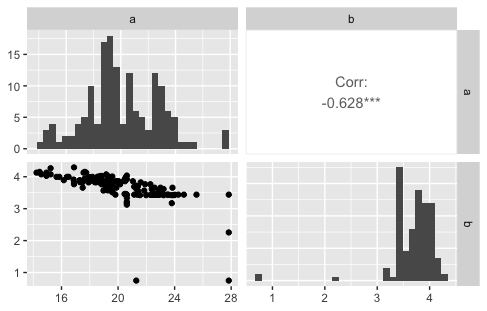
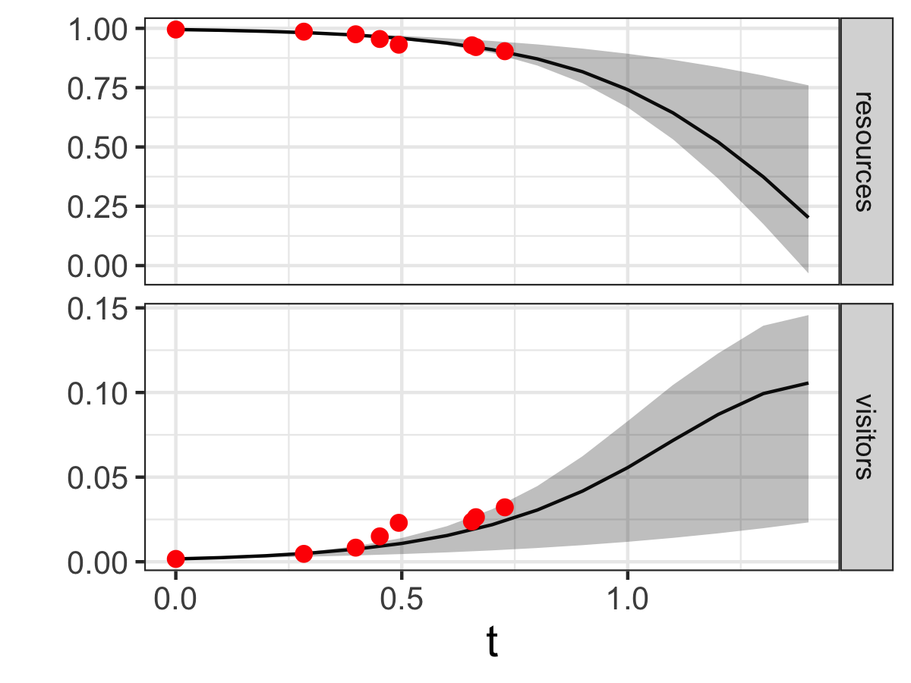

# Markov Chain Monte Carlo Parameter Estimation {#mcmc-13}

We have explored likelihood functions, iterative methods, and the Metropolis-Hastings algorithm. In this chapter all these together introduce a sophisticated parameter estimation algorithm called Markov Chain Monte Carlo (MCMC) parameter estimation, which has a rich history [@richey_evolution_2010].\index{Markov Chain Monte Carlo}  MCMC methods can be highly computational; more importantly you already have the skills in place to understand *how* the MCMC method works. To do the heavy lifting we will rely on functions from the `demodelr` package. Let's get started!

## The recipe for MCMC
The MCMC approach is a systematic exploration to determine the set of parameters that optimizes the value of the log-likehood function, given the data. It may be helpful to think of the MCMC method as a recipe, and in order to "run" the MCMC method, you will need four key ingredients:

- _Model_: a function that we have for our dynamics (this is $\displaystyle \frac{d\vec{y}}{dt} = f(\vec{y},\vec{\alpha},t)$), or an empirical equation $\vec{y}=f(\vec{x},\vec{\alpha})$.
- _Data_: a data frame (`tibble`) or a spreadsheet file (to read into `R`) of the data you wish to use for parameter estimation.
- _Parameter bounds_: upper and lower bounds on your parameter values. We typically assume an initial uniform distribution on the parameters.
- _Initial conditions_: (optional) needed if your model is a differential equation.
- _Run diagnostics_: specifications for the MCMC code, which may include how long you will run the code and other aspects of the MCMC algorithm.

We will work step by step through two examples of an application of the MCMC algorithm using both a differential equation and an empirical model. Example code is provided so you can also run your own estimates. The workflow that we will use is:

\newpage

> Define the model, parameters, and data $\rightarrow$ Determine MCMC settings $\rightarrow$ Compute MCMC estimate $\rightarrow$ Analyze results.

Having an established workflow helps to breakdown the process step by step, making it easier to check for any coding errors.

## MCMC parameter estimation with an empirical model
The first step of our workflow is to "Define the model and parameters". Here we return to the problem exploring of the phosphorous content in algae (denoted by $x$) compared to the phosphorous content in daphnia (denoted by $y$), and estimating $c$ and $\theta$ from Equation \@ref(eq:phos-13).

\begin{equation}
y = c \cdot x^{1/\theta} (\#eq:phos-13)
\end{equation}

The parameters $c$ and $\theta$ from Equation \@ref(eq:phos-13) range from $0 \leq c \leq 2$ and $1 \leq \theta \leq 20$. To define the model we use similar code to how we defined models in Chapter \@ref(linear-regression-08). Then to define the parameters we will use a `tibble`, specifying the upper and lower bounds:

```{r}
## Step 1: Define the model and parameters
phos_model <- daphnia ~ c * algae^(1 / theta)

# Define the parameters that you will use with their bounds
phos_param <- tibble(
  name = c("c", "theta"),
  lower_bound = c(0, 1),
  upper_bound = c(2, 20)
)
```

Notice how we defined that `tibble` called `phos_param`, which has three columns: `name` which contains the name of the variables in our model (`c` and `theta`), the lower (`lower_bound`) and upper (`upper_bound`) for the parameters (listed in the same order as the parameters listed in `name`).

The data that we use is the dataset `phosphorous`, which is already located in the `demodelr` package).


The next two steps in our workflow (Determine MCMC settings $\rightarrow$ Compute MCMC estimate) are combined together below:

```{r, eval = FALSE}
## Step 2: Determine MCMC settings
# Define the number of iterations
phos_iter <- 1000

## Step 3: Compute MCMC estimate
phos_mcmc <- mcmc_estimate(
  model = phos_model,
  data = phosphorous,
  parameters = phos_param,
  iterations = phos_iter
)
```

The variable `phos_iter` specifies how many iterations we will run of the MCMC method. Notice that `mcmc_estimate` has several inputs, which for convenience we write on separate lines. There are four required inputs to the function `mcmc_estimate` and several predefined inputs; you will explore these further in Exercise \@ref(exr:mcmc-input-13).

The function `mcmc_estimate` may take some time (which is OK). But once it finishes a `tibble` is produced, which we call `phosphorous_mcmc` (run this code on your own):

```{r eval=FALSE}
glimpse(phos_mcmc)
```

Notice `phos_mcmc` contains four columns:

 - `accept_flag` tells you if at that particular iteration the MCMC estimate was accepted or not. This is a categorical variable of `TRUE` or `FALSE`
 - `l_hood` is the value of the likelihood for that given iteration.
 - The values of the parameters follow on the next few lines. Notice that $\theta$ is written as `theta` in the resulting data frame.

The final step of our workflow is to "Analyze results". Fortunately the `demodelr` package has a function called `mcmc_analyze` to help you:

```{r, eval=FALSE}
## Step 4: Analyze results:
mcmc_analyze(
  model = phos_model,
  data = phosphorous,
  mcmc_out = phos_mcmc
)
```

The function `mcmc_analyze` filters `phos_mcmc` whenever the variable `accept_flag` is `TRUE`. This function will compute parameter statistics (e.g. median and 95% confidence intervals) to be displayed at the console. In addition this function will generate two different types of graphs.^[To see each graph, you can click the left arrow button on the Plots tab in the lower right hand pane of the RStudio window.] Let's examine each one individually. The first plot (Figure \@ref(fig:phos-pp-13) is called a pairwise parameter plot, which is a collection of different plots together in a square matrix pattern, sized to the number of parameters that were estimated.


```{r phos-pp-13, echo=FALSE,out.width = "80%",fig.align='center',fig.cap="Pairwise parameter histogram from the MCMC parameter estimation with Equation \\ref{eq:phos-13}."}
knitr::include_graphics("figures/13-mcmc/histogram.png")
```

Along the diagonal of Figure \@ref(fig:phos-pp-13) is a histogram of the accepted parameter values from the Metropolis algorithm. Depending on the results that you obtain, you may have some interesting shaped histograms. Generally they are grouped in the following ways:

- *well-constrained:* the parameter takes on a definite, well-defined value. The parameter $c$ seems to behave like this.
- *edge-hitting:* the parameter seems to cluster near the edges of its value.
- *non-informative:* the histogram looks like a uniform distribution. The parameter $\theta$ has some indications of being edge hitting, but we would need more iterations in order to confirm.

The off-diagonal plots in Figure \@ref(fig:phos-pp-13) are interesting as well. These plots are a scatter plot of the accepted values for the two parameters in the particular row and column, and the upper off-diagonal reports the correlation coefficient $r$ from simple linear regression of the variables in that particular row and column. The asterisks (`*`) denote the degree of significance of the linear correlation.

Examining the off-diagonal terms in Figure \@ref(fig:phos-pp-13) helps ascertain the degree of *equifinality* in a particular set of variables [@beven_equifinality_2001].\index{equifinality}  In Figure \@ref(fig:phos-pp-13) it looks like as *c* increases, $\theta$ decreases. This degree of linear coupling means that we may not be able to independently resolve each parameter separately. Each model and parameter estimation is different, so be prepared to be surprised!

The presence of equifinality in a model does not mean the parameter estimation is a failure - just that we need to be aware of these relationships. Perhaps we may be able to go out in the field and measure a parameter (for example $c$) more carefully, narrowing the range of accepted values.

The second figure that is produced from `mcmc_analyze` displays an *ensemble* estimate of the model results with the data (Figure \@ref(fig:phos-out-13)). The ensemble average plot provides a high-level model-data overview. Figure \@ref(fig:phos-out-13) is generated when the model (`phos_mcmc`) is run for each accepted parameter estimate in `phos_mcmc`. At each of the data points in Figure \@ref(fig:phos-out-13) a [boxplot](https://ggplot2.tidyverse.org/reference/geom_boxplot.html) is produced from the model runs. The median, and the 25th and 75th percentile make up the box. The whiskers extend no further than 1.5 of the difference between the 25th and 75th percentile. By eye, it seems that the model and estimated parameters fit the data, but there is still wide variation in the model predictions. Perhaps this variation is caused by relative wide confidence intervals on our parameters (Figure \@ref(fig:phos-pp-13)).


```{r phos-out-13, echo=FALSE,out.width="80%",fig.align='center',fig.cap="Ensemble output results from the MCMC parameter estimation with Equation \\ref{eq:phos-13}."}

knitr::include_graphics("figures/13-mcmc/output-plot.png")
```

## MCMC parameter estimation with a differential equation model
Next let's try parameter estimation with a differential equation model. Here the measured data are solutions to a differential equation, which contains unknown parameters. Once the MCMC method proposes a parameter, then the differential equation needs to be solved numerically with Euler's or a Runge-Kutta method before evaluating the likelihood function.^[If we knew the function that solves the differential equation, then we would have an empirical model.]

The example that we are going to use relates to land use management, in particular a coupled system between a resource (such as a national park) and the number of visitors it receives [@sinay_simple_2006]. The tourism model relies on two nondimensional scaled variables, $R$ which is the amount of the resource (as a percentage) and $V$ the percentage of visitors that could visit (also as a percentage):

\begin{equation}
\begin{split}
\frac{dR}{dt}&=R\cdot (1-R)-aV \\ 
\frac{dV}{dt}&=b\cdot V \cdot (R-V)
\end{split} (\#eq:tourism-13)
\end{equation}

Equation \@ref(eq:tourism-13) has two parameters $a$ and $b$, which relate to how the resource is used up as visitors come ($a$) and how as the visitors increase, word of mouth leads to a negative effect of it being too crowded ($b$).

For this case we are going to use a pre-defined dataset of the number of resources and visitors to a national park as reported in @sinay_simple_2006 (this is the `parks` dataset in the `demodelr` package) which is plotted in Figure \@ref(fig:park-data-13).


```{r park-data-13,fig.cap="Scaled data on resources and visitors to a national park over time.",echo=FALSE}
parks %>%
  pivot_longer(cols = c("visitors", "resources")) %>%
  ggplot(aes(x = time, y = value)) +
  # geom_line(size = 0.75) +
  facet_grid(name ~ ., scales = "free_y") +
  geom_point(size = 2) +
  labs(x = "Time", y = "Proportion") +
  theme_bw() +
  theme(
    legend.position = "bottom",
    legend.text = element_text(size = 14),
    axis.title.x = element_text(size = 14),
    axis.text.x = element_text(size = 10),
    axis.text.y = element_text(size = 10),
    axis.title.y = element_text(size = 14)
  ) +
  scale_color_colorblind()
```

As the visitors $V$ increase in Figure \@ref(fig:park-data-13), the percentage of the resources $R$ decreases. Notably though, the data on both variables may be limited. In Figure \@ref(fig:park-data-13) the proportion of visitors ranges from 0.9 to 1, and the resources ranges up to 0.03. Perhaps from this limited dataset given we can estimate the parameters $a$ and $b$ and then forecast out as time increases. We will estimate the parameters $a$ and $b$ in Equation \@ref(eq:tourism-13) with the data shown in Figure \@ref(fig:park-data-13). We are going to assume that $0 \leq a \leq 30$ and $0 \leq b \leq 5$. We will still use the same workflow (Define the model, parameters, and data $\rightarrow$ Determine MCMC settings $\rightarrow$ Compute MCMC estimate $\rightarrow$ Analyze results) as we did in estimating parameters for an empirical model. Since this workflow was presented earlier we will combine the first three steps below: 


```{r, eval = FALSE}
## Step 1: Define the model, parameters, and data
# Define the tourism model
tourism_model <- c(
  dRdt ~ resources * (1 - resources) - a * visitors,
  dVdt ~ b * visitors * (resources - visitors)
)

# Define the parameters that you will use with their bounds
tourism_param <- tibble(
  name = c("a", "b"),
  lower_bound = c(10, 0),
  upper_bound = c(30, 5)
)

## Step 2: Determine MCMC settings
# Define the initial conditions
tourism_init <- c(resources = 0.995, visitors = 0.00167)

deltaT <- .1 # timestep length
n_steps <- 15 # must be a number greater than 1

# Define the number of iterations
tourism_iter <- 1000

## Step 3: Compute MCMC estimate
tourism_out <- mcmc_estimate(
  model = tourism_model,
  data = parks,
  parameters = tourism_param,
  mode = "de",
  initial_condition = tourism_init,
  deltaT = deltaT,
  n_steps = n_steps,
  iterations = tourism_iter
)
```

Notice how `mcmc_estimate` has some additional arguments. Most important is the option `mode "de"`, where `de` stands for *differential equation*. (The default mode is `emp`, or *empirical* model - like the `phosphorous` data set.)  If the `de` mode is specified, then you also need to define the initial conditions (`tourism_init`), $\Delta t$ (`deltaT`), and timesteps (`n_steps`) in order to generate the numerical solution. 

Visualizing the data also is done with `mcmc_analyze`:
```{r,eval=FALSE}
## Step 4: Analyze results
mcmc_analyze(
  model = tourism_model,
  data = parks,
  mcmc_out = tourism_out,
  mode = "de",
  initial_condition = tourism_init,
  deltaT = deltaT,
  n_steps = n_steps
)
```

Examining the parameter histograms (Figure \@ref(fig:tourism-pp-13)) shows $b$ to be well-constrained. The histogram for $a$ seems like it could be well-constrained - but we may need to run more iterations to confirm this.


```{r tourism-pp-13, echo=FALSE,out.width = "70%",fig.align='center',fig.cap="Pairwise parameter histogram of MCMC parameter estimation results with Equation \\ref{eq:tourism-13}."}

```


The model results and confidence intervals show good agreement to the data (Figure \@ref(fig:tourism-out-13)). Additionally the model forecasts out in time confirming that as visitors increase, the resources in the national park will decrease due to overuse. In contrast to Figure \@ref(fig:phos-out-13), the black line in Figure \@ref(fig:tourism-out-13) represents the median and the grey shading is the 95% confidence interval for all timesteps defined in solving the model.

```{r tourism-out-13, echo=FALSE,out.width = "80%",fig.align='center',fig.cap="Ensemble output results from the MCMC parameter estimation for Equation \\ref{eq:tourism-13}."}

```


## Timing your code
As you can imagine the more iterations we have the better our parameter estimates will be. However, this means the full estimate with that number of iterations will take some more time. Before doing that, you first should get an estimate for the length of time it takes to run this code. Fortunately `R` has a stopwatch function. Let's check this out with one iteration of the phosphorous dataset:

```{r}
# This "starts" the stopwatch
start_time <- Sys.time()

# Compute a single mcmc estimate
phosphorous1_mcmc <- mcmc_estimate(
  model = phos_model,
  data = phosphorous,
  parameters = phos_param,
  iterations = 1
)

# End the stopwatch
end_time <- Sys.time()

# Determine the difference between the start and end times
end_time - start_time
```

Timing the code for one iteration gives you a ballpark estimate for a full MCMC parameter estimate. If we were to run *N* MCMC iterations, a good benchmark would be to multiply the time difference (`end_time - start_time`) by *N*. Performance time varies by computer and the other programs / apps that are running at the same time. However, this gives you an estimate of what to expect.^[I am a big fan of "set it and forget it" - meaning I set up the code before I go to sleep and it is ready in the morning!]


## Further extensions to MCMC
For the examples in this chapter we limited the number of iterations to a smaller number to make the results computationally feasible. However we can extend the MCMC approach in two notable ways:

- One approach is to separate the data into two different sets - one for optimization and one for validation. In this approach the "optimization data" consists of a certain percentage of the original dataset, leaving the remaining to validate the forward forecasts. This is a type of cross-validation approach, and is generally preferred because you are demonstrating the strength of your model ability against non-optimized data.

- We also run multiple "chains" of optimization, starting from a different value in parameter space. What we do then after running each of these chains is to select the one with the best log-likelihood value, and run *another* MCMC iteration starting at that value.  The idea is with a different chain we have sampled the parameter space and are hopefully starting near an optimum value.

As you can see, the MCMC algorithm is an extremely powerful technique for parameter estimation. While MCMC may take additional time and programming skill to analyze - it is definitely worth it!


## Exercises
```{exercise}
Re-run both of the MCMC examples in this chapter, but increase the number of iterations to $10,000$. Analyze your results from both cases. How does increasing the number of iterations affect the posterior parameter estimates and their confidence intervals?  Does the log-likelihood value change?
```


```{exercise}
Time the MCMC parameter estimate for the `phosphorous` dataset for $1$ iteration. Then time the MCMC parameter estimate for $10$, $100$, and $1000$ iterations, recording the times for each one. Make a scatterplot with the number of iterations on the horizontal axis and time on the vertical axis. How would you characterize the relationship between the number of iterations and the time it takes to run the code? How long would it take to compute an MCMC estimate with $10,000$ iterations?
```

```{exercise mcmc-input-13}
The function `mcmc_estimate` has several other input variables that are set to default values. What are they and how would you explain their use? (*Hint:* to see the documentation associated with this function type `?mcmc_estimate` at the `R` console.)
```

```{exercise}
For the `parks` data (Equation (13.2)) studied in this chapter, compare the 1:1 and the posterior parameter plots (Figure \@ref(fig:tourism-pp-13)). Write a summary of each panel of the plot. Apply your understanding of equifinality and other observations to determine by how much you have estimated the parameters $a$ and $b$ from the data.


```


```{exercise yeast-v1-13}
Run an MCMC parameter estimation on the dataset `yeast` from @gause_experimental_1932, where the equation for the volume of yeast $V$ over time is given by the following equation for a yeast growing in isolation:

\begin{equation}
V = \frac{K}{1+e^{a-bt}},
\end{equation}

where $K$ is the carrying capacity, $a$ and $b$ respective rate constants.

a. Show that when $V(0)=0.45$, $a = \ln(K/0.45-1)$.
b. Rewrite the $V(t)$ equation without $a$.
c. With the `yeast` data, perform an MCMC estimate for this equation. (*Reminder:* $\ln(5)$) is implemented as `log(5)` in `R`.)

Use the following settings for your MCMC parameter estimation:
  
- $K:$ 1 to 20
- $b$: 0 to 1
- 1000 iterations


When setting up the MCMC method, be sure to name the variables in your model to match the `yeast` data frame.

d. Report all outputs from the MCMC estimation (this includes parameter estimates, confidence intervals, log-likelihood values, and any graphs). Compare your results to the results from Exercise \@ref(exr:yeast-v2-13).

```


```{exercise yeast-v2-13}
Another model for this growth of yeast is the function $\displaystyle V= K + Ae^{-bt}$.

a. Show that when $V(0)=0.45$, $A = K - 0.45$.
b. Rewrite the initial equation without $A$.
c. With the `yeast` data, apply an MCMC estimate for this equation.

Use the following settings for your MCMC parameter estimation:

- $K:$ 1 to 20
- $b$: 0 to 1
- 1000 iterations

When setting up the MCMC method, be sure to name the variables in your model to match the `yeast` data frame.

d. Report all outputs from the MCMC estimation (this includes parameter estimates, confidence intervals, log-likelihood values, and any graphs). Compare your results to the results from Exercise \@ref(exr:yeast-v1-13).

```


```{exercise}
Run an MCMC parameter estimation on the dataset `wilson` according to the following differential equation:

\begin{equation}
\frac{dP}{dt} = b(N-P),
\end{equation}

where $P$ represents the mass of the dog. Use the following settings for your MCMC parameter estimation:
  
- $N$: 60 to 90
- $b$: 0 to .01
- $P(0)=5$
- $\Delta t = 1$ day
- Number of timesteps: 1500
- Number of iterations: 1000

When setting up the MCMC method, be sure to name the variables in your model to match the `wilson` data frame. Be sure to report all outputs from the MCMC estimation (this includes parameter estimates, confidence intervals, log-likelihood values, and any graphs).

```
