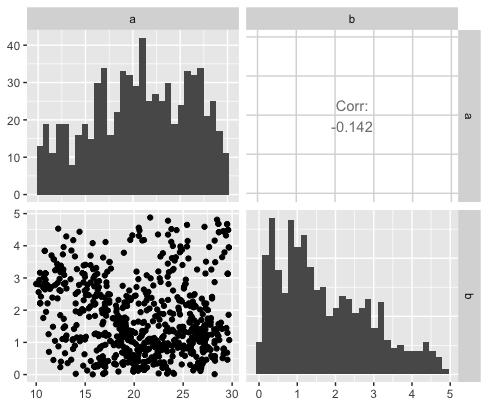
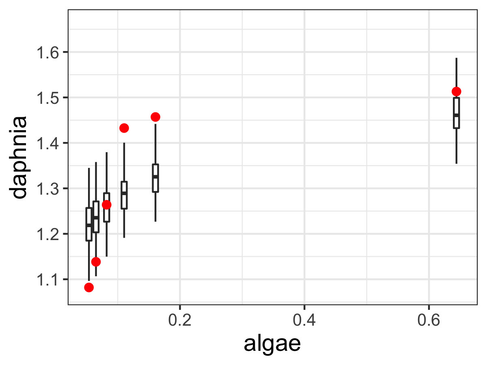

# Markov Chain Monte Carlo Parameter Estimation {#mcmc-13}

This sections extends our understanding of the Metropolis Algorithm to Markov Chain Monte Carlo (MCMC) parameter estimation.  MCMC methods can be exhaustively studied and can be highly computational.  Fortunately you have the skills in place already to understand how the MCMC method works - we will rely on functions from `demodelr` to do the heavy lifting.

The MCMC approach is a systematic exploration to determine the minimum value of the log likelihood function using the data and parameters for a model.  In order to make this solver work method work, you will need four things:

- _Model_: A function that we have for our dynamics (this is $\displaystyle \frac{d\vec{y}}{dt} = f(\vec{y},\vec{\alpha},t)$), or an empirical equation $\vec{y}=f(\vec{x},\vec{\alpha})$.
- _Data_: A spreadsheet file of the data you wish to use (or from built in data).
- _Parameter bounds_: upper and lower bounds on your parameter values.
- _(Initial conditions)_: If you have a dynamic (differential equation) model.
- _Run diagnostics_: Things that need to be specified in order to run the MCMC code.

We will work you through this step by step, with example code that you can type along the way. As always it will be good to load up the libraries you will be using.  

First let's load up some of the libraries we will need to analyze the MCMC:
```{r warning=FALSE}
library(tidyverse)
library(demodelr)
```


This section will examine two examples: the first example will be an empirical model (no differential equations), and the second will solve a differential equation. one with a differential equation and one without.

## MCMC Parameter Estimation with an Empirical Model
Here are going to return to the problem exploring the phosphorous content in algae (denoted by $x$) to the phosphorous content in daphnia (denoted by $y$).

The equation we are going to fit is:

\begin{equation}
y = c \cdot x^{1/\theta} (\#eq:phos-13)
\end{equation}

Equation \@ref(eq:phos-13) has two parameters $c$ and $theta$, which range from $0 \leq c \leq 2$ and $1 \leq \theta \leq 20$, which we define below:


```{r, fig.show='hold'}
# Define the model
phos_model <- daphnia ~ c*algae^(1/theta)

# Define the parameters that you will use with their bounds
phos_param <- tibble(name = c("c","theta"),
                     lower_bound = c(0,1),
                     upper_bound = c(2,20))

```

The data that we use is the dataset `phosphorous`, which is already located in the `demodelr` package):

```{r, echo=FALSE, results='asis'}
knitr::kable(phosphorous)
```

The final piece is to determine the number of iterations we run our the MCMC parameter estimate:
That is it!  All we need to do is to run our code:

```{r, fig.width=4,fig.height=3,fig.cap="MCMC parameter estimates of the `phosphorous` dataset."}
# Define the number of iterations
phos_iter <- 1000

# Compute the mcmc estimate
phos_mcmc <- mcmc_estimate(model = phos_model,
                                   data = phosphorous,
                                   parameters = phos_param,
                                   iterations = phos_iter
                                  )
```

The function `mcmc_estimate` may take some time (which is OK). This function has several inputs, which for convenience we write them on separate lines.

Let's take a look at the data frame `phosphorous_mcmc`:

```{r}
glimpse(phos_mcmc)
```

There are four columns here:
 - `accept_flag` tells you if at that particular iteration the MCMC estimate was accepted or not.
 - `l_hood` is the value of the likelihood for that given iteration.
 - The values of the parameters follow on the next few lines.

Next we need to visualize our results. The function `mcmc_visualize` summarizes and visualizes the results filtering on whenever `accept_flag` is `TRUE` (which means the parameter was accepted).

```{r, eval = FALSE}
# Visualize the results
mcmc_visualize(model = phos_model,
               data = phosphorous,
               mcmc_out = phos_mcmc
               )

```

You will notice that `mcmc_visualize` produces different types of graphs.  Let's take a look at each one individually.  The first plot is called a pairwise parameter plot.  This contains a lot of different plots together, in a matrix pattern:


```{r phos-pp-13, echo=FALSE,out.width = "2in",fig.cap="Pairwise parameter histogram for the `phosphorous` data set."}

```

Along of the diagonal of Figure \@ref(fig:phos-pp-13) is a histogram of the accepted parameter values from the Metropolis algorithm. Depending on the results that you obtain, you may have some interesting shaped histograms.  Generally they are grouped in the following ways:

- *well-constrained:* the parameter takes on a definite, well-defined value.
- *edge-hitting:* the parameter seems to cluster near the edges of its value.  The parameter $b$ seems to behave like this.
- *non-informative:* the histogram looks like a uniform distribution.

The off-diagonal terms in Figure \@ref(fig:phos-pp-13) are interesting as well.  The lower off-diagonal makes a scatter plot of the accepted values for the two parameters in the particular row and column, and the upper off-diagonal reports the correlation coefficient $r$ of the variables in that particular row and column.  This helps ascertain the degree of *equifinality* in a particular set of variables.  In the Figure \@ref(fig:phos-pp-13) it looks like *c* increases, $\theta$ decreases.  This degree of linear coupling means that we may not be able to independent resolve each parameter separately.  This is ok, just that we need to be aware of these relationships.  Perhaps we may be able to go out in the field and measure a parameter more carefully, narrowing the range of accepted values.

Figure \@ref(fig:phos-out-13) displays an *ensemble* estimate of the results with the data. The ensemble average plot provides a high-level model-data overview.  The black line represents the median ensemble average, and the grey is the 95% confidence interval, giving you a perspective of the model spread with the data.  For our results here it does look there is wide variation in the model, most likely due to the relative wide confidence intervals on our parameters.


```{r phos-out-13, echo=FALSE,out.width = "2in",fig.cap="Ensemble output results from the MCMC parameter estimation."}

```

## MCMC Parameter Estimation with a Differential Equation Model

Next let's try parameter estimation with a differential equation model. What is different with a differential equation model is that we are given information about the solution, so we need to first numerically solve the differential equation for a given parameter set and then compute the likelihood.

The example that we are going to use relates to land use management, in particular a coupled system between a resource (such as a national park) and the amount of visitors it receives, such as the one described [here](https://espace.library.uq.edu.au/data/UQ_7692/A_simple_mathema.pdf?Expires=1565380784&Key-Pair-Id=APKAJKNBJ4MJBJNC6NLQ&Signature=MB3gO6l1dkEOMfRtQ7moPD5m04u51u8uPSPRA3DgXrNwYYOSEyiVsUh2ZTrPl8~UJAhlWL8LYO2PlJvjv8zbnyJ1I55TBR3DLj-6AwMcCWWpDFyFdZ0UUqlGgGSmx2iN7JHZ25Zpt7rvCloCCowElPFsgiPBcy6EX1287nUv8nYVB13LxrOwBoc7IR1sFP8UvdTsHl6BDrCbr2siw0GzBG7h3mkEWsoX35zoU84yN6lcQoUwtMSkdI33EyOj9PXoLLwhpY0kBHvnH5s2RTHVaCyyKyE-xGMiw~mQfiGz9qdHPYG4TDJNUf0Xgqo7WlsRquwRHlxJ3Q7bV~9LtWBcoA__). The tourism model relies on two non-dimensonal scaled variables, $R$ which is the amount of the resource (as a percentage) and $V$ the percentage of visitors that could visit (also as a percentage):

\begin{equation}
\begin{cases}
\frac{dR}{dt}&=R\cdot (1-R)-aV \\ (\#eq:tourism-13)
\frac{dV}{dt}&=b\cdot V \cdot (R-V)
\end{cases}
\end{equation}

Equation \@ref(eq:tourism-13) has two parameters $a$ and $b$, which relate to how the resource is used up as visitors come ($a$) and how as the visitors increase, word of mouth leads to a negative effect of it being too crowded ($b$).

For this case we are going to use a pre-defined dataset of the number of resources and visitors to a national park as shown in the original paper:
```{r, echo=FALSE,results='asis'}
knitr::kable(parks)
```

Figure \@ref(fig:park-data-13) plotting these data we have the following:

```{r park-data-13, echo=FALSE,fig.width=5,fig.height=4,fig.cap="Data on resources and visitors to a national park over time."}
parks %>% 
  gather(key=variable,value=value,visitors,resources) %>%
  ggplot(aes(x=time,y=value,color=variable)) +
  geom_line(size=1) +
  geom_point(size=2) +
    theme(plot.title = element_text(size=20),
          axis.title.x=element_text(size=20),
          axis.text.x=element_text(size=15),
          axis.text.y=element_text(size=15),
          axis.title.y=element_text(size=20),
          legend.position = 'bottom') +
    labs(x='Time',y = 'Proportion')

```

We can see that the data show as the visitors increase the percentage of the resources decrease.  Perhaps from this limited dataset given we can estimate the parameters $a$ and $b$.  We are going to assume that $0 \leq a \leq 30$ and $0 \leq b \leq 5$. We will need to implement this model in our code, which combines our knowledge of how we numerically solved differential equations in Section \@ref(euler-04).


```{r, fig.show='hold'}
# Define the model applied:
tourism_model <- c(dRdt ~ resources*(1-resources)-a*visitors,
                   dVdt ~  b*visitors*(resources-visitors)
                   )

# Define the parameters that you will use with their bounds
tourism_param <- tibble(name = c("a","b"),
                     lower_bound = c(10,0),
                     upper_bound = c(30,5))

# Define the initial conditions
tourism_init = c(resources = 0.995, visitors = 0.00167)

deltaT <- .1    # timestep length
n_steps <- 15   # must be a number greater than 1

# Define the number of iterations
tourism_iter <- 1000

tourism_out <- mcmc_estimate(model = tourism_model,
                             data = parks,
                             parameters = tourism_param,
                             initial_condition = tourism_init,
                             deltaT = deltaT,
                             n_steps = n_steps,
                             iterations = tourism_iter,
                             mode = "de"
                             )
  
```

Notice how `mcmc_estimate` has some additional arguments defining the initial conditions, $\Delta t$, timesteps (`n_steps`).  Most importantly is the option `mode`, which `de` stands for *differential equation*.  (The default mode is `emp`, or *empirical* model - like the `phosphorous` data set.)

Visualizing the data also is done with `mcmc_visualize`:

```{r}
mcmc_visualize(model = tourism_model, 
               data = parks, 
               mcmc_out = tourism_out,
               mode = "de",
               initial_condition = tourism_init,
               deltaT = deltaT,
               n_steps = n_steps
               )
```

For this case there does not seem to be any association, as shown by the correlation coefficient between the two in the upper diagonal.


## Timing your code
As you can imagine the more iterations we have the better our parameter estimates will be.  This comes with a tradeoff: it takes some time to run the full estimate.  To get a sense of timing the code there is a helpful clock function in `R` that serves a stopwatch if you will.  Let's check this out with one iteration of the phosphorous dataset:

```{r}

# This "starts" the stopwatch
start_time <- Sys.time()

# Compute a single mcmc estimate
phosphorous1_mcmc <- mcmc_estimate(model = phos_model,
                                   data =phosphorous,
                                   parameters = phos_param,
                                   iterations = 1)

# End the stopwatch
end_time <- Sys.time()

# Determine the difference between the start and end times
end_time - start_time

```

This gives you a sense of timing for one iteration.  If we were to run *N* iterations, a good benchmark would be to multiply the time difference by *N*.  Performance time varies by computer and the other programs / apps that are running at the same time.  However, timing your code should give you an idea of what to expect.


## Further extensions to MCMC
For the examples in this section we limited the number of iterations to a smaller number to make the results computationally feasible.  However we can extend the MCMC approach a few different ways:

- One approach is to separate the data into two different sets - one for optimization and one for validation. In this approach the ``optimization data'' consists a certain percentage of the original dataset, leaving the remaining to validate the forward forecasts.  This is a type of cross-validation approach, and is generally preferred because you are demonstrating the strength of your model ability against non-optimized data.
- We also run multiple ``chains'' of optimization, starting from a different value in parameter space.  What we do then after running each of these chains is to select the one with the best log-likelihood value, and run *another* MCMC iteration starting at that value.  They idea is that we have sampled the parameter space and are hopefully starting near an optimum value.

These approaches are useful, but also take additional time and programming skill to analyze - but are definitely worth it!


\newpage

## Exercises
```{exercise}
For both of the MCMC examples in this section, increase the number of iterations to 10000.  Analyze your results from both cases.  How does increasing the number of iterations affect the posterior parameter estimates and their confidence intervals?  Does the log likelihood value change?
```

&nbsp;

```{exercise}
Time the MCMC parameter estimate for the `phosphorous` dataset for 1 iteration. Then time the MCMC parameter estimate for 10, 100, 1000, and 10000 iterations, recording the times for each one. Make a scatterplot with the number of iterations on the horizontal axis and time on the vertical axis. How would you characterize the relationship between the number of iterations and the time it takes to run the code?
```

&nbsp;

```{exercise}
For the `parks` data (Equation \@ref(eq:tourism-13)) studied in this section, compare the 1:1 and the posterior parameter plots.  Summarize the following:
  
\begin{enumerate}[label=\alph*.]
\item The posterior parameter estimates, with 95% confidence interval.
\item The posterior parameter histograms.
\end{enumerate}

Apply your knowledge of equifinality and other observations to determine by how much you have estimated the parameters $a$ and $b$ fom the data.

```

&nbsp;

```{exercise}
Run an MCMC parameter estimation on the dataset `yeast` from @gause_experimental_1932, where the equation for the volume of yeast $V$ over time is given by the following equation for an yeast growing in isolation is:
\begin{equation}
V = \frac{K}{1+e^{a-bt}},
\end{equation}

where $K$ is the carrying capacity, $a$ and $b$ respective rate constants.  Apply the data for Sacchromyces to do an MCMC estimate for this equation.  You may assume the following prior values on your parameters:

\begin{itemize}
\item $K:$ 0 to 20
\item $b$: 0 to 1
\item $a$: automatically equals to $a = \ln(K/0.45-1)$
\end{itemize}

Be sure to report all outputs from the MCMC estimation (this includes parameter estimates, confidence intervals, log likelihood values, and any graphs).
```

&nbsp;

```{exercise}
Another model for this growth of yeast is the function $\displaystyle V= K + Ae^{-bt}$.  Compute an MCMC estimate for the parameters $K$ and $b$ (use the same bounds as in the previous problem).  You may assume that $V(0)=0.45$, so $A = K - 0.45$. Be sure to report all outputs from the MCMC estimation (this includes parameter estimates, confidence intervals, log likelihood values, and any graphs).  Compare your results to the previous exercise.
```

&nbsp;

```{exercise}
Run an MCMC parameter estimation on the dataset `wilson` according to the following differential equation:

\begin{equation}
\frac{dP}{dt} = b(N-P)
\end{equation}

\begin{itemize}
\item $K:$ 60 to 90
\item $b$: 0 to 1
\end{itemize}

Be sure to report all outputs from the MCMC estimation (this includes parameter estimates, confidence intervals, log likelihood values, and any graphs).


```


