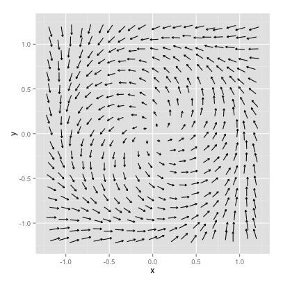

# Bifurcation {#bifurcation-20}

In this section we will study a key topic that applies the qualititative stability analysis to examine sensitivity to parameters, or what is called *bifurcation*.

## A series of equations
First let's consider the differential equations $\displaystyle \frac{dx}{dt} = 1-x^{2}$. This equation has an equibrium solution at $x=\pm 1$.  To classify the stability of the equilibrium solutions we apply the following test (developed in Section \@ref(phase-05)):


- If $f'(y_{*})’>0$ at an equilibrium solution, the equilibrium solution $y=y_{*}$ will be unstable.
- If $f'(y_{*}) <0$ at an equilibrium solution, the equilibrium solution $y=y_{*}$ will be stable.
- If $f'(y_{*}) = 0$, we cannot conclude anything about the stability of $y=y_{*}$.

Applying this test, we know $f(x)=1-x^2$ and $f'(x)=-2x$.  Since $f'(1)=-2$ and $f'(-1)=2$, then the equilibrium solution $x=1$ is stable and $x=-1$ unstable.

Figure \@ref(fig:eq1-x2) shows a plot of the phase plane along with some solutions:

```{r eq1-x2, echo=FALSE,fig.width=5,fig.height=4,results='hide',warning=FALSE,fig.cap="Phase plane of $x'=1-x^{2}$"}
system_eq <- c(dxdt ~ 1,
               dydt ~ 1-y^2)


system_eq_rev <- c(dxdt ~ 1-x^2)

initialCondition <- tibble(value = c(2,1.5,1,0.5,0,-0.5,-1,-1.5,-2),sim=1:9,vector="x") %>% relocate(vector) %>%
  group_by(sim) %>%
  nest()


out_values <- initialCondition %>%
  mutate(result = map(.x=data,.f=~rk4(system_eq_rev,
                                      initial_condition=deframe(.x),
                                      deltaT=.1,
                                      n_steps = 200))) %>%
  select(-data) %>%
  unnest(cols=c(result))


phaseplane(system_eq,'x','y',c(-0.1,2),c(-2,2)) +
  geom_line(data=out_values,aes(x=t,y=x,color=as.factor(sim),group=sim),inherit.aes = TRUE,size=1.5) + xlim(c(-0.1,2)) + ylim(c(-2,2)) + guides(color="none")+ ggtitle(expression("dx/dt = 1"~-x^2)) + xlab("t") + ylab("x")

```


Let's modify and extend this example further. Consider two more differential equations to consider:
 - $\displaystyle \frac{dx}{dt} = -1-x^{2}$: This differential equation does not have any equilibrium solutions, so we do not need to apply the stability test.
 - $\displaystyle \frac{dx}{dt} = -x^{2}$:  The stability of the second equation is a little more tricky.  While it has an equilibrium solution at $x=0$, the stability test cannot apply because $f'=-2x$ and $f'(0)=0$.  However investigating the sign of $f(x)$ to the left and right of $x=0$, we see that this solution is constantly decreasing, so the equilibrium is unstable.

So let's also take a look at these phaseplanes along with the solution:

```{r eq1-x2-2, echo=FALSE,fig.width=3.5,fig.height=3,results='hide',warning=FALSE,fig.ncol=1,fig.cap="Phase plane of $x'=-1-x^{2}$ and $x'=-x^{2}$"}
system_eq <- c(dxdt ~ 1,
               dydt ~ -1-y^2)


system_eq_rev <- c(dxdt ~ -1-x^2)

initialCondition <- tibble(value = c(2,1.5,1,0.5,0,-0.5,-1,-1.5,-2),sim=1:9,vector="x") %>% relocate(vector) %>%
  group_by(sim) %>%
  nest()


out_values <- initialCondition %>%
  mutate(result = map(.x=data,.f=~rk4(system_eq_rev,
                                      initial_condition=deframe(.x),
                                      deltaT=.1,
                                      n_steps = 200))) %>%
  select(-data) %>%
  unnest(cols=c(result))


phaseplane(system_eq,'x','y',c(-0.1,2),c(-2,2)) +
  geom_line(data=out_values,aes(x=t,y=x,color=as.factor(sim),group=sim),inherit.aes = TRUE,size=1.5) + xlim(c(-0.1,2)) + ylim(c(-2,2)) + guides(color="none")+ ggtitle(expression("dx/dt = -1"~-x^2)) + xlab("t") + ylab("x")

###
system_eq <- c(dxdt ~ 1,
               dydt ~ -y^2)


system_eq_rev <- c(dxdt ~ -x^2)

initialCondition <- tibble(value = c(2,1.5,1,0.5,0,-0.5,-1,-1.5,-2),sim=1:9,vector="x") %>% relocate(vector) %>%
  group_by(sim) %>%
  nest()


out_values <- initialCondition %>%
  mutate(result = map(.x=data,.f=~rk4(system_eq_rev,
                                      initial_condition=deframe(.x),
                                      deltaT=.1,
                                      n_steps = 200))) %>%
  select(-data) %>%
  unnest(cols=c(result))


phaseplane(system_eq,'x','y',c(-0.1,2),c(-2,2)) +
  geom_line(data=out_values,aes(x=t,y=x,color=as.factor(sim),group=sim),inherit.aes = TRUE,size=1.5) + xlim(c(-0.1,2)) + ylim(c(-2,2)) + guides(color="none")+ ggtitle(expression("dx/dt ="~-x^2)) + xlab("t") + ylab("x")

```


There is an interesting pattern going on here. Let's build on these three examples in a more general context. Consider the differential equation $\displaystyle \frac{dx}{dt} = c-x^{2}$ the value of $c$ influences whether or not we will have a stable equilibrium solution.

Steady states to this differential equation are when $x^{*}=\pm \sqrt{c}$.  If $c>0$ we have two steady states.  If $c=0$ there is only one steady state, and if $c<0$, then there are no steady states.

We can also test out the stability of our steady states using the stability test, with $f(x)=c-x^{2}$ and $f'(x)=-2x$:


Equilibrium solution | $f'(x^{*})$  | Tendency of solution | 
-------------| ------------- | ------------- | 
    $x^{*}=\sqrt{c}$ | $-2 \sqrt{c}$ | Stable 
    $x^{*}=-\sqrt{c}$ |  $2 \sqrt{c}$ | Unstable 
   $x^{*}=0$  | 0 | Inconclusive 


Even better, since we have a function dependence of $x^{*}$ on the value of $c$, we can represent the different notions of stability encapsulated in the above table graphically in what is called a *bifurcation diagram*:

```{r,engine='tikz',warning=FALSE,message=FALSE,echo=FALSE,fig.cap='A saddle-node bifurcation'}
\begin{center}

\begin{tikzpicture}
%\draw[help lines, color=gray!30, dashed] (-4.9,-4.9) grid (4.9,4.9);
\draw[<->,ultra thick] (-3,0)--(3,0) node[right]{$c$};
\draw[<->,ultra thick] (0,-1)--(0,3) node[above]{$x^{*}$};
\draw[->,thick,scale=0.5,domain=0:5,smooth,variable=\x,blue] plot (\x,{sqrt(\x)});
\draw[->,thick,scale=0.5,domain=0:5,dashed,variable=\x,blue] plot (\x,-{sqrt(\x)});
\node at (3,-1.5) {Unstable};
\node at (3,1.5) {Stable};

\end{tikzpicture}


\end{center}
```

For this particular example we have what is called a *saddle-node* bifurcation.  It might be helpful to think of this $c$ like a tuning knob.  As $c>0$ we will always have two different equilibrium solutions that are symmetrical based on the value of $c$.  The positive one will be stable, the other unstable.  As $c$ gets smaller these equilbrium solutions will collapse into one, which will be unstable.  If $c$ is negative, the equilibrium solution disappears.

## Bifurcations with systems of equations 

 Determine the behavior of solutions near the origin for the system
 \begin{equation}
 \frac{\vec{dx}}{dt} = \begin{pmatrix} 3 & b \\ 1 & 1 \end{pmatrix} \vec{x}. (\#eq:b-bifurc-20)
 \end{equation}

Let's take a look at the phase plane with solution curves.

```{r bifuc-b-20, echo=FALSE,fig.width=3.5,fig.height=3,results='hide',warning=FALSE,fig.cap="Comparison of two phase planes for Equation \\@ref(eq:b-bifurc-20)"}
eq_1 <- c( dx ~ 3*x + -1, dy~x+y)

initialCondition <- tibble(x = c(1,-1,1,-1),
                           y = c(1,1,-1,-1),
                           sim = 1:4) %>%
  pivot_longer(cols=c("x","y")) %>%
  group_by(sim) %>%
  nest()

out_values <- initialCondition %>%
  mutate(result = map(.x=data,.f=~rk4(eq_1,
                                      initial_condition=deframe(.x),
                                      deltaT=.1,
                                      n_steps = 200))) %>%
  select(-data) %>%
  unnest(cols=c(result))

phaseplane(eq_1,'x','y',c(-5,5),c(-5,5)) +
  geom_line(data=out_values,aes(x=x,y=y,color=as.factor(sim),group=sim),inherit.aes = TRUE,size=1.5) + xlim(c(-5,5)) + ylim(c(-5,5)) + guides(color="none")+ ggtitle(expression("b = -1"))

###


eq_2 <- c( dx ~ 3*x + 4, dy~x+y)

initialCondition <- tibble(x = c(1,-1,1,-1),
                           y = c(1,1,-1,-1),
                           sim = 1:4) %>%
  pivot_longer(cols=c("x","y")) %>%
  group_by(sim) %>%
  nest()

out_values <- initialCondition %>%
  mutate(result = map(.x=data,.f=~rk4(eq_2,
                                      initial_condition=deframe(.x),
                                      deltaT=.1,
                                      n_steps = 200))) %>%
  select(-data) %>%
  unnest(cols=c(result))

phaseplane(eq_2,'x','y',c(-5,5),c(-5,5)) +
  geom_line(data=out_values,aes(x=x,y=y,color=as.factor(sim),group=sim),inherit.aes = TRUE,size=1.5) + xlim(c(-5,5)) + ylim(c(-5,5)) + guides(color="none")+ ggtitle(expression("b = 4"))

```


This equation has one free parameter $b$ that we will analyze using the trace determinant conditions developed in Section \@ref(stability-19). Let's call the matrix $A$, so the tr$(A)=4$ and $\det(A)=3-b$.  Since the trace is always positive either it will be a saddle if the $\det(A)<0$, or when $3<b$.  We have a unstable spiral when $3>b$ and $(\mbox{tr}(A))^2-4 \det(A)<0$, or when $4^2-4\cdot(3-b) = 16-12+4b = 4+4b<0$, which leads to $b<-1$.  Notice this is a contradictory condition - we have already assumed $b>3$, so we will not have any unstable spirals.

To summarize, we have the following dynamics:

- When $b<3$ the equilibrium solution will be a saddle.
- When $b=3$ we will have an unstable solution.
- When $b>3$ we will have a unstable node.


The benefit of a bifurcation diagram is that is provides a complete understanding of the dynamics of the system *as a function of the parameters*.  In this section we examined *one-parameter* bifurcations (for example we looked the stability of the equilibrium solution as it depends on *c* or *b*), but bifurcations can also be extended further to two parameter bifurcation families, applying similar methods.  In general the methods are similar to what we have done.

## Limit Cycles and Bifurcations with systems of equations 
The previous examples we have studied examine the stability of an equilibrium solution as a parameter changes. An extension of an equilibrium solution (as a point in space) is an equilibrium solution that is a *function*. 

 Consider the following highly nonlinear system:
\begin{equation}
\begin{cases}
\frac{dx}{dt} =-y-x(x^2+y^2-1) \\ (\#eq:limit-cycle-20)
\frac{dy}{dt}=x-y(x^2+y^2-1)
\end{cases}
\end{equation}

The phase plane for Equation \@ref(eq:limit-cycle-20) is shown in Figure \@ref(fig:phase-limit-20). You can verify that Equation \@ref(eq:limit-cycle-20) system has an equilibrium solution at the point  $x=0$, $y=0$. 

```{r phase-limit-20, echo=FALSE,out.width = "4in",fig.cap="Phase plane for Equation \\ref(eq:limit-cycle-20)"}

```

 
However the phase plane suggests there might be other equilibrium solutions. To further explore this, let's look at the phase plane with some solution curves in Figure \@ref(fig:limit-cycle-20-f):

```{r limit-cycle-20-f, warning=FALSE,echo=FALSE,fig.width=4,fig.height=4,fig.cap="Phase plane with solutions curves for Equation \\@ref(eq:limit-cycle-20)"}
mu <- 1

mu_eq <- c( dx ~ -y-x*(x^2+y^2-1), dy~x-y*(x^2+y^2-1))


initialCondition <- tibble(x = c(1,0.3,0.7,-0.3,0.7,0.7,0.9,1.1),
                           y = c(0.5,.5,.5,.5,-0.5,-0.5,0,0.5),
                           sim = 1:8) %>%
  pivot_longer(cols=c("x","y")) %>%
  group_by(sim) %>%
  nest()


out_values <- initialCondition %>%
  mutate(result = map(.x=data,.f=~rk4(mu_eq,
                                      initial_condition=deframe(.x),
                                      deltaT=.1,
                                      n_steps = 200))) %>%
  select(-data) %>%
  unnest(cols=c(result))

phaseplane(mu_eq,'x','y',c(-1.5,1.5),c(-1.5,1.5)) +
  geom_point(data=out_values,aes(x=x,y=y,color=as.factor(sim),group=sim),inherit.aes = TRUE,size=1.5) + xlim(c(-1.5,1.5)) + ylim(c(-1.5,1.5)) + guides(color="none")


```

What is interesting in Figure \@ref(fig:limit-cycle-20-f) that the solution is tending towards a circle of radius 1 (or the equation $x^{2}+y^{2}=1$). This is an example of an equilibrium solution that is a *curve* rather than a specific point.  We can transform this system from $x$ and $y$ to a single new variables $X$ (see Exercise \@ref(exr:limit-transform-20)).

\begin{equation}
\frac{dX}{dt} = -X(X-1), \mbox{ where } X=r^{2}. (\#eq:limit-X-20)
\end{equation}

How Equation \@ref(eq:limit-cycle-20) transforms to Equation \@ref(eq:limit-X-20) is by applying a polar coordinate transformation to this system.  By applying stability analysis for Equation \@ref(eq:limit-X-20) we can show that the equilibrium solution $X=0$ is unstable (meaning the origin $x=0$ and $y=0$ is an unstable solution) and the circle of radius 1 is stable (which is the equation $x^{2}+y^{2}=1$). In this case we would say $r=1$ is a *stable limit cycle*.

This is another example of next steps with studying the qualitative analysis of systems.  While we have focused on bifurcation of equilibrium solutions, hopefully this brief introduction will pique your interest in further study of bifurcations.


\newpage

## Exercises
```{exercise}
Apply local linearization to classify stability of the following differential equations:
  \begin{enumerate}
\item $\displaystyle \frac{dx}{dt} = x-x^{2}$
\item $\displaystyle \frac{dx}{dt} = -x^{2}$
\item $\displaystyle \frac{dx}{dt} = -x-x^{2}$
  \end{enumerate}
```
&nbsp;
```{exercise}
Consider the differential equation $\displaystyle \frac{dx}{dt} = cx-x^{2}$.  What are equations that describe the dependence of the equilibrium solution on the value of $c$?  Once you have that figured out plot the bifurcation diagram, with the parameter $c$ along the horizontal axis.  This bifurcation is called a \emph{transcritical} bifurcation.
```
&nbsp;
```{exercise}
Consider the differential equation $\displaystyle \frac{dx}{dt} = cx-x^{3}$.  What are equations that describe the dependence of the equilibrium solution on the value of $c$?  Once you have that figured out plot the bifurcation diagram, with the parameter $c$ along the horizontal axis.  This bifurcation is called a \emph{pitchfork} bifurcation.
```
&nbsp;
```{exercise}
 Through constructing a bifurcation diagram, determine the behavior of solutions near the origin for the system
 \begin{equation}
 \frac{\vec{x}}{dt} = \begin{pmatrix} 3 & b \\ b & 1 \end{pmatrix} \vec{x}.
 \end{equation}
```
&nbsp;
<!-- LW pg 164 -->
```{exercise}
Consider the linear system of equations:
    \begin{align*}
\frac{dx}{dt}&=-ax-y \\
\frac{dy}{dt} &= -x-ay
\end{align*}

Construct a bifurcation diagram for this system of equations.

```
&nbsp;

```{exercise limit-transform-20}
 Consider the following highly nonlinear system:
\begin{align*}
\frac{dx}{dt} =-y-x(x^2+y^2-1) \\
\frac{dy}{dt}=x-y(x^2+y^2-1)
\end{align*}

We are going to transform the system by defining new variables $x=r \cos \theta$ and $y=r \sin \theta$.  Observe that $r^2=x^2+y^2$.

\begin{enumerate}
\item Consider the equation $r^2=x^2+y^2$, where $r$, $x$, and $y$ are all functions of time. Apply implicit differentiation to determine a differential equation for $\displaystyle \frac{d(r^{2})}{dt}$, expressed in terms of $x$, $y$, $\displaystyle \frac{dx}{dt}$ and $\displaystyle \frac{dy}{dt}$.
\item Multiply $\frac{dx}{dt}$ by $2x$ and $\frac{dy}{dt}$ by $2y$ on both sides of the equation.  Then add the two equations together.  You should get an expression for $\displaystyle \frac{d(r^{2})}{dt}$ in terms of $x$ and $y$.
\item Re-write the equation for the right hand side of $\displaystyle \frac{d(r^{2})}{dt}$ in terms of $r^{2}$.

\item Use your equation that you found to verify that 

\begin{equation}
\frac{dX}{dt} = -X(X-1), \mbox{ where } X=r^{2}
\end{equation}

\item Verify that $X=1$ is a stable node and $X=0$ is unstable.
\item As discussed in the text this system has a stable limit cycle. What quick and easy modification to our system could you do to the system to ensure that this is a unstable limit cycle?  Justify your work.
\end{enumerate}
```
&nbsp;
```{exercise}
Construct a bifurcation diagram for $\displaystyle \frac{dX}{dt} = - X(X-\mu)$, $\mu$ is a parameter.  Explain how you can apply that result to understanding the bifurcation diagram of the system

\begin{align*}
\frac{dx}{dt} =-y- x(x^2+y^2-\mu) \\
\frac{dy}{dt}=x- y(x^2+y^2-\mu)
\end{align*}
  
This system is an example of a \emph{Hopf bifurcation}.
```


&nbsp;

<!-- adapted LW pg 183 -->
```{exercise}
Consider following predator-prey model:
    \begin{align*}
\frac{dx}{dt}&=\frac{2}{3}x\left(1 - \frac{x}{4} \right) - \frac{xy}{1+x} \\
\frac{dy}{dt} &= ry\left(1 - \frac{y}{x} \right)
\end{align*}

\begin{enumerate}
\item Explain the various terms in this model and their biological meaning.
\item Determine the equilibrium solutions.
\item Evaluate the Jacobian at each of the equilibrium solutions.
\item Construct a bifurcation diagram (with the parameter $r$) for each of the equilibrium solutions.
\end{enumerate}
```
&nbsp;
<!-- adapted LW pg 185, get some more citations in here -->
```{exercise}
The immune response to HIV has been described with differential equations.  In the early stages (before the body is swamped by the HIV virions) the dynamics of the virus can be described by the following system of equations, where $v$ is the virus load and $x$ the immune response:
    \begin{align*}
\frac{dv}{dt}&=rv - pxv \\
\frac{dx}{dt} &= cv-bx
\end{align*}

\begin{enumerate}
\item Explain the various terms in this model and their biological meaning.
\item Determine the equilibrium solutions.
\item Evaluate the Jacobian at each of the equilibrium solutions.
\item Construct a bifurcation diagram for each of the equilibrium solutions.
\end{enumerate}
```

