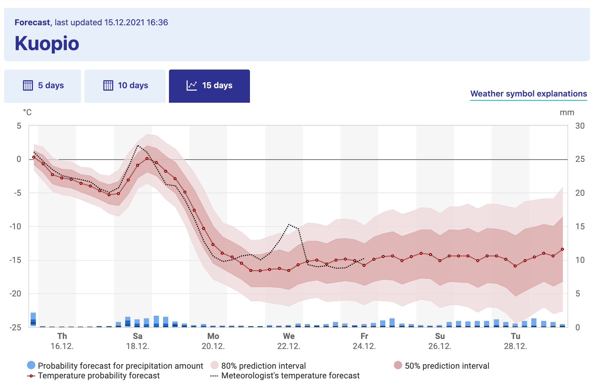

# Simulating and Visualizing Randomness {#stoch-sim-22}

In Chapter \@ref(stoch-sys-21) we examined models for stochastic biological systems. These types of models are an introduction to the study of stochastic differential equations (SDEs). A common theme to SDEs is learning how to analyze and visualize randomness, broadly defined. In order to do that we will need to level up our skills to summarize a cohort of simulations over time. Let's get started!

## Ensemble averages
Consider Figure \@ref(fig:kuopio-weather), which shows the weather forecast for Kuopio, a city in Finland [@finnish_meteorological_institute_weather_2021]:^[While I could have picked any city, a lot of this textbook was written while I was on sabbatical in Kuopio. I highly recommend Finland as a country to visit.] 

```{r kuopio-weather, echo=FALSE,out.width = "80%",fig.cap = "Long term weather forecast for Kuopio, a city in Finland, from the Finnish Weather Institute. Accessed 16-Dec 2021."}

```

Figure \@ref(fig:kuopio-weather) shows a great example of what is called an *ensemble average*.\index{ensemble average} The horizontal axis lists the time of day and the vertical axis is the temperature (the bar graph represents precipitation). The forecast temperature at a given point in time can have a range of outcomes, with the median of the distribution as the "temperature probability forecast"[^stochasticsimulation-1]. The red shading states that 80% of the outcomes fall in a given range, so while the median temperature on Monday, December 20 (labeled as Mo 20.12 - dates are represented as DAY-MONTH-YEAR) is  $-10^{\circ}$C, it may range between $-16$ and $-4^{\circ}$C (3 to 24 $^{\circ}$F, brrr!). Based on the legends given, we would say the 80% confidence interval is between $-10$ to $-4^{\circ}$C, or the models have 80% confidence for the temperature to be between that range of temperatures.

[^stochasticsimulation-1]: Notice the meteorologist's temperature forecast on Wednesday, December 22 - sometimes what they predict may diverge from the model outcomes!

Because there may be different factors that alter the weather in a particular spot (e.g. the timing of a low pressure front, clouds, etc.) there are different possibilities for an outcome of the weather forecast. While it may seem like forecasting weather is impossible to do, sometimes these changes lead to small fluctuations in the forecasted weather at a given point. The ensemble average in Figure \@ref(fig:kuopio-weather) becomes more uncertain (wider shading), as unforeseen events may drastically change the weather in the long term.

### Spaghetti plots
Now let's focus on how to construct an ensemble average, but first let's start with a sample dataset. Consider the following data in Table \@ref(tab:simul-table). Notice how all the simulations (`sim1`, `sim2`, `sim3`) share the variable `t` in common, so it makes sense to plot them on the same axis in Figure \@ref(fig:simul-graph-prev). We call a plot of all of the simulations together a *spaghetti plot*, because, well, it can look like a bowl of spaghetti noodles was dumped all over the plotting space.\index{plot!spaghetti}

```{r simul-table, echo=FALSE}
my_table <- tibble(
  t = 1:5,
  sim1 = round(runif(5, min = 0, max = 5), digits = 2),
  sim2 = round(runif(5, min = 0, max = 5), digits = 2),
  sim3 = round(runif(5, min = 0, max = 5), digits = 2)
)

knitr::kable(my_table, caption = "Simulations of a variable at different times.")
```


```{r simul-graph-prev,fig.cap="Spaghetti plot of the three simulations from Table \\@ref(tab:simul-table).",echo=FALSE}

my_table %>%
  pivot_longer(cols = c("sim1":"sim3"), 
               names_to = "name", values_to = "value") %>%
  ggplot(aes(x = t, y = value, group = name)) +
  geom_point() +
  geom_line() +
  labs(x = "Time", y = "Simulation Value") +
  theme_bw() +
  theme(
    legend.position = "bottom",
    legend.text = element_text(size = 14),
    axis.title.x = element_text(size = 14),
    axis.text.x = element_text(size = 10),
    axis.text.y = element_text(size = 10),
    axis.title.y = element_text(size = 14)
  ) 
  


```

While making the spaghetti plot isn't bad when you have three simulations, with (a lot) more simulations this would be a pain! An ensemble average computes *across* the rows in Table \@ref(tab:simul-table) (could be an average or a quantile) to generate a new column in the data. Building an ensemble average is a step by step process that involves a series of processes that transform a dataset where you will need to first pivot the dataset and then group and summarize.

### Pivot
When you have multiple columns of a plot that you want to show together (such as a spaghetti plot) we can use a command called `pivot_longer` that gathers different columns together (also shown in Table \@ref(tab:simul-table-long)).

```{r}
my_table_long <- my_table %>%
  pivot_longer(cols = c("sim1":"sim3"), 
               names_to = "name", values_to = "value")
```

```{r simul-table-long,echo=FALSE}
knitr::kable(my_table_long, caption = "Simulations of a variable at different times, condensed into a long table.")
```

Notice how the command `pivot_longer` takes the different simulations (`sim1`, `sim2`, `sim3`) and reassigns the column names to a new column called `name`, with values in the different columns appropriately assigned to the column `value`. This process called pivoting creates a new data frame, which makes it easier to generate the spaghetti plot (Figure \@ref(fig:simul-graph-prev)). Try the following code out on your own to confirm this:


```{r eval=FALSE}
my_table_long %>%
  ggplot(aes(x = t, y = value, group = name)) +
  geom_point() +
  geom_line() +
  labs(x = "Time", y = "Simulation Value")
```

### Group and summarize
The next step after pivoting is to collect the time points at $t=1$ together, $t=2$ together, and so on. In each of these groups we then compute the mean (average). This process is called *grouping* and then applying a *summarizing* function to all the members in a particular group (which in this case is the `mean`). The code to do this summarizing is shown below, with the results in Table \@ref(tab:table-summary):

```{r}
summarized_table <- my_table_long %>%
  group_by(t) %>%
  summarize(mean_val = mean(value))
```

```{r table-summary,echo=FALSE}
knitr::kable(t(round(summarized_table,2)), caption = "Ensemble averages for the three simulations at each of the times $t$.")
```

Notice how we are using the pipe `%>%` command to help organize the actions that we are doing. Think of the pipe as part of a multistep process - similar to function composition. Here is how you can read the previous code:

To compute the variable `summarized_table` we will:

 - **First** start with the data frame `my_table_long`,
 - **Second** signal to `R` to `group_by` the variable `t` (collect similar values together) in order to,
- **Third** compute the mean.


To explain this code a little more:  

- The command `group_by(t)` means collect similar time points together.
- The next line computes the mean. The command `summarize` means that we are going to create a new data frame column (labeled `mean_val` that is the mean of all the grouped times, from the `value` column.

We can add this mean value to our data (Figure \@ref(fig:simul-graph-prev)), represented with a thick red line. Try the following code out on your own:

```{r eval = FALSE}
my_table_long %>%
  ggplot(aes(x = t, y = value, group = name)) +
  geom_point() +
  geom_line() +
  geom_line(data = summarized_table, 
            aes(x = t, y = mean_val), color = "red", size = 2, 
            inherit.aes = FALSE) +
  geom_point(data = summarized_table, aes(x = t, y = mean_val), 
             color = "red", size = 2, 
             inherit.aes = FALSE) +
  guides(color = "none") +
  labs(x = "Time", y = "Simulation Value")
```

Notice two things:

- We can use the pipe (`%>%`) to the workflow before plotting with `ggplot`. This signals that `my_table_long` is the input data into `ggplot`.
- We included the option `inherit.aes = FALSE` (`inherit.aes` stands for "inherit aesthetics" ) when we plotted `summarized_table` with `geom_point` and `geom_line`. When you add a new data frame to a plot, the initial aesthetics (such as the `color` or the `group`) are passed on to subsequent commands. Setting `inherit.aes = FALSE` allows you to work with a clean slate.


## Repeated iteration
The previous example introduced the concept of pivoting data and computing an ensemble mean. Let's put this into additional practice with examples we have studied previously. Let's work with the logistic differential equation $\displaystyle \frac{dx}{dt} = rx\left(1- \frac{x}{K}\right)$. Our goal is to examine how different (random) initial conditions affect the modeled solution trajectories. The way we will approach this problem is with the following workflow:

> Do once $\rightarrow$ Do several times $\rightarrow$ Summarize $\rightarrow$ Visualize

We will apply this workflow step by step with code and results provided.

### Do once
To investigate the effect of the initial condition on the solution we will choose the initial condition from a uniform distribution between 0 and 20, shown in the following code and plotted in Figure \@ref(fig:logistic-example-rev):

```{r,eval=FALSE}

# Define the rate equation
logistic_eq <- c(dx ~ r * x * (1 - x / K)) 

# Identify any parameters
params <- c(r = .8, K = 100) 

# Random initial condition number 1
init_cond_rand <- c(x = runif(1, min = 0, max = 20)) 

soln_rand <- euler(
  system_eq = logistic_eq,
  initial_condition = init_cond_rand,
  parameters = params,
  deltaT = .05,
  n_steps = 200
)

# Random initial condition number 2
init_cond_rand_two <- c(x = runif(1, min = 0, max = 20)) 

soln_rand_two <- euler(
  system_eq = logistic_eq,
  initial_condition = init_cond_rand_two,
  parameters = params,
  deltaT = .05,
  n_steps = 200
)

# Plot your solutions:
ggplot() +
  geom_line(data = soln_rand, aes(x = t, y = x), color = "black") +
  geom_line(data = soln_rand_two, aes(x = t, y = x), color = "red") +
  labs(
    x = "Time",
    y = "x"
  ) 
```

```{r logistic-example-rev,fig.cap="Two solutions to the logistic differential equation with a random initial condition.",echo=FALSE}

# Define the rate equation
logistic_eq <- c(dx ~ r * x * (1 - x / K)) 

# Identify any parameters
params <- c(r = .8, K = 100) 

# Random initial condition
init_cond_rand <- c(x = runif(1, min = 0, max = 20)) 

soln_rand <- euler(
  system_eq = logistic_eq,
  initial_condition = init_cond_rand,
  parameters = params,
  deltaT = .05,
  n_steps = 200
) %>% mutate(run = 1)

# Random initial condition
init_cond_rand_two <- c(x = runif(1, min = 0, max = 20)) 

soln_rand_two <- euler(
  system_eq = logistic_eq,
  initial_condition = init_cond_rand_two,
  parameters = params,
  deltaT = .05,
  n_steps = 200
) %>% mutate(run = 2)

# Plot your solution:
solutions <- rbind(soln_rand,soln_rand_two)

solutions %>%
ggplot() +
  geom_line(aes(x = t, y = x,color=as.factor(run))) +
  labs(
    x = "Time",
    y = "x"
  ) +
  theme_bw() +
  theme(
    legend.position = "bottom",
    legend.text = element_text(size = 14),
    axis.title.x = element_text(size = 14),
    axis.text.x = element_text(size = 10),
    axis.text.y = element_text(size = 10),
    axis.title.y = element_text(size = 14)
  ) +
  scale_color_colorblind() +
  guides(color="none")
```


### Do several times
Running several hundred iterations of this model could quickly grow time consuming. Fortunately we can use iteration here to compute and gather several different solutions. First the code, followed by a deconstruction:

```{r eval=FALSE}
n_sims <- 500 # The number of simulations

# Compute solutions
logistic_sim <- rerun(n_sims, c(x = runif(1, min = 0, max = 20))) %>%
  set_names(paste0("sim", 1:n_sims)) %>%
  map(~ euler(
    system_eq = logistic_eq,
    initial_condition = .x,
    parameters = params,
    deltaT = .05,
    n_steps = 200
  )) %>%
  map_dfr(~.x, .id = "simulation")

# Plot these all together
logistic_sim %>%
  ggplot(aes(x = t, y = x)) +
  geom_line(aes(color = simulation)) +
  ggtitle("Random initial conditions") +
  guides(color = "none")

```


```{r logistic-example-many,fig.cap="Spaghetti plot for logistic differential equation with 500 random initial conditions.",echo=FALSE}
n_sims <- 500 # The number of simulations

# Compute solutions
logistic_sim <- rerun(n_sims, c(x = runif(1, min = 0, max = 20))) %>%
  set_names(paste0("sim", 1:n_sims)) %>%
  map(~ euler(
    system_eq = logistic_eq,
    initial_condition = .x,
    parameters = params,
    deltaT = .05,
    n_steps = 200
  )) %>%
  map_dfr(~.x, .id = "simulation")

# Plot these all together
logistic_sim %>%
  ggplot(aes(x = t, y = x)) +
  geom_line(aes(color = simulation)) +
  ggtitle("Random initial conditions") +
  guides(color = "none") +
  theme_bw() +
  theme(
    legend.position = "bottom",
    legend.text = element_text(size = 14),
    axis.title.x = element_text(size = 14),
    axis.text.x = element_text(size = 10),
    axis.text.y = element_text(size = 10),
    axis.title.y = element_text(size = 14)
  )

```


Wow!  This spaghetti plot is really interesting - it should show how even though the initial conditions vary between $x=0$ to $x=20$, eventually all solutions flow to the carrying capacity $K=100$ (which is a stable equilbrium solution). Initial conditions that start closer to $x=0$ take longer, mainly because they are so close to the other equilibrium solution at $x=0$ (which is an unstable equilibrium solution).

Ok, let's deconstruct this code line by line:

-   `rerun(n_sims, c(x=runif(1,min=0,max=20)))` This line does two things: `x=runif(1,min=0,max=20)` makes a random initial condition, and the command `rerun` runs this again for `n_sims` times.
-   `set_names(paste0("sim", 1:n_sims))` This line distinguishes between all the different simulations.
-   `map(~ euler( ... )` You should be familiar with `euler`, but notice the pronoun `.x` that substitutes all the different initial conditions into Euler's method. The `map` function iterates over each of the simulations.
-   `map_dfr(~ .x, .id = "simulation")` This line binds everything up together.

The resulting data frame should have three columns:
- `simulation`: which one of the 500 simulations (`sim1`, `sim2`, etc ...) this corresponds to.
- `t`: the value of the time
- `x`: the output value of the variable x.

This code applies a new concept called *functional programming*. This is a powerful tool that allows you to perform the process of iteration (do the same thing repeatedly) with uncluttered code. We won't delve more into this here, but I encourage you to read about more functional programming concepts in @wickham_r_2017.

### Summarize
Computing the ensemble average requires knowledge of how to use `R` to compute percentiles from a distribution of values. For our purposes here we will use the 95% confidence interval, so that means the 2.5 and 97.5 percentile (in which only 5% of the values will be outside of the specified interval), along with the median value (50th percentile). Let's take a look at the code for how to do that:

```{r,warning=FALSE,message=FALSE}

quantile_vals <- c(0.025, 0.5, 0.975)

logistic_quantile <- logistic_sim %>%
  group_by(t) %>%
  summarize(
    q_val = quantile(x,   # x is the column to compute the quantiles
      probs = quantile_vals
    ),
    q_name = quantile_vals
  ) %>%
  pivot_wider(names_from = "q_name", values_from = "q_val", 
              names_glue = "q{q_name}")

```


While this code is a little more involved, let's break it down piece by piece:

- To make things easier the variable `quantile_vals` computes the different quantiles, expressed between 0 to 1 - so 2.5% is 0.025, 50% is 0.5, and 97.5% is .975.
- As above, we are still grouping by the variable `t` and summarizing our data frame.
- However rather than applying the mean, we are using the command `quantile`, whose value is computed with the new column `q_val`. Like the mean, we define to which columns we apply the quantile function in the column `value`. We use `probs = quantile_vals` to specify the quantiles that we wish to compute.
- We also create a new column called `q_name` the contains the names of the quantile probabilities.
- The command `pivot_wider` takes the values in `q_val` with the associated names in `q_name` and creates new columns associated with each quantile. This process of making a data frame wider is the opposite of making a skinny and tall data frame with `pivot_longer`. A key convention with column names is not to start them with a number, so we *glue* a `q` onto the names of the column using the option `names_glue = "q{q_name}"`.

Wow. This is getting involved. One thing to keep in mind is that the the code as written should be easily adaptable if you need to compute an ensemble average. If you take an introductory data science or data visualization course I bet you will learn more about the role of pivoting data - but for now you can just adapt the above code to your needs


### Visualize
To plot the 95% confidence interval we introduce the plot geom called `geom_ribbon`. Applying `geom_ribbon` requires a few more aesthetics (`ymin` and `ymax`, or the minimum and maximum $y$ values to be plotted). The option `alpha = 0.2` refers to the transparency of the plot. The `fill` aesthetic just provides the shading (in other words the fill) between `ymin` and `ymax`.

```{r eval=FALSE}
logistic_quantile %>%
  ggplot() +
  geom_line(aes(x = t, y = q0.5), 
            color = "red", size = 2, inherit.aes = FALSE
            ) +
  geom_ribbon(aes(x = t, ymin = q0.025, ymax = q0.975),
              alpha = 0.2, fill = "red", inherit.aes = FALSE
              ) +
  guides(color = "none") +
  labs(x = "Time", y = "Ensemble average")
```

```{r logistic-conf,fig.cap="Ensemble average plot for the logistic differential equation with 500 random initial conditions.",echo=FALSE}
logistic_quantile %>%
  ggplot() +
  geom_line(aes(x = t, y = q0.5), 
            color = "red", size = 1, inherit.aes = FALSE
            ) +
  geom_ribbon(aes(x = t, ymin = q0.025, ymax = q0.975),
              alpha = 0.2, fill = "red", inherit.aes = FALSE
              ) +
  guides(color = "none") +
  labs(x = "Time", y = "Ensemble average") +
  theme_bw() +
  theme(
    legend.position = "bottom",
    legend.text = element_text(size = 14),
    axis.title.x = element_text(size = 14),
    axis.text.x = element_text(size = 10),
    axis.text.y = element_text(size = 10),
    axis.title.y = element_text(size = 14)
  )
```


Making ensemble averages isn't easy and requires strengthening your computational skills on several levels. Fortunately there are a lot of good tools when doing iteration and looping that easily allow you to adapt (shall I say iterate on?) existing examples to your needs. In future chapters we will move beyond random initial conditions to figuring out how the variables or parameters can be subject to random effects as time goes on.


## Exercises
<!-- EXERCISES - how are the logistic results different with varying k? varying r? what would you expect? - do a stochastic lotka-volterra or something stable (predator-prey) - find an ensemble average plot and interpret it. - do random initial conditions with neutral stability problem (birfurcation). - what if they plotted the ensemble phase plane? HMMM - bonus problem. -->
```{exercise}
Using the code to produce Figure \@ref(fig:logistic-conf):
  
  a. Adjust the `alpha` level to a number between 0 and 1. What does that do to the plot?
  b. Adjust the `fill` level to a color of your choosing. A list of R Colors can be found at the [R Color chart](http://www.cookbook-r.com/Graphs/Colors_(ggplot2)/).

```

```{exercise}
Read the Chapter 12 (tidy data) in @wickham_r_2017. In this chapter you will learn about tidy data. Explain what tidy data is and the potential uses for pivoting data wider or longer.
```

```{exercise}
Look at the documentation for quantile (remember you can type `?quantile` at the command line to see the associated help for this function). Change the ensemble average in `quantile_vals` to compute the 25%, 50%, and 75% percentile for `logistic_sim`. Finally, produce a ensemble average plot of this percentile.
```


```{exercise}
Consider the logistic differential equation: $\displaystyle \frac{dx}{dt} = rx\left(1- \frac{x}{K}\right)$. The function `logistic_mod` below takes the initial value problem $x(0)=3$ and solves the differential equation.

a. Run `logistic_mod(r=0.8,K=100)` and plot its result.
b. Run 500 simulations with varying $r$ chosen from a uniform distribution with minimum value of 0.4 and maximum value of 1.0. Create a spaghetti and ensemble average plot. Set $K=100$.
c. Run 500 simulations with varying $K$ chosen from a uniform distribution with minimum value of 50 and maximum value of 150. Create a spaghetti and ensemble average plot. Set $r=0.8$.
d. Compare your results along with Figures \@ref(fig:logistic-example-many) and \@ref(fig:logistic-conf). How does randomizing the initial condition or the parameters affect the results?

```


```{r,eval=FALSE}
logistic_mod <- function(r,K) {
  logistic_eq <- c(dx ~ r * x * (1 - x / K)) # Define the rate equation
  
  params <- c(r=r,K=K) # Identify any parameters
  
  init_cond <- c(x = 3) # Initial condition
  soln <- euler(
    system_eq = logistic_eq,
    initial_condition = init_cond,
    parameters = params,
    deltaT = .05,
    n_steps = 200
  )
  
  return(soln)
}
```

```{exercise}
Using the data frame `my_table`, compare the following code below. The data frame `table1` is skinny and long, and the second data frame `table2` is called short and wide. Why did we need to make this data frame short and wide for plotting?

```

```{r code-chunk-compare,eval=FALSE}
# First code chunk
table1 <- my_table %>%
  rowwise(t) %>%
  summarise(q_val = quantile(c_across(starts_with("sim")),
                                probs = quantile_vals),
            q_name = quantile_vals)

# Second code chunk
table2 <- my_table %>%
  rowwise(t) %>%
  summarise(q_val = quantile(c_across(starts_with("sim")),
                                probs = quantile_vals),
            q_name = quantile_vals) %>%
  pivot_wider(names_from = "q_name",values_from="q_val",
              names_glue = "q{q_name}")
```


```{exercise}
Consider the following differential equation:

\begin{equation}
\begin{split}
\frac{dx}{dt} =-y-x(x^2+y^2-1) \\
\frac{dy}{dt}=x-y(x^2+y^2-1)
\end{split}
\end{equation}

a. Generate a phase plane for this differential equation. Store this phase plane in a variable called `pp1`. Set your x and y windows to be between $-1$ and $1$.
b. The code below defines a function `limit_cycle_mod` that creates a solution trajectory of the differential equation. Super-impose a few different solution trajectories with random initial conditions onto your phase plane (`pp1`). Use initial conditions `x0` and `y0` between 0 and 1. Be sure to use the plot geom `geom_path`.
c. Modify the code from this chapter to run 50 different simulations with random initial conditions `x0` and `y0` between 0 and 1. *Note:* It may be helpful to include the code `map(~ limit_cycle_mod(runif(1),runif(1)))`.
d. Plot the initial conditions from your simulation onto your phase plane. Isn't the result pretty?
  
```

```{r eval=FALSE}
limit_cycle_mod <- function(x0,y0) {
  limit_cycle_eq <- c(dx ~ -y-x*x*(x^2+y^2-1),
                   dy ~ x-y*(x^2+y^2-1) ) # Define the rate equation

  init_cond = c(x=x0,y=y0)
  soln <- rk4(
    system_eq = limit_cycle_eq,
    initial_condition = init_cond,
    deltaT = .05,
    n_steps = 200
  )
  
  return(soln)
}

```
