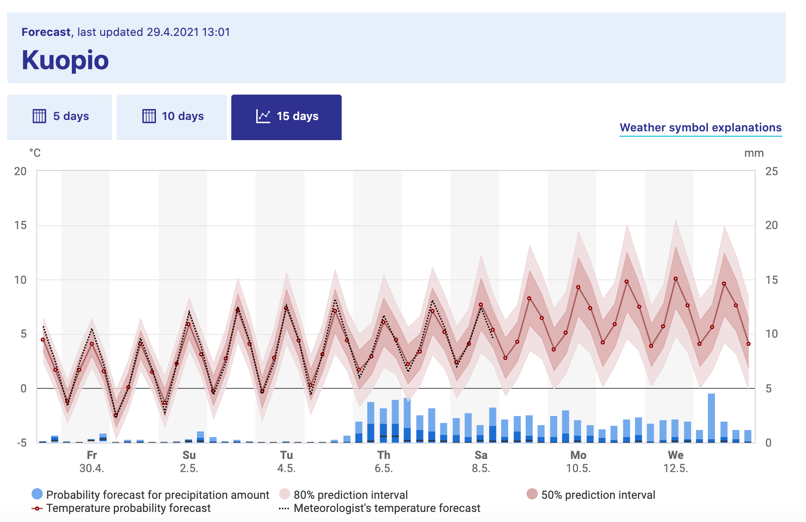

# Simulating and Visualizing Randomness {#stoch-sim-22}

In Section \@ref(stoch-sys-21) we examined models for stochastic biological systems, which will lead us into the study of stochastic differential equations (SDEs). A key factor in understanding SDEs is learning basic tools to simulate and visualize results. In this section we will study how to visualize different simulations in `R` and ways to summarize the cohort of simulations over time.

## Ensemble Averages
Consider Figure \@ref(fig:kuopio-weather), which shows the weather forecast for Kuopio, which is a city in Finland:^[I could have picked any city, but a lot of this textbook was written while I was on sabbatical in Kuopio. I highly recommend Finland as a country to visit.]

```{r kuopio-weather, echo=FALSE,out.width = "5in",fig.align="center",fig.cap = "Long-term weather forecast for Kuopio, a city in Finland"}

```

Figure \@ref(fig:kuopio-weather) is a great example of what is called an *ensemble average*. The horizontal axis lists the time of day and the vertical axis is the temperature (the precipitation is in bars down below, but not important in this context). The forecast temperature at a given point in time can have a range of outcomes, with the median of the distribution as the \`\`temperature probability forecast''[^stochasticsimulation-1]. The shading says that 80% of the outcomes fall in a given range, so while the median temperature on Tuesday May 5 (labeled as Tu 4.5) is 7$^{\circ}$ C, it may range between 4 and 11$^{\circ}$ C (39 to 51 $^{\circ}$ F). Based on the legends given, the 80% confidence interval is between 4 - 11$^{\circ}$ C, or the models have 80% confidence for the temperature to be between that range of temperatures.

[^stochasticsimulation-1]: Notice the meteorologist's temperature forecast - sometimes that may diverge from the model outcomes!

Because there may be different factors that alter the weather in a particular spot (e.g. the timing of a low-pressure front, or clouds, etc) there are different possibilities for an outcome of the weather forecast. While that may seem like forecasting weather may impossible to do, sometimes these changes lead to small fluctuations in the forecasted weather at a given point. The further out in time the more ensemble average becomes more uncertain (wider bars), as unforeseen events may drastically change the weather in the long term.

## Computing ensemble averages

Dealing with an ensemble average is a great way to show your uncertainty or confidence in a model outcome. But how would you compute an ensemble average?

We are going to build this up step by step. For example let's say we have the following data in Table \@ref(tab:simul-table):

```{r simul-table, echo=FALSE}
my_table <- tibble(t = 1:5, 
                   sim1 = round(runif(5,min=0,max=5),digits=2),
                   sim2 = round(runif(5,min=0,max=5),digits=2),
                   sim3 = round(runif(5,min=0,max=5),digits=2) )

knitr::kable(my_table, caption = "Simulations of a variable at different times.")

```

Notice how all the simulations (`sim1`, `sim2`, `sim3`) share the variable `t` in common, so it makes sense to plot them on the same axis in Figure \@ref(fig:simul-graph). 

```{r simul-graph-prev,out.width = "5in",fig.align="center",fig.cap="Initial Timeseries plot of the three simulations from Table \\@ref(tab:simul-table)."}
my_table %>%
  ggplot() +
  geom_point(aes(x=t,y=sim1)) +
  geom_line(aes(x=t,y=sim1)) +
  geom_point(aes(x=t,y=sim2)) +
  geom_line(aes(x=t,y=sim2)) +
  geom_point(aes(x=t,y=sim3)) +
  geom_line(aes(x=t,y=sim3)) +
  labs(x = "Time", y="Simulation Value")

```

One thing to adjust in the code used to produce the spaghettic plot in Figure \@ref(fig:simul-graph-prev) is that the code is really long - we needed a `geom_point` and `geom_line` for each simulation.  While this isn't bad when you have three simulations, one lesson we will learn is that the more simulations gives you better confidence in your results. If we have 500 simulations this would be a pain to code! Fortunately there is a command called `pivot_longer` that gathers different columns together:

```{r simul-table-long}
my_table_long <- my_table %>%
  pivot_longer(cols=c("sim1":"sim3"),names_to="name",values_to="value")

knitr::kable(my_table_long, caption = "Simulations of a variable at different times, condensed into a long table.")

```

Notice how the command `pivot_longer` takes the different simulations (`sim1`, `sim2`, `sim3`) and reassigns the column names to a new column `name` and the values in the different columns to `value`. This process called pivoting creates a new data frame, which is easier to generate the spaghetti plot.


```{r simul-graph,out.width = "5in",fig.align="center",fig.cap="Timeseries plot of the three simulations from Table \\@ref(tab:simul-table)."}
my_table_long <- my_table %>%
  pivot_longer(cols=c("sim1":"sim3"),names_to="name",values_to="value")

my_table_long %>%
  ggplot(aes(x=t,y=value,group=name)) +
  geom_point() +
  geom_line() +
  labs(x = "Time", y="Simulation Value")

```

### Grouping
To compute an ensemble average we collect the time points at $t=1$ together, $t=2$ together, and so on. In each of these groups we then compute the mean (average). This process is called *grouping* and then applying a summarizing function to all the members in a particular group (which in this case is the mean). Here is the code to do that process with the data frame `my_table_long`:

```{r table-summary}
summarized_table <- my_table_long %>%
  group_by(t) %>% 
  summarize(mean_val = mean(value))

knitr::kable(summarized_table, caption = "Simulations of a variable at different times, along with the mean value (last column).")

```

Let's break this down.  

- The command `group_by(t)` means collect similar time points together
- The next line computes the mean.  The command `summarize` means to that we are going to create a new data frame column (labeled `mean_val` that is the mean of all the grouped times, from the `value` column.

We can add this mean value to our data (Figure \@ref(fig:simul-graph-rev)), represented with a thick red line.

```{r simul-graph-rev,out.width = "5in",fig.align="center",fig.cap="Timeseries plot of the three simulations from Table \\@ref(tab:table-summary)."}
my_table_long %>%
  ggplot(aes(x=t,y=value,group=name)) +
  geom_point() +
  geom_line() +
  geom_line(data=summarized_table,aes(x=t,y=mean_val),color='red',size=2,inherit.aes = FALSE) +
  geom_point(data=summarized_table,aes(x=t,y=mean_val),color='red',size=2, inherit.aes = FALSE) +
  guides(color=FALSE) +
  labs(x = "Time", y="Simulation Value")
```

Notice how we added the additional `geom_point` and `geom_line` with the option `inherit.aes = FALSE`. This stands for "inherit aesthetics"  When you add a new data frame to a plot, the initial aesthetics (such as the `color` or the `group`) are passed on. Setting `inherit.aes = FALSE` allows you to work with a clean slate.

Computing the other parts of the ensemble average requires knowledge of how to compute percentiles of a distribution of values. For our purposes here we will use the 95% confidence interval, so that means the 2.5th, 97.5th percentile (which only 5% of the values will be outside of the specified interval), along with the median value (50th percentile). Let's take a look at the code how do do that:

```{r quantile-table}
quantile_vals <- c(0.025, 0.5, 0.975)

quantile_table <- my_table_long %>%
  group_by(t) %>%
  summarize(q_val = quantile(value,
                                probs = quantile_vals),
            q_name = quantile_vals) %>%
  pivot_wider(names_from = "q_name",values_from="q_val",names_glue = "q{q_name}")

knitr::kable(quantile_table, caption = "Simulations of a variable at different times, along with the median and the 95% confidence interval.")

```
While this code is a little more involved, let's break it down piece by piece:

- To make things easier the variable `quantile_vals` computes the different quantiles, expressed between 0 to 1 - so 2.5% is 0.025, 50% is 0.5, and 97.5% is .975.
- As above, we are still looking grouping by the variable `t` and summarizing our data frame.
- However rather than applying the mean, we are using the command `quantile`, whose value is computed with the new column `q_val`. Like the mean, we define which columns we apply the quantile function in the column `value`.  We use `probs = quantile_vals` to specify the quantiles that we wish to compute.
- We also create a new column called `q_name` the contains the names of the quantile probabilities.
- The command `pivot_wider` takes the values in `q_val` with the associated names in `q_name` and creates new columns associated with each quantile.  This process of making a data frame wider is the opposite of making a skinny and tall data frame with `pivot_longer`. Notice that a key convention in column names is that they don't start with a number, so we *glue* a `q` onto the names of the column.

Wow.  This is getting involved. One thing to keep in mind is that the the code as written should be easily adaptable if you need to compute an ensemble average. The last command about pivoting may seem foreign, but learning how to pivot data is a good skill to invest time in. If you take an introductory data science or data visualization course I bet you will learn more about the role of pivoting data - but for now you can just adapt the above code to your needs

Now onto plotting the data. What we will do is plot the ensemble average as a ribbon, so that is a new plot `geom_ribbon`. It requires a few more aesthetics (`ymin` and `ymax`, or the minimum and maximum y values to be plotted).

```{r simul-graph-conf,out.width = "5in",fig.align="center",fig.cap="Timeseries plot of the three simulations from Table \\@ref(tab:table-summary), along with the 95% confidence interval (red)."}
my_table_long %>%
  ggplot(aes(x=t,y=value,color=name)) +
  geom_point() +
  geom_line() +
  geom_line(data=quantile_table,aes(x=t,y=q0.5),color='red',size=2,inherit.aes = FALSE) +
  geom_point(data=quantile_table,aes(x=t,y=q0.5),color='red',size=2, inherit.aes = FALSE) +
  geom_ribbon(data=quantile_table,aes(x=t,ymin=q0.025,ymax=q0.975),alpha=0.2,fill='red', inherit.aes = FALSE) +
  guides(color=FALSE) +
  labs(x = "Time", y="Simulation Value")
```

A lot of this code to produce Figure \@ref(fig:simul-graph-conf) is similar to when we plotted the mean value (Figure \@ref(fig:simul-graph-rev)), but we changed the second data frame to be plotted to `quantile_table` and included the `geom_ribbon` command. The command `alpha = 0.2` refers to the transparency of the plot. The `fill` aesthetic just provides the shading (in other words the fill) between `ymin` and `ymax`.

## Doing many simulations and visualizing

Now that we have some idea of a ensemble average, let's put this into practice by doing some simulations of some one and two dimensional equations. What you will learn here is how to generate a simulation

For example consider the following code that produces a solution to the logistic differential equation:

```{r logistic-example,out.width = "5in",fig.align="center",fig.cap="Solution to the logistic differential equation."}

logistic_eq <- c(dx~r*x*(1-x/K))  # Define the rate equation

params <- c(r=.8,K=100)  # Identify any parameters

init_cond <- c(x=3)  # Initial condition
soln <- euler(logistic_eq,init_cond,params,deltaT=.05,n_steps=200)

# Plot your solution:

ggplot() + 
  geom_point(data = soln, aes(x = t, y = x)) +
  geom_line(data = soln, aes(x = t, y = x)) +
  labs(x='Time',
         y='x')

```

What if you wanted to investigate the effect of the initial condition on the solution, so the solution was randomly chosen, from a uniform distribution between 0 and 20? Well, to do one simluation is not a small modification of the code:

```{r logistic-example-rev,out.width = "5in",fig.align="center",fig.cap="Solution to the logistic differential equation with a random initial condition."}

logistic_eq <- c(dx~r*x*(1-x/K))  # Define the rate equation

params <- c(r=.8,K=100)  # Identify any parameters

init_cond <- c(x=runif(1,min=0,max=20))  # Random initial condition
soln <- euler(logistic_eq,init_cond,params,deltaT=.05,n_steps=200)

# Plot your solution:

ggplot() + 
  geom_point(data = soln, aes(x = t, y = x)) +
  geom_line(data = soln, aes(x = t, y = x)) +
  labs(x='Time',
         y='x')

```

But this could quickly grow time consuming if you wanted to do this several times (think hundreds). Fortunately we will can use iteration here to compute and gather several different solutions. I am going to post the code and then we can deconstruct it:

```{r logistic-example-many,out.width = "5in",fig.align="center",fig.cap="Many realiziations of the logistic differential equation with random initial conditions."}
n_sims <- 500  # The number of simulations

# Compute solutions
try1 <- rerun(n_sims, c(x=runif(1,min=0,max=20))) %>%
  set_names(paste0("sim", 1:n_sims)) %>%
  map(~ euler(logistic_eq,.x,params,deltaT=.05,n_steps=200)) %>%
  map_dfr(~ .x, .id = "simulation")


# Plot these all up together
try1 %>%
  ggplot(aes(x = t, y = x)) +
  geom_line(aes(color = simulation)) +
  ggtitle("Random initial conditions") +
  guides(color=FALSE)

```

Ok, let's deconstruct this code line by line:

-   `rerun(n_sims, c(x=runif(1,min=0,max=5)))` This line does two things: `x=runif(1,min=0,max=5)` makes a random initial condition, and the command `rerun` runs this again for `n_sims` times.
-   `set_names(paste0("sim", 1:n_sims))` This line distinguishes between all the different simulations.
-   `map(~ euler(logistic_eq,.x,params,deltaT=.05,n_steps=200))` You should be familiar with `euler`, but notice the pronoun `.x` that substitutes all the different initial conditions into Euler's method. The `map` function iterates over each of the simulations.
-   `map_dfr(~ .x, .id = "simulation")` This line binds everything up together.

This code applies a new concept called *functional programming*.  This is a powerful tool that allows you to perform the process of iteration (do the same thing repeatedly) with uncluttered code. We won't delve more into this here, but I encourage you to read about more programming concepts in [https://r4ds.had.co.nz/iteration.html](R for data science) by Wickham and Grolemund

## Exercises
<!-- EXERCISES - how are the logistic results different with varying k? varying r? what would you expect? - do a stochastic lotka-volterra or something stable (predator-prey) - find an ensemble average plot and interpret it. - do random initial conditions with neutral stability problem (birfurcation). - what if they plotted the ensemble phase plane? HMMM - bonus problem. -->
```{exercise}
Using the code to produce Figure \@ref(fig:simul-graph-conf):
  a. Adjust the `alpha` level to a number between 0 and 1.  What does that do to the plot?
  b. Adjust the `fill` level to a color of your choosing. A list of R Colors can be found here: [http://www.cookbook-r.com/Graphs/Colors_(ggplot2)/](R Color chart)
```
&nbsp;
```{exercise}
Read the Chapter 12 in R for Data Science: [https://r4ds.had.co.nz/tidy-data.html](Tidy data). In this chapter you will learn about tidy data. Explain what tidy data is and the potential uses for pivoting data wider or longer.
```
&nbsp;
```{exercise}
Look at the documentation for quantile (remember you can type `?quantile` at the command line to see the associated help for this function.) Change the ensemble average in `quantile_table` to compute the 25%, 50%, and 75% percentile.  Finally, produce a ensemble average plot of this percentile. How does your result compare to Figure \@ref(fig:simul-graph-conf)?
```
&nbsp;
```{exercise}
Take the data frame `try1` from the simulations of the logistic equation and generate an ensemble average (median with 95% confidence interval) of the different simulations and make a plot of the ensemble average without the different simulations.
```

&nbsp;

```{exercise}
Using the data frame `my_table`, compare the following code:
\begin{verbatim}
my_table %>%
  rowwise(t) %>%
  summarise(q_val = quantile(c_across(starts_with("sim")),
                                probs = quantile_vals),
            q_name = quantile_vals)
\end{verbatim}

\begin{verbatim}
my_table %>%
  rowwise(t) %>%
  summarise(q_val = quantile(c_across(starts_with("sim")),
                                probs = quantile_vals),
            q_name = quantile_vals) %>%
  pivot_wider(names_from = "q_name",values_from="q_val",names_glue = "q{q_name}")
\end{verbatim}

The first data frame is skinny and long, and the second one is called short and wide. Why did we need to make this data frame short and wide for plotting?

```


