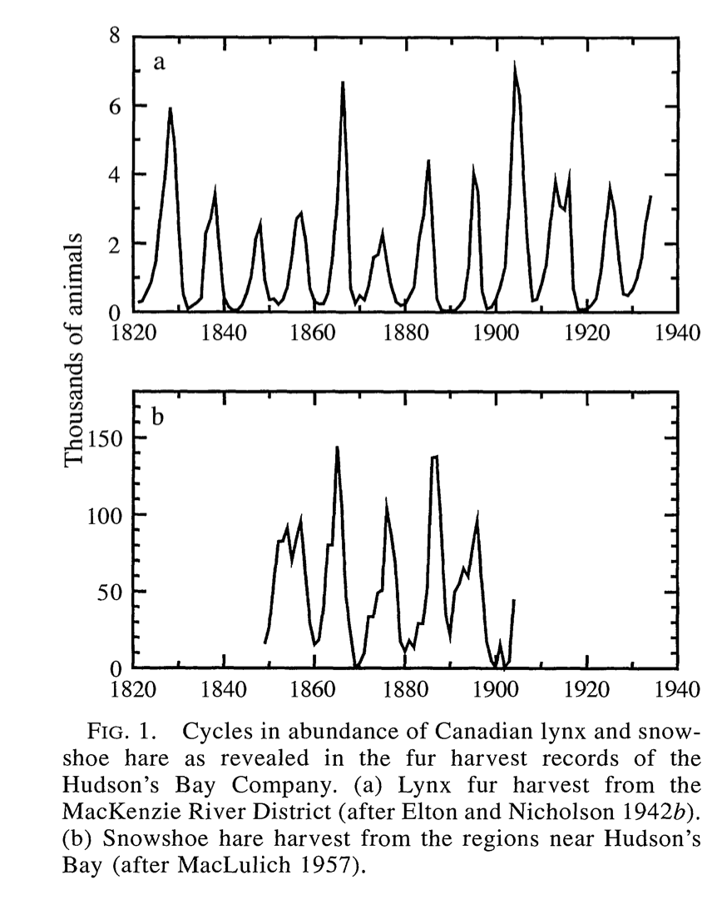

--- 
title: "Exploring modeling with data and differential equations using R"
author: "John M. Zobitz"
date: "`r Sys.Date()`"
description: "A textbook used for MAT 369 at Augsburg University."
geometry: "left=0.5in,right=0.5in,top=0.75in,bottom=0.5in"
site: bookdown::bookdown_site
# output: bookdown::gitbook
documentclass: book
bibliography: [book.bib, packages.bib]
biblio-style: apalike
link-citations: yes
github-repo: openscapes/series
header-includes: 
  - \usepackage{tikz}
  - \usepackage{pgfplots}
  - \usepackage{amsmath}
  - \usetikzlibrary{calc}
  - \usetikzlibrary{arrows,matrix,positioning}
  - \usepackage{float}
  - \floatplacement{figure}{H}
  - \usepackage[shortlabels]{enumitem}
  - \usepackage{mathtools}
output:
  bookdown::gitbook:
    toc_depth: 2
    split_by: section
    number_sections: true
    split_bib: true
    config:
      toc:
        scroll_highlight: yes
        collapse: section
        before: |
          <li><a href="./"><strong>Modeling with R</strong><br>by John Zobitz</a></li>
        after: |
          <li style="padding: 10px 15px; font-weight: bold;">Open access book-in-progress</li>
          <li><a rel="license" href="http://creativecommons.org/licenses/by-nc-nd/4.0/"></a></li>
          <li><a href="https://bookdown.org" target="_blank">Built with Bookdown + RStudio</a></li>
      view: https://jmzobitz.github.io/ModelingWithR/
      search: yes
      sharing:
        twitter: yes
        facebook: no
        github: yes
        all: no

  bookdown::pdf_book:
    toc_depth: 2
    number_sections: true
    citation_package: default

  bookdown::markdown_document2:
    default
---

```{r include=FALSE}
# Define the packages that we need to load up:
library(tidyverse)
#library(MAT369Code)
library(lubridate)
library(bookdown)
library(knitr)
```


# Welcome {#welcome}

# Creating this from Bookdown to Github
I stumbled on how to do this by going to this [website](https://jules32.github.io/bookdown-tutorial/) and built this out from here.  I am glad that I will be able to work on this.


```{r include=FALSE}
# automatically create a bib database for R packages
knitr::write_bib(c(
  .packages(), 'bookdown', 'knitr', 'rmarkdown'
), 'packages.bib')
```

<!--chapter:end:index.Rmd-->

# (PART) Models with Differential Equations {-} 

# Models of rates with data


## What is the book about?

The focus of this textbook is understanding _rates of change_ and how you can apply them to model real-world phenomena. In addition this textbook focuses on _using_ equations with data, building both your competence and confidence to construct a mathematical model from data and a context. 

I can imagine that your first sustained encounter of rates of change was in your calculus course, perhaps answering the following types of questions:

- If $y = xe^{-x}$, determine the derivative function $f'(x)$.
- Where is the graph of $\sin(x)$ increasing at an increasing rate?
- If you release a ball from the top of a skyscraper 500 meters above the ground, what is its speed when it impacts the ground?

Some of these mathematical questions derive from models from physical phenomena, such as the ball falling off a skyscraper which assumes that acceleration of the ball is constant.  This assumption is typically a starting point to build a mathematical model.  Using acceleration, the velocity (or the antiderivative of acceleration) can be found, from which the position function can be calculated through antidifferentiation.

However many times we observe data and _then_ construct a mathematical model to corroborate our observations. Some of the these models come from well-understood physical phenomena (such as the case of the falling ball).


## Modeling in context: the spread of a disease
To see what the first steps would be, consider the data in Figure \@ref(fig:sierra-leone), which come from an [Ebola outbreak](https://www.cdc.gov/vhf/ebola/history/2014-2016-outbreak/index.html) in Sierra Leone in 2014.

```{r sierra-leone,warning=FALSE,message=FALSE,echo=FALSE,fig.cap='An Ebola outbreak in Sierra Leone', fig.width=4,fig.height=3}
ebola <- read_csv("data/ebola.csv") %>%
  mutate(date = mdy(`WHO report date`), `WHO report date` = NULL) %>%
  select(-c(1,3,5)) %>%
  gather(key=nation, value=deaths,
         1:3) %>%
  mutate(monitor_days = as.numeric(date) - min(as.numeric(date)) + 1)

ebola %>% filter(nation=="Deaths Sierra Leone") %>%
  ggplot() +
  geom_point(aes(x=monitor_days,y=deaths),size=2) +
  theme(legend.position="bottom",
        legend.text=element_text(size=14),
        axis.title.x=element_text(size=18),
        axis.text.x=element_text(size=10),
        axis.text.y=element_text(size=10),
        axis.title.y=element_text(size=18)) +
  labs(x = "Monitoring Days",y = "Ebola deaths")
```

These data represent the deaths due to Ebola in Sierra Leone. Constructing a model from disease dynamics is part of the field of [mathematical epidemiology](https://en.wikipedia.org/wiki/Mathematical_modelling_of_infectious_disease).  How we construct a mathematical model of the spread of this outbreak largely depends on the assumptions underlying the dynamics of the disease, such as considering the rate of spread of Ebola. This model also depends on the spatial scale studied as well - how a model is constructed depends if we wish to examine the spread of the disease in an individual immune response, or understand general principles for the spread through a population. 

Basic questions that one can ask is if the rate of deaths due to Ebola proportional to:

- The number of people infected?
- The number of people not infected?
- The number of infected people coming into contact with those not infected?

Let's see what each of these mathematical models would look like if we wrote down an equation.  Since we are discussing *rates* of infection, this means we will need a *rate of change* or derivative.  Let's use the letter $I$ to represent the number of people that are infected.

### Model 1: Infection rate proportional to number infected.
In the first case (the rate of infection proportional to the number of people infected), to translate that statement into an equation would be the following:

\begin{equation}
\frac{dI}{dt} = kI
\end{equation}

where $k$ can be thought of as a proportionality constant, with units of time$^{-1}$ for consistency.  This is an example of a *differential equation*, which is just a mathematical equation with rates of change.

Differential equations may look different because what we are solving for is the function $I(t)$. ^[You may be used to working with *algebraic equations* (e.g. solve $x^{2}-4=0$ for $x$).  In that case the solution can be points (for our example, $x=\pm2$).]  Later on we will examine how to ``solve'' a differential equation (which means we determine the family of functions consistent with our rate equation).

Notice the proportionality constant $k$ - we call this a *parameter*.  We can always try to solve an equation without specifying the parameter - and then if we wanted to plot a solution the parameter would also be specified.  In some situations we may not be as concerned with the particular _value_ of the parameter but rather its influence on the long-term behavior of the system (this is one aspect of [bifurcation theory](https://en.wikipedia.org/wiki/Bifurcation_theory)).  Otherwise we can use the collected data shown above with the given model to determine the value for $k$.  This combination of a mathematical model with data is called *data assimilation* or *model-data fusion*. How exciting!


Before we think about possible solutions let's try to reason out if the first model would be plausible.  This model states that the rate of change (the amount of increase) gets larger the more people that are sick.  That does seem reasonable as a model, but perhaps unreasonable in real life.  In the case of Ebola or any other infection disease, stringent public health measures would be put in place before large numbers of people die.  We would expect that the rate of infection would decrease and the number of deaths to slow.  So perhaps the second model might be a little more plausible.  At some point the number of people who are *not* sick will reach zero, making the rate of infection be zero (or no increase).

### Model 2:  Infection rate proportional to number NOT infected.
In this description notice how we are talking about people who are sick (which we have denoted as $I$) and people who are *not* sick.  This looks like we might need to introduce another variable for the ``not sick'' people, which we will call $S$, or susceptible.  So the differential equation we would write down would be:

\begin{equation} 
\frac{dI}{dt} = kS  (\#eq:01notinfected)
\end{equation}

We are still using the parameter $k$ as with the previous model.  Also note we introduced the second variable $S$ is in Equation \@ref(eq:01notinfected).  Because we have introduced another variable $S$ we should also include a differential equation for how $S$ changes as well.  One way that we can do this is by considering our entire population as consisting of two groups of people: $S$ and $I$.  Infection brings someone over from $S$ to $I$, which we have in this diagram:

```{r,engine='tikz',warning=FALSE,message=FALSE,echo=FALSE}
\begin{center}
\tikzstyle{vspecies}=[rectangle,minimum size=0.5cm,draw=black]
\begin{tikzpicture}[auto, outer sep=1pt, node distance=2cm]

\node [vspecies] (S) {S} ;
\node [vspecies, right of = S] (I) {I} ;
\draw [->,thick] (S) --  node {\small{$k$}} (I) ;

\end{tikzpicture}
\end{center}

```

There are three reasons why I like to use diagrams like these: (1) they help organize my thinking about a mathematical model (2) any assumed parameters are listed, and (3) they help me to see that rates can be conserved.  In other words, if I enter into the box for $I$, then someone is leaving $S$.  In other words, $\displaystyle \frac{dS}{dt} = -kS$.  So the two equations together can be represented as:

\begin{align*}
\frac{dS}{dt} &= -kS \\
\frac{dI}{dt} &= kS
\end{align*}


This differential equation is what we would call a *coupled differential equation*.  In order to ``solve'' the system we need to determine functions for $S$ and $I$.  This coupled set of equations looks a little clunky, but we do notice something cool.  Algebriacally we have:

\begin{equation} 
\frac{dS}{dt} +  \frac{dI}{dt} = \frac{d(S+I)}{dt} = 0
\end{equation}

Recall from calculus that if a rate of change equals zero then the function is constant.  In this case, the variable $S+I$ is constant, or we can also call $S+I=N$, the number of people in the population.  This means that $S=N-I$, so we can re-write our differential equation in one equation:

\begin{equation}
\frac{dI}{dt} = k(N-I)
\end{equation}


This second model does have some limiting behavior to this model as well.  As the number of infected people reaches $N$ (the total population size), the values of $\displaystyle \frac{dI}{dt}$ approaches zero, meaning $I$ doesn't change.  There is one caveat to this - if there are no infected people around ($I=0$) *the disease can still be transmitted*, which might make not good biological sense. 

### Model 3: Infection rate proportional to infected meeting not infected.
The third model rectifies some of the shortcomings of the second model (which rectified the shortcomings of the first model).  This model states that the rate of infection is due to those who are sick, actually infecting those who are not sick.  This would sort of scenario would also make some sense, as it focused on that *transmission* of the disease are between susceptibles and infected people. So if nobody is sick ($I=0$) then the disease is not spread.  Likewise if there are no susceptibles ($S=0$), the disease is not spread as well.

In this case the diagram outlining this approach looks something like this:

```{r logistic,engine='tikz',warning=FALSE,message=FALSE,echo=FALSE}
\begin{center}
\tikzstyle{vspecies}=[rectangle,minimum size=0.5cm,draw=black]
\begin{tikzpicture}[auto, outer sep=1pt, node distance=2cm]

\node [vspecies] (S) {S} ;
\node [vspecies, right of = S] (I) {I} ;
\draw [->,thick] (S) --  node {\small{$k$}} (I) ;

\end{tikzpicture}
\end{center}

```


The differential equations that describe this scenario are the following:

\begin{align*}
\frac{dS}{dt} &= -kSI \\
\frac{dI}{dt} &= kSI
\end{align*}

Just like before for Model 2 we can combine the two equations to yield a single differential equation:

\begin{equation}
\frac{dI}{dt} = k\cdot I \cdot (N-I)
\end{equation}
Look's pretty similar to model 2, doesn't it?  In this case notice the variable $I$ outside the expression.  Notice this seems to be appropriate - if $I=0$, then there is no increase in infection.  If $I=N$ (the total population size) then there is no increase in the infection.


## The qualitative nature of solution curves
So far we have primarily been focused on the qualitative understanding of the different models.  One way we can look at how these different models work together is by plotting $\displaystyle \frac{dI}{dt}$ versus $I$.  I know we have the parameters $k$ and $N$ to specify, but let's just set them to be $k=1$ and $N=10$ respectively.  Plots of these functions are shown in Figure \@ref(fig:threeRates).

```{r threeRates,message=FALSE,echo=FALSE,fig.cap='Comparing rates of change for three models',warning=FALSE,fig.width=4,fig.height=3}
x <- seq(0,12,length.out=100)
n <- 10

data.frame(x,m1=x,m2=(n-x),m3=x*(n-x)) %>%
  gather(key=model,value=rate,m1,m2,m3) %>%
  ggplot(aes(x=x,y=rate,color=model)) +
  geom_line(size=1) + xlab("I") + ylab("dI/dt") +
  scale_color_discrete(labels=c("Model 1","Model 2","Model 3"),name=NULL) +
  theme(legend.position="bottom",
        legend.text=element_text(size=14),
        axis.title.x=element_text(size=18),
        axis.text.x=element_text(size=10),
        axis.text.y=element_text(size=10),
        axis.title.y=element_text(size=18)) +
  geom_hline(yintercept = 0)
  

```

There is a lot that we can tell from this figure.  Notice how the sign of $\displaystyle \frac{dI}{dt}$ is always positive for Model 1, indicating that the solution ($I$) is always increasing.  For Models 2 and 3, $\displaystyle \frac{dI}{dt}$ equals zero when $I=10$, which also is the value for $N$  After that case, $\displaystyle \frac{dI}{dt}$ turns negative, meaning that $I$ is decreasing.


In summary, we can tell a lot about the *qualitative behavior* of a solution to a differential equation even without the solution.

## Simulating a differential equation
Let's talk solutions.  One thing to note is that usually a differential equation also has a starting, or an initial value that actualizes the solution.  When we state a differential equation with a starting value we have an **initial value problem**.  For our case here we will assume that $I(0)=I_{0}$, where this is also another parameter at our disposal.

With that assumption, we can (and will solve later!) the following solutions for these models:

\begin{align*}
\mbox{ Model 1 (Exponential): } & I(t) = I_{0}e^{kt} \\
\mbox{Model 2 (Saturating): } & I(t) = N-(N-I_{0})e^{-kt} \\
\mbox{Model 3 (Logistic): } & I(t) = \frac{N \cdot I_{0} }{I_{0}+(N-I_{0})e^{-kt}}
\end{align*}

```{r threeSoln,message=FALSE,echo=FALSE,fig.cap='Three models compared',fig.width=4,fig.height=3,message=FALSE}
x <- seq(0,600,length.out=100)
n <- 4000
k <- 0.03
i0 <- 5

data.frame(x,m1=i0*exp(k*x),m2=n-(n-i0)*exp(-k*x),m3=n*i0/(i0 + (n-i0)*exp(-k*x))) %>%
  gather(key=model,value=rate,m1,m2,m3) %>%
  ggplot(aes(x=x,y=rate,color=model)) +
  geom_line(size=2) + xlab("t") + ylab("I") +
  scale_color_discrete(labels=c("Model 1","Model 2","Model 3"),name=NULL) +
  theme(legend.position="bottom",
        legend.text=element_text(size=14),
        axis.title.x=element_text(size=18),
        axis.text.x=element_text(size=10),
        axis.text.y=element_text(size=10),
        axis.title.y=element_text(size=18)) +
   ylim(c(0,4010))
  

```


In Figure \@ref(fig:threeSoln), I plot these solutions over the course of several days, using $k=0.03$ and $N=4000$ and $I_{0}=5$. Notice how Model 1 increases quickly - it actually grows without bound off the chart!  Model 2 and Model 3 have saturating behavior, but it looks like Model 3 might be the one that actually captures the trend of the data.  Models 2 and 3 are more commonly known as the __saturating__ and __logistic__ models respectively.


## Which model is best?
All three of these scenarios describe different modeling scenarios.  While we haven't solved these differential equations, we do have some intuitive sense of what could occur. With the saturating and logistic models (Models 2 and 3) we have some limiting behavior the possibility that the the rate of infecion slows.  There are several possible models that on the surface seem plausible, but which one is the _best_ one?  We will also address that question later on in this textbook when we discuss *model selection*.

Model selection is one key part of the modeling hypothesis - where we investigate the implications of a particular model analyzed.  If we don't do this, we don't have an opportunity to test out what is plausible and what is believeable in our models.

\newpage 

## Exercises

```{exercise} 
Solutions to an outbreak model of the flu are the following:
  \begin{align*}
\mbox{Saturating model: } & I(t) = 3000-(2990)e^{-.1t} \\
\mbox{Logistic model: } &  I(t) = \frac{30000 }{10+(2990)e^{-.15t}},
\end{align*}

where $t$ is in days.  Make a plot of both of these models for $0 \leq t \leq 100$.  How would you describe the growth of the outbreak as $t$ increases?  How many people will be infected overall?  Finally,evaluate $\lim_{t \rightarrow \infty} I(t)$. How do these results compare to values found on your graph?
```
&nbsp;

```{exercise}
The general solution for the saturating and the logistic models are:
    \begin{align*}
\mbox{Saturating model: } & I(t) = N-(N-I_{0})e^{-kt} \\
\mbox{Logistic model: } &  I(t) = \frac{N \cdot I_{0} }{I_{0}+(N-I_{0})e^{-kt}},
\end{align*}
where $I_{0}$ is the initial number of people infected and $N$ is the overall population size. Using the functions from the previous exercise, for both models, what are $N$ and $I_{0}$?
```
&nbsp;

```{exercise}
The general solution for the saturating and the logistic models are:
    \begin{align*}
\mbox{Saturating model: } & I(t) = N-(N-I_{0})e^{-kt} \\
\mbox{Logistic model: } &  I(t) = \frac{N \cdot I_{0} }{I_{0}+(N-I_{0})e^{-kt}},
\end{align*}
where $I_{0}$ is the initial number of people infected and $N$ is the overall population size. For both models carefully evaluate the limits to show $\lim_{t \rightarrow \infty} I(t)=N$. How do these compare to the steady-state values you found for Models 2 and 3 of the outbreak data?
```
&nbsp;

```{r liberia,warning=FALSE,message=FALSE,echo=FALSE,fig.cap='An Ebola outbreak in Liberia in 2014',fig.width=4,fig.height=3,fig.pos='H'}
ebola <- read_csv("data/ebola.csv") %>%
  mutate(date = mdy(`WHO report date`), `WHO report date` = NULL) %>%
  select(-c(1,3,5)) %>%
  gather(key=nation, value=deaths,
         1:3) %>%
  mutate(monitor_days = as.numeric(date) - min(as.numeric(date)) + 1)

ebola %>% filter(nation=="Deaths Liberia") %>%
  ggplot() +
  geom_point(aes(x=monitor_days,y=deaths),size=2) +
  theme(legend.position="bottom",
        legend.text=element_text(size=14),
        axis.title.x=element_text(size=18),
        axis.text.x=element_text(size=10),
        axis.text.y=element_text(size=10),
        axis.title.y=element_text(size=18)) +
  labs(x = "Monitoring Days",y = "Ebola deaths")
```
&nbsp;
```{exercise} 
Figure \@ref(fig:liberia) shows the Ebola outbreak for the country of Liberia in 2014.
If we were to apply the logistic model based on this graphic what would be your estimate for $N$?
```
&nbsp;
 <!-- Sethi model for advertising -->
```{exercise}
A model that describes the growth of sales of a product in response to advertising is the following:
  $$\frac{dS}{dt} = .55\sqrt{1-S}-S, $$
  where $S$ is the product's share of the market (scaled between 0 and 1).  Make a plot of the function $f(S)=.55\sqrt{1-S}-S$. for $0 \leq S \leq 1$. Interpret your plot to predict when the market share will be increasing and decreasing.  At what value is $\frac{dS}{dt}=0$?  (This is called the __steady-state__ value.).
  
A second campaign is has the following differential equation:
  $$\frac{dS}{dt} = .2\sqrt{1-S}-S $$

What is the steady-state value and how does it compare to the previous one?
```
&nbsp;

```{exercise}
A more general form of the advertising model is the following:
  $$\frac{dS}{dt} = r\sqrt{1-S}-S, $$
  where $S$ is the product's share of the market (scaled between 0 and 1). The parameter $r$ is related to the effectiveness of the advertising (between 0 and 1). Solve this equation for the steady state value (where $\frac{dS}{dt}=0$).  Make a plot of the steady state value as a function of $r$, where $0 \leq r \leq 1$.  What can you conclude about the steady state value as the effectiveness of the advertising increases?
```
&nbsp;

```{exercise}
A common saying is ``You are what you eat.''  This saying is mostly true and can be related in a mathematical model!  An equation that relates a consumer's nutrient content (denoted as $y$) to the nutrient content of food (denoted as $x$) is given by:
\begin{equation}
 y = c x^{1/\theta},
\end{equation}
where $\theta \geq 1$ and $c$ are both constants is a constant. Units on $x$ and $y$ are expressed as a proportion of a given nutrient (such as nitrogen or carbon).

Let's start with an example: $y=x$.  In this case the point $(0.05,0.05)$ would say that if an animal ate food that was 5% nitrogen, their body composition would be 5% as well.

Let's just assume that $c=1$. How does the nutrient content of the consumer compare to the food when $\theta=2$?  $\theta = 5$?  $\theta \rightarrow \infty$? Draw some sample curves to help illustrate your findings.
```
&nbsp;

```{exercise}
A model for the outbreak of a cold virus assumes that the rate people get infected is proportional to infected people contacting susceptible people, as in the logistic model 3.  However people who are infected can also recover and become susceptible again with rate $\alpha$.  Construct a diagram similar Model 3 for this scenario and also write down the system of differential equations.
```
&nbsp;


```{exercise}
A model for the outbreak of the flu assumes that the rate people get infected is proportional to infected people contacting susceptible people, as in Model 3.  However people also account for recovering from the flu, denoted with the variable $R$.  Assume that the rate of recovery is proportional to the number of infected people with parameter $\beta$.  Construct a diagram like Model 3 for this scenario, and also write down the system of differential equations.
```
&nbsp;
 <!-- Van den Berg page 19 -->
```{exercise}
Organisms that live in a saline environment biochemically maintain the amount of salt in their blood stream.  An equation that represents the level of $S$ in the blood is the following:
  
$$\frac{dS}{dt} = I + p \cdot (W - S), $$

where the parameter $I$ represents the active uptake of salt, $p$ is the permeability of the skin, and $W$ is the salinity in the water. What is that value of $S$ at *steady state*, or when $\displaystyle \frac{dS}{dt} = 0$?
```
&nbsp;
```{exercise}
Use your steady state solution from the last exercise to determine what parameters ($I$, $p$, or $W$) cause the steady state value $S$ to increase?
```
&nbsp;

<!-- From LW -->
```{exercise}
The immigration rate of bird species (species per time) from a mainland to an offshore island is $I_{m} \cdot (1-S/P)$, where $I_{m}$ is the maximum immigration rate, $P$ is the size of the source pool of species on the mainland, and $S$ is the number of species already occupying the island.  Further, the extinction rate is $E \cdot S / P$, where $E$ is the maximum extinction rate.  The growth rate of the number of species on the island is the immigration rate minus the extinction rate.
\begin{enumerate}
\item Make representative plots of the of the immigration and the extinction rates as a function of $S$.  You may set $I_{m}$, $P$, and $E$ all equal to 1.
\item Determine the number of species for which the net growth rate is zero, or the number of species is in equilibrium.  Express your answer as $S$ as a function of $I_{m}$, $P$, and $E$.
\item Suppose that two islands of the same size are at different distances from the mainland. Birds arrive from the source pool and they have the same extinction rate on each island.  However the maximum immigration rate is larger for the island farther away.  Which of the two islands will have the larger number of species at equilibrium?
\end{enumerate}
```
&nbsp;

```{exercise}
This problem relates to animal size and volume. Assume that an animal assimilates nutrients at a rate $R$ proportional to its surface area.  Also assume that it uses nutrients at a rate proportional to its volume. You may assume that the size of the animal is implicitly a function of the nutrient intake and usage. Determine the size of the animal if its intake and use rates were in balance (meaning $R$ is set to zero), assuming the animal is the following shapes:

\begin{enumerate}
\item A sphere (assume size is measured with radius $r$) \emph{Note:} first determine the geometric formulas for surface area and volume.
\item A cube (assume size is measured with length $l$)
\end{enumerate}
For both of these problems your goal is to determine a numeric value of $r$ and $l$.
```


<!--chapter:end:01-intro.Rmd-->

# Modeling with rates of change
So far we have looked at some examples for how we can apply rates of change to develop a mathematical model, and also learned a little bit about the ways we can apply computational software such as `R`.

In this section we are going to look some additional examples of how we can translate equations with rates of change to understand phenomena.  

## Lynx and Hares
Our first example is a *system of differential equations*.  The context is between the snowshoe hare and the Canadian lynx. Here is a picture of them below from [link](https://www.cbc.ca/news/canada/north/canseq150-genome-sequencing-lynx-hare-1.4676308) 

```{r, echo=FALSE,out.width = "5in"}
knitr::include_graphics("figures/03-systems/lynx-hare.png")
```

This has been a well studied system (REFERENCES), and a timeseries of their population is shown with this figure from REFERENCE.


```{r, echo=FALSE,out.width = "5in"}

```

Notice how in this figure both populations seem to fluctuate periodically.  One plausible reason is that the lynx prey on the snowshoe hares, which causes the population to initially decline.  Once the snowshoe hare population declines, then there is less food for the lynx to survive, so their population declines.  The decline in the lynx population causes the hare population to increase, and so on it goes ...


In summary it is safe to say that the two populations are *coupled* to one another.  But in order to understand how they are coupled together, first let's consider the two populations *separately*.


The hares grow much more quickly than then lynx - in fact some hares have been known to reproduce several times a year, so a reasonable assumption (assuming the hare population is much larger) is that rate of change of the hares is proportional to the hare population.  Based on this assumption we have the following differential equation, with $H$ is the population of the hares:

\begin{equation}
\frac{dH}{dt} = r H
\end{equation}

In this case we know that the growth rate $r$ is positive, so then the rate of change ($H'$) will be positive as well, and $H$ will be increasing. Typical values given for $r$ in REFERENCE are between 1.8 - 2.0 year$^{-1}$.  One way to think about $b$ is - to take its inverse (about 0.5 - 0.55 years), which represents the amount of time that passes before the hare population decreases by one (pretty short!)

Let's consider the lynx now.  A approach is to assume their population declines exponentially, or changes at the rate proportional to the current population.  Let's consider $L$ to be the lynx population, so we have the following equation for them:

\begin{equation}
\frac{dL}{dt} = -dL
\end{equation}

As you can see in this case, the death rate $d$ is positive, leading to a negative rate of change for the Lynx population (and a decreasing value for $L$).  Typical values of $d$ are 0.9 - 2.4 year$^{-1}$.  One way to think about $d$ is - like $b$ - to take its inverse (about 0.4 - 1.1 years), which represents the amount of time that passes before the lynx population decreases by one.

The next part to consider is how they interact.  Since the hares are prey for the lynx, when the lynx hunt, the hare population.  We can represent this with the following adjustment to our hare equation:

\begin{equation}
\frac{dH}{dt} = r H - b HL
\end{equation}

So the parameter $b$ represents the hunting rate.  Notice how we have the term $HL$ for this interaction.  This term injects a sense of realism: if the lynx are not present ($L=0$), then the hare population can't decrease due to hunting.  We say that the *interaction* between the hares and the lynx with multiplication.  Typical values for $b$ are 480 - 870 hares $\cdot$ lynx$^{-1}$ year$^{-1}$.  It is okay if that unit seems a little odd to you - it should be!  Here is one way to think about it.  The quantity $\displaystyle \frac{dH}{dt}$ represents the *rate of change* of the hares, so it should have units of hares per year.  Since the term $bHL$ has both lynx and hare, the units for $b$ need to account for this.

How does hunting affect the lynx population?  One possibility is that it increases the lynx population:

\begin{equation}
\frac{dL}{dt} =bHL -dL
\end{equation}

Notice the symmetry between the rate of change for the hares and the lynx equations.  In many cases this makes sense - if you subtract a rate from one population, then that rate should be added to the receiving population.  You could also argue that there is some efficiency loss in converting the hares to lynx - not all of the hare is converted int the lynx biomass.  In this situation we sometimes like to adjust the lynx equation with another parameter $e$, representing the efficiency that hares are converted into lynx:

\begin{equation}
\frac{dL}{dt} =e\cdot bHL -dL
\end{equation}

(sometimes people just make a new parameter $c=e \cdot b$, but for now we will just leave it as is).  So now we have the following coupled system of differential equations:

\begin{align}
\frac{dH}{dt} &= r H - b HL \\
\frac{dL}{dt} &=ebHL -dL
\end{align}


The schematic diagram representing these interactions is the following:

```{r lynxhare,engine='tikz',warning=FALSE,message=FALSE,echo=FALSE}
\begin{center}

\tikzstyle{vspecies}=[rectangle,minimum size=0.5cm,draw=black]
\begin{tikzpicture}[auto, outer sep=1pt, node distance=2cm]

\node [vspecies] (H) {$H$} ;
\node [vspecies, right of = H] (L) {$L$} ;
\draw [->] ([yshift=3pt]H.east) --  node[above] {\small{$b$}} ([yshift=3pt]L.west) ;
\draw [->] ([yshift=-3pt]L.west) --  node[below] {\small{$eb$}} ([yshift=-3pt]H.east) ;
\draw [->] (L.east) --  node[above] {\small{$d$}} +(1cm,0pt) ;
\draw [<-] (H.west) --  node[above] {\small{$r$}} +(-1cm,0pt) ;

\end{tikzpicture}
\end{center}
```


 This differential equation is a classical model in mathematical biology and differential equations - it is called the *predator prey* model, also known as the [Lotka-Volterra equations](https://en.wikipedia.org/wiki/Lotka%E2%80%93Volterra_equations).  There is a lot of interesting mathematics from this system of equations that we will study later in this textbook.  The next steps of the analysis that we will be working on is determining solutions to these differential equations numerically or directly.

Stenseth paper - this is a lot more complicated than we think!

## The Law of Mass Action
Notice in the previous section that the interaction between the lynx and the hare was of the form *bHL* - meaning you needed both positive values of *H* and *L* for the interaction to continue.  This law states that the rate of a change is directly proportional to the *product* of the populations.

This assumption of the law of mass action is also commonly used in chemical reactions - especially in modeling enzyme dynamics.  For example let's say you have a substrate *A* that reactions with enzyme *B* to form a product *S*.  Perhaps you might have seen this represented as a reaction equation:

\begin{equation}
A+B \rightarrow S
\end{equation}

How we would write the product of formation, or $\displaystyle \frac{dS}{dt}$ is the following:

\begin{equation}
\frac{dS}{dt}= kAB,
\end{equation}

where $k$ is the proportionality constant or the rate constant associated with the reaction.  If we wanted to represent this as a schematic we would have the following diagram:

```{r,engine='tikz',warning=FALSE,message=FALSE,echo=FALSE}
\begin{center}

\tikzstyle{vspecies}=[rectangle,minimum size=0.5cm,draw=black]
\begin{tikzpicture}[auto, outer sep=1pt, node distance=2cm]

\node [vspecies] (A) {$A$} ;
\node [vspecies, right of = A] (S) {$S$} ;
\draw [->] ([yshift=0pt]A.east) --  node[above] {\small{$kB$}} ([yshift=0pt]S.west) ;
\end{tikzpicture}
\end{center}

```

We could also consider if there was a constant decay of the substrate, which we might revise our diagram to the following:

```{r,engine='tikz',warning=FALSE,message=FALSE,echo=FALSE}
\begin{center}

\tikzstyle{vspecies}=[rectangle,minimum size=0.5cm,draw=black]
\begin{tikzpicture}[auto, outer sep=1pt, node distance=2cm]

\node [vspecies] (A) {$A$} ;
\node [vspecies, right of = A] (S) {$S$} ;
\draw [->] ([yshift=0pt]A.east) --  node[above] {\small{$kB$}} ([yshift=0pt]S.west) ;
\draw [->] (S.east) --  node[above] {\small{$d$}} +(1cm,0pt) ;
\end{tikzpicture}
\end{center}

```

## Invasive species
Let's look at another example where we will determine a differential equation model from a context:


> An invasive species enters new territory at a rate proportional to the difference between the current number of native individuals and the number of invasive individuals established in the territory. Assume that the number of native individuals is constant.
<!-- LW pg 5 -->


For this problem we will start by naming our variables.  Let $I$ represent number of invasive individuals and $N$ the number of native individuals.  We will break this down accordingly:

- *An invasive species enters new territory at a rate proportional* means $\displaystyle \frac{dI}{dt}$.
- *proportional to the difference between the current number of native individuals and the number of invasive individuals established in the territory* means $\displaystyle k \cdot (N-I)$, where $k$ is the proportionality constant.  Including this parameter helps to avoid assuming we have a 1:1 correspondence between the growth rate of the invasive individuals and the population difference.
- *Assume that the number of native individuals is constant.* This means that $N=C$, or equivalently $\displaystyle \frac{dN}{dt} = 0$  (a constant function has zero rate of change).

So in summary we have the following model:
\begin{equation}
\frac{dI}{dt} = k(N-I)
\end{equation}

Does this equation seem familiar to you?  It is similar to the second model in Chapter 1 for the spread of Ebola!  While this may seem surprising, it is often the case that similar equations appear in different contexts.  It is far more advantageous to learn how to analyze models qualitatively rather than memorize several different types of models and not see the connections between them.


<!-- LW pg 73 has some good examples, derived in handlingh patches. -->
## Other types of functional responses 
In several examples we have seen a rate of change proportional to the current population, as in the rate of growth of the hare population is $rH$.  This is one example of what we would call a [*functional response*](https://en.wikipedia.org/wiki/Functional_response).  Another type of functional response assumes that the rate reaches a limiting value proportional to the population size, so $\displaystyle \frac{dH}{dt} = \frac{rH}{1+arH}$. This is an example of a **type II functional response**.  Finally the type II response has also been generalized (a **type III functional response**) $\displaystyle \frac{dH}{dt} = \frac{rH^{2}}{1+arH^{2}}$. The following plot shows all three together:

```{r,echo=FALSE,fig.width=5,fig.height=4}
x <- seq(0,2,by=.01)

  
type1 <-  .5*x
type2 <- 2*x/(1+2*x)
type3 <- 4*x^2/(1+4*x^2)

my_data <- data.frame(x,type1,type2,type3) %>%
  gather(key=type,value=value,-x)
ggplot() +
  geom_line(data=my_data,aes(x=x,y=value,color=type),size=1.0) +
    theme(plot.title = element_text(size=20),
          axis.title.x=element_text(size=20),
          axis.text.x=element_text(size=15),
          axis.text.y=element_text(size=15),
          axis.title.y=element_text(size=20),
          legend.position = 'bottom') +
    labs(x='x',y = 'Rate') +
  scale_color_discrete(name="Functional \n Response",
                      labels=c("Type I", "Type II","Type III"))


```

Notice the limiting behavior in the Type II and Type III functional responses.  These responses are commonly used in ecology and predator-prey dynamics and in problems of how animals search for food.


\newpage
## Exercises
```{exercise}
Consider the following type of functional responses:
\begin{align}
\mbox{ Type I: } \frac{dP}{dt} &= a P \\
\mbox{ Type II: } \frac{dP}{dt} &= \frac{aP}{1+abP} \\
\mbox{ Type III: } \frac{dP}{dt} &= \frac{rP^{2}}{1+arP^{2}}
\end{align} 
  
For each of the functional responses evaluate $\displaystyle \lim_{P \rightarrow \infty} \frac{dP}{dt}$.  Since these functional responses represent a rate of change of a population, what are some examples (hypothetical or actual) would each of these responses be appropriate?


```
&nbsp;
```{exercise}
A population grows according to the equation $\displaystyle \frac{dP}{dt} = \frac{aP}{1+abP} - dP$, where $a$, $b$ and $d$ are parameters.  Determine the value of $P$ when the population is in steady state, that is $\displaystyle \frac{dP}{dt}=0$.
```
&nbsp;
```{exercise}
For a chemical reaction takes two chemicals $X$ and $Y$ to form a substrate $Z$ through the law of mass action.  However the substrate can also disassociate.  The reaction schematic is the following:
  
\begin{equation}
X + Y \rightleftharpoons Z,
\end{equation}

where the proportionality constant $k_+$ is associated with the formation of the substrate $Z$ and $k_-$ the disassociation ($Z$ decays back to $X$ and $Y$). Write down a differential equation that represents the rate of reaction $\displaystyle \frac{dZ}{dt}$.

```  

&nbsp;

For each of the following exercises consider the following contextual situations modeling rates of change.  Name variables for each situation and write down a differential equation describing the context. For each problem you will need to:
\begin{itemize}
\item Name and describe all variables.
\item Write down a differential equation.
\item Identify and describe any parameters needed.
\item Write a brief one-two sentence explanation of why your differential equation models the situation at hand.
\item Hand sketch a rough graph of what you think the solution as a function of time - \emph{note:} your solution needs to be consistent with your explanation and vice versa.
\end{itemize}
&nbsp;
```{exercise}
The rate of change of an animal's body temperature is proportional to the difference in temperature between the environment.
```
&nbsp;
<!-- Thornley and Johnson -->
```{exercise}
A plant grows propritional to its current length $L$.  Assume this proportionality constant is $\mu$, whose rate also decreases proportional to its current value.  You will need to write down a system of two equation with variables $L$ and $\mu$.  
```
&nbsp;
<!-- Logan and wollensenky -->
```{exercise}
A patient undergoing chemotherapy receives an injection at rate $I$. This injection decreases the rate that a tumor accumulates mass. Independent of the injection, the tumor accumulates mass at a rate proportional to the mass of the tumor.
```
&nbsp;
<!-- Logan and wollensenky page 4 -->
```{exercise}
A cell with radius $r$ assimilates nutrients at a rate proportional to its surface area, but uses nutrients proportional to its volume. Determine an equation that represents the rate of change of the radius. 
```
&nbsp;
```{exercise}
The rate that a cancer cell divides (increases in amount) is proportional to the amount of healthy cells in its surrounding environment.  You may assume that a healthy cell has a mortality $\delta_{H}$ and a cancer cell has mortality $\delta_{C}$.  Be sure to write down a system of differential equations for the population of cancer cells $C$ and healthy cells $H$.
```
&nbsp;
```{exercise}
The rate that a virus is spread to the population is proportional to the probability that a person is sick (out of $N$ total sick and healthy individuals). 
```

&nbsp;

```{r pesticide-ch3,engine='tikz',warning=FALSE,message=FALSE,echo=FALSE,fig.cap="Reaction schemes."}
\begin{center}

\tikzstyle{vspecies}=[rectangle,minimum size=0.5cm,draw=black]
\begin{tikzpicture}[auto, outer sep=1pt, node distance=1.5cm]

%% Model 1  Burnham Anderson
\node [vspecies] (A) {$W$} ;
\node [vspecies, right of = A] (B) {$P$} ;
\node [vspecies, below of = A] (C) {$F$} ;
\node [vspecies, above of = A,node distance = 1cm] (model) {\textbf{Model 1}};
\draw [->] ([yshift=3pt]A.east) --  node[above] {\small{$k_1$}} ([yshift=3pt]B.west) ;
\draw [->] ([yshift=-3pt]B.west) --  node[below] {\small{$k_2$}} ([yshift=-3pt]A.east) ;

\draw [->] ([xshift=0]A.south) --  node[left] {\small{$k_3$}} ([xshift=0pt]C.north) ;

%%% Model 2a  Burnham Anderson
\node [vspecies, right of = B, node distance = 1.75 cm] (A2) {$W$} ;
\node [vspecies, right of = A2] (B2) {$P$} ;
\node [vspecies, below of = A2] (C2) {$F$} ;
\node [vspecies, above of = A2,node distance = 1cm] (model2) {\textbf{Model 2a}};
\draw [->] ([yshift=3pt]A2.east) --  node[above] {\small{$k_1$}} ([yshift=3pt]B2.west) ;
\draw [->] ([yshift=-3pt]B2.west) --  node[below] {\small{$k_2$}} ([yshift=-3pt]A2.east) ;

\draw [->] ([xshift=-2pt]A2.south) --  node[left] {\small{$k_3$}} ([xshift=-2pt]C2.north) ;
\draw [<-] ([xshift=2pt]A2.south) --  node[right] {\small{$k_4$}} ([xshift=2pt]C2.north) ;


%%% Model 2b Burnham Anderson
\node [vspecies, right of = B2, node distance = 1.75 cm] (A3) {$W$} ;
\node [vspecies, right of = A3] (B3) {$P$} ;
\node [vspecies, below of = A3] (C3) {$F$} ;
\node [vspecies, below of = C3] (A3pr) {$W'$} ;
\node [vspecies, above of = A3,node distance = 1cm] (model3) {\textbf{Model 2b}};
\draw [->] ([yshift=3pt]A3.east) --  node[above] {\small{$k_1$}} ([yshift=3pt]B3.west) ;
\draw [->] ([yshift=-3pt]B3.west) --  node[below] {\small{$k_2$}} ([yshift=-3pt]A3.east) ;

\draw [->] ([xshift=0]A3.south) --  node[left] {\small{$k_3$}} ([xshift=0pt]C3.north) ;
\draw [->] ([xshift=0]C3.south) --  node[left] {\small{$k_4$}} ([xshift=0pt]A3pr.north) ;


%%% Model 3a Burnham Anderson
\node [vspecies, below of = C, node distance = 3 cm] (A4) {$W$} ;
\node [vspecies, right of = A4] (B4) {$P$} ;
\node [vspecies, below of = A4] (C4) {$F$} ;
\node [vspecies, below of = C4] (A4pr) {$W'$} ;
\node [vspecies, right of = A4pr] (B4pr) {$P'$} ;


\node [vspecies, above of = A4,node distance = 1cm] (model4) {\textbf{Model 3a}};
\draw [->] ([yshift=3pt]A4.east) --  node[above] {\small{$k_1$}} ([yshift=3pt]B4.west) ;
\draw [->] ([yshift=-3pt]B4.west) --  node[below] {\small{$k_2$}} ([yshift=-3pt]A4.east) ;

\draw [->] ([xshift=0]A4.south) --  node[left] {\small{$k_3$}} ([xshift=0pt]C4.north) ;

\draw [->] ([xshift=0]C4.south) --  node[left] {\small{$k_4$}} ([xshift=0pt]A4pr.north) ;

\draw [->] ([yshift=0pt]A4pr.east) --  node[above] {\small{$k_5$}} ([yshift=0pt]B4pr.west) ;


%%% Model 3b Burnham Anderson
\node [vspecies, right of = B4, node distance = 1.75 cm] (A5) {$W$} ;
\node [vspecies, right of = A5] (B5) {$P$} ;
\node [vspecies, below of = A5] (C5) {$F$} ;
\node [vspecies, below of = C5] (A5pr) {$W'$} ;
\node [vspecies, right of = A5pr] (B5pr) {$P'$} ;


\node [vspecies, above of = A5,node distance = 1cm] (model5) {\textbf{Model 3b}};
\draw [->] ([yshift=3pt]A5.east) --  node[above] {\small{$k_1$}} ([yshift=3pt]B5.west) ;
\draw [->] ([yshift=-3pt]B5.west) --  node[below] {\small{$k_2$}} ([yshift=-3pt]A5.east) ;

\draw [->] ([xshift=0]A5.south) --  node[left] {\small{$k_3$}} ([xshift=0pt]C5.north) ;

\draw [->] ([yshift=-3pt]B5pr.west) --  node[below] {\small{$k_6$}} ([yshift=-3pt]A5pr.east) ;
\draw [<-] ([yshift=3pt]B5pr.west) --  node[above] {\small{$k_5$}} ([yshift=3pt]A5pr.east) ;


\draw [->] ([xshift=0]C5.south) --  node[left] {\small{$k_4$}} ([xshift=0pt]A5pr.north) ;


%%% Model 4a Burnham Anderson
\node [vspecies, below of = A4pr, node distance = 2.25 cm] (A6) {$W$} ;
\node [vspecies, right of = A6] (B6) {$P$} ;
\node [vspecies, below of = A6] (C6) {$F$} ;
\node [vspecies, right of = C6] (C6pr) {$F'$} ;
\node [vspecies, below of = C6] (A6pr) {$W'$} ;
\node [vspecies, right of = A6pr] (B6pr) {$P'$} ;


\node [vspecies, above of = A6,node distance = 1cm] (model6) {\textbf{Model 4a}};


\draw [->] ([yshift=3pt]A6.east) --  node[above] {\small{$k_1$}} ([yshift=3pt]B6.west) ;
\draw [->] ([yshift=-3pt]B6.west) --  node[below] {\small{$k_2$}} ([yshift=-3pt]A6.east) ;


\draw [->] ([yshift=3pt]C6.east) --  node[above] {\small{$k_8$}} ([yshift=3pt]C6pr.west) ;
\draw [->] ([yshift=-3pt]C6pr.west) --  node[below] {\small{$k_9$}} ([yshift=-3pt]C6.east) ;

\draw [->] ([yshift=0pt]A6pr.east) --  node[above] {\small{$k_5$}} ([yshift=0pt]B6pr.west) ;

\draw [->] ([yshift=0pt]C6.south) --  node[left] {\small{$k_4$}} ([yshift=0pt]A6pr.north) ;


\draw [->] ([xshift=0]A6.south) --  node[left] {\small{$k_3$}} ([xshift=0pt]C6.north) ;

%%% Model 4b Burnham Anderson
\node [vspecies, right of = B6, node distance = 1.75 cm] (A7) {$W$} ;
\node [vspecies, right of = A7] (B7) {$P$} ;
\node [vspecies, below of = A7] (C7) {$F$} ;

\node [vspecies, below of = C7] (A7pr) {$W'$} ;
\node [vspecies, right of = A7pr] (B7pr) {$P'$} ;

\node [vspecies, above of = A7,node distance = 1cm] (model7) {\textbf{Model 4b}};
\draw [->] ([yshift=3pt]A7.east) --  node[above] {\small{$k_1$}} ([yshift=3pt]B7.west) ;
\draw [->] ([yshift=-3pt]B7.west) --  node[below] {\small{$k_2$}} ([yshift=-3pt]A7.east) ;

\draw [->] ([xshift=0]A7.south) --  node[left] {\small{$k_3$}} ([xshift=0pt]C7.north) ;

\draw [->] ([xshift=-3pt]C7.south) --  node[left] {\small{$k_4$}} ([xshift=-3pt]A7pr.north) ;
\draw [<-] ([xshift=3pt]C7.south) --  node[right] {\small{$k_7$}} ([xshift=3pt]A7pr.north) ;

\draw [->] ([xshift=0]A7pr.east) --  node[above] {\small{$k_5$}} ([xshift=0pt]B7pr.west) ;

\end{tikzpicture}
\end{center}


```


<!-- From Burnham and Anderson pg 135 of pdf -->
```{exercise}
You are tasked with the job of investigating the effect of a pesticide on water quality, in terms of its effects on the health of the plants and fish in the ecosystem.  Different models can be created that investigate the effect of the pesticide.  Different types of reaction schemes for this system are shown in Figure \@ref(fig:pesticide-ch3), where $F$ represents the amount of pesticide in the fish, $W$ the amount of pesticide in the water, and $S$ the amount of pesticide in the soil.  The prime (e.g. $F'$, $W'$, and $S'$ represent other bound forms of the respective state).  In all seven different models can be derived. For each of the model schematics, apply the Law of Mass Action to write down a system of differential equations.
```


<!--chapter:end:03-modelingWithRates.Rmd-->

