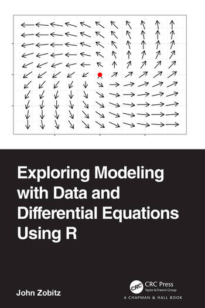

# Preface - 2025 updates {.unnumbered} 
This is the web home of *Exploring Modeling with Data and Differential Equations Using R*, published in 2022 by [Chapman and Hall/CRC](https://www.routledge.com/Exploring-Modeling-with-Data-and-Differential-Equations-Using-R/Zobitz/p/book/9781032259482). I am glad you are here.

```{r label=fig-book-cover, echo=FALSE,out.width = "40%",fig.cap="Cover for @zobitzExploringModelingData2022.", fig.align="center"}

```

This website contains the published text and updates since the text was originally published.

- Notice any errors? If you encounter problems with code in this repository, feel free to post an [issue](https://github.com/jmzobitz/ModelingWithR/issues).
- I also maintain a running list of errata in the print version: [LINK](https://docs.google.com/document/d/1BJmyeQbrDRmUdoM11pZTA_kTV0XG76L1UQLOxCIR8M0/edit?usp=sharing)


### Updates in 2025 {.unnumbered}
I've appreciated feedback from the community of users 
[ngiann](https://github.com/ngiann) (Nikos Gianniotis), [discoleo](https://github.com/discoleo), [nonlinearnature](https://github.com/nonlinearnature) (Ethan Deyle) for suggestions and improvements in the text.

In August 2025 the entire text was migrated from Rmarkdown to quarto. This update also changed from the dplyr pipe (`%>%`) to the native R pipe (`|>`), as well as recommended language updates in the code that have occurred since publication.

New sections or homework problems that were added in this update are prefaced with the  symbol.

I am appreciative of the community that has utilized this text and learned from it.  Thank you all.

